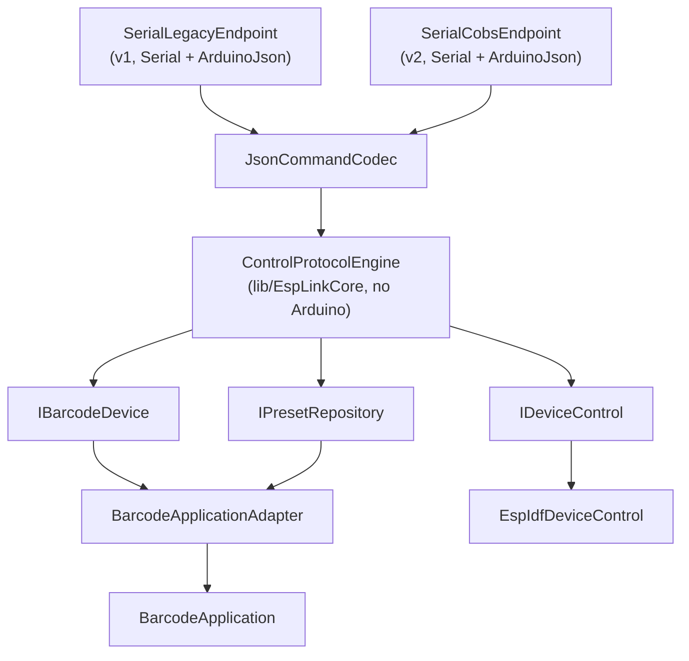

# Architecture

## Goals

`EspScreenBarcodeGenerator` turns the Hosyond ESP32 screen into a deterministic lab instrument rather than a desktop image viewer. The device owns barcode generation, layout, display state, touch interaction, and persistent presets. A host sends intent and parameters, not pre-rendered screenshots, unless it deliberately uses raw matrix upload for an unsupported symbology or exact fixture.

## Component model

```text
USB cable -> USB-to-UART bridge -> NDJSON (v1, default) or COBS hop frames (v2, opt-in)
                                        |
                                        v
                              ESP32 firmware
--------------------------------------------------------------------
  SerialLegacyEndpoint (Serial, ArduinoJson)   SerialCobsEndpoint (Serial, ArduinoJson)
                    \                              /
                     v                            v
                       JsonCommandCodec (ArduinoJson, no Serial)
                                        |
                                        v
                  ControlProtocolEngine (lib/EspLinkCore, no Arduino at all)
                                        |
                                        v
        IBarcodeDevice  /  IPresetRepository  /  IDeviceControl   (ports)
                    /                              \
                   v                                v
     BarcodeApplicationAdapter (Arduino)   EspIdfDeviceControl (Arduino)
     (implements IBarcodeDevice,           (implements IDeviceControl:
      IPresetRepository)                    backlight, reboot, free heap)
                   |
                   v
                BarcodeApplication (state + workflows)
                   |                    \
                   v                     v
        Core (encoders + layout)      Presets (LittleFS)
                   |
                   v
        integer module rectangles
                   |
                   v
        TFT_eSPI / ST7796U
                   ^
                   | XPT2046 touch
        direct touch UI/keyboard
--------------------------------------------------------------------
```

## EspLink v2 foundation

The dependency direction runs strictly one way, transport-specific code at the edges and pure domain logic at the center:

```text
SerialLegacyEndpoint / SerialCobsEndpoint  (Serial, ArduinoJson)
        -> JsonCommandCodec                (ArduinoJson, no Serial)
        -> ControlProtocolEngine           (no Arduino at all — lib/EspLinkCore)
        -> IBarcodeDevice / IPresetRepository / IDeviceControl  (ports)
        -> BarcodeApplicationAdapter / EspIdfDeviceControl      (Arduino)
        -> BarcodeApplication
```

`lib/EspLinkCore` (`Envelope`, `HopFrame`, `Cobs`, `FrameAssembler`, `ControlSession`, `TransferSession`, `ControlProtocolEngine`, `SelectionPolicy`) declares zero Arduino dependency (`lib/EspLinkCore/library.json`). `JsonCommandCodec` links ArduinoJson for its `JsonObjectConst`/`JsonDocument` types but never touches `Serial` — only `SerialLegacyEndpoint` and `SerialCobsEndpoint` own the `Serial` object. This is why `tests/esplink_codec_tests.cpp`, `tests/esplink_golden_shape_tests.cpp`, `tests/esplink_selection_tests.cpp`, `tests/esplink_types_tests.cpp`, and `tests/control_protocol_engine_tests.cpp` all build and run as plain host binaries, with no ESP32 attached and no PlatformIO upload step.

`esplink::ControlSession` and `esplink::TransferSession` replace the old monolithic `UsbProtocol::UploadState`. Each `ControlSession` (one per active connector — `main.cpp` constructs a separate `legacySession` and `v2Session`) owns its own `TransferSession`, its own write lease (`tryAcquireLease`/`releaseLease`/`hasLease`), and its own duplicate-result cache. The property this buys, and that a future Bluetooth/Wi-Fi Direct/ESP-NOW-gateway connector depends on holding: **two sessions can never corrupt each other's in-flight upload or replay each other's cached command result**, because each session's state is a separate object, not shared globals. A new transport can be added without auditing every existing transport's upload/replay state for cross-contamination.



## Portable barcode core

`lib/EspBarcodeCore` is standard C++17 and has no Arduino, display, filesystem, or serial dependency. It provides:

- `BarcodeSpec`: symbology and generation options.
- `BarcodeResult`: normalized data, packed module matrix, default quiet zone, and linear/matrix classification.
- `BitMatrix`: continuous row-major, MSB-first packed bits with a 512x512 bound.
- Encoders for the supported linear and matrix symbologies.
- Base64 helpers shared by firmware and native tests.
- `calculateLayout`: selects an integer module size and valid rotation for a fixed screen.

QR is adapted through the external `ricmoo/QRCode` C library. If its header is absent in a plain host build, the rest of the core still compiles and returns an explicit QR dependency error. PlatformIO resolves and tests the real QR adapter.

## Application state

`BarcodeApplication` owns the active specification and current rendered result. The current symbol can be:

1. Generated from a `BarcodeSpec`.
2. Loaded and regenerated from a preset.
3. Installed as a raw packed matrix uploaded over USB.

Closing a barcode returns to the home UI without discarding the current symbol, so the host can redisplay or download it. A generated symbol retains its specification; a raw matrix retains only matrix/display metadata and is not stored as a preset in v0.1.0.

## Rendering pipeline

1. Encoder returns logical black/white modules without quiet-zone pixels.
2. Application chooses the quiet zone from the explicit option or symbology default.
3. `calculateLayout` evaluates portrait and 90-degree layouts for `auto` rotation.
4. It computes `floor(screen_dimension / logical_modules)` and requires that integer scale to meet `minModulePixels`.
5. The TFT is filled with the background color.
6. Each black module is drawn as an exact `scale x scale` rectangle. Linear bars are drawn as tall rectangles from a one-row matrix.

No resized bitmap is pushed to the screen. This avoids filtering artifacts and keeps bar/module edges aligned to the physical pixel grid.

## USB transport

The ESP32-WROOM-32E does not expose native USB device functionality. The board's connector reaches the ESP32 through a USB-to-UART bridge, so the PoC exposes an ordinary COM/tty port at 115200 baud. The device boots into one endpoint and, for v2, transitions to the other on request — there is no dual-listening mode.

`SerialLegacyEndpoint` (v1, default) speaks USB Serial Protocol 1.0 — one UTF-8 JSON object per newline-terminated line, unchanged from prior releases. See [`docs/PROTOCOL.md`](PROTOCOL.md) for the full command/error reference. The application protocol is deliberately independent of UART framing:

- UTF-8 JSON object per line.
- Optional caller-supplied `id`, echoed in responses.
- Stable command names and error objects.
- Chunked binary transfer represented as Base64.
- Declared dimensions, sequential offsets, exact byte counts, and CRC32.

`SerialCobsEndpoint` (v2, opt-in) speaks EspLink v2: COBS-delimited binary hop frames carrying a binary message envelope carrying a JSON control body. A host requests the switch with the v1 command `{"cmd":"upgrade"}`; the firmware acknowledges over NDJSON, then switches its `loop()` to the COBS endpoint for the rest of the boot. See [`docs/PROTOCOL_V2.md`](PROTOCOL_V2.md) for the wire format, the current 5-command v2 subset, and the extension guide for adding a new transport.

A later Windows service, virtual device driver, WebSerial client, TCP bridge, Bluetooth, or Wi-Fi Direct connector maps the same `ControlProtocolEngine`/envelope/frame layers (§ EspLink v2 foundation) to a different carrier — see `docs/PROTOCOL_V2.md`'s extension guide.

## Persistence

LittleFS uses the final 960 KiB of the custom 4 MiB partition table. Each preset is a JSON file under `/presets`. Names are restricted to 1-24 alphanumeric, dash, or underscore characters. The UI automatically selects `SLOT01` through `SLOT32`; USB callers may use meaningful names.

The mount currently permits format-on-failure to make first boot self-initializing. A production qualification should verify power-loss behavior and decide whether formatting on an unexpected mount failure is acceptable for the lab process.

## Error strategy

Errors are explicit and do not silently degrade scan quality:

- Invalid payload or check digit: generation fails.
- Unknown symbology or malformed option: protocol returns `invalid_spec`.
- Symbol too dense for the display/minimum module size: display fails.
- Overlong serial line: discarded through the next newline and reported.
- Matrix upload with wrong dimensions, order, byte count, offset, Base64, or CRC: rejected.
- Missing current symbol or preset: rejected without altering prior state.

## Resource bounds

| Resource | Bound |
|---|---:|
| Input payload | 2,048 bytes |
| Matrix dimensions | 1-512 modules per axis |
| Matrix storage | 32,768 packed bytes |
| Serial request line | 4,096 bytes |
| Presets | 32 |
| Preset name | 24 characters |
| Upload chunk recommendation | 384 bytes |
| Upload/download chunk accepted | 48-768 bytes |

A 320x480 display normally imposes a much smaller practical module count than the storage bound. The larger raw-matrix bound exists for transfer/inspection but display still requires a valid integer layout.

## Extension points

- Add an encoder by extending `Symbology`, parsing/string conversion, `encode()`, capability lists, UI type list, tests, and protocol docs.
- Add PDF417 as a new portable encoder while retaining raw upload compatibility.
- Add named preset entry through a touch keyboard modal.
- Add test sequences/playlists that advance through symbols on scanner feedback or a timed schedule.
- Add a new transport (Bluetooth Classic RFCOMM, Wi-Fi Direct TCP, a cross-platform BLE connector for Linux/macOS) by implementing a new connector/endpoint against `lib/EspLinkCore`'s ports (`ControlProtocolEngine`, the `Envelope`/`HopFrame`/`Cobs` codecs, `IControlResponseSink`) — see [`docs/PROTOCOL_V2.md`](PROTOCOL_V2.md)'s extension guide and "Next PRs" section for the concrete steps and known gaps (including the .NET `TransportSelector` fallback-policy parity gap). Two worked examples of this pattern now exist: the ESP-NOW compatibility endpoint (`src/EspNowEndpoint.cpp`, single-board radio-init validated only) and the BLE GATT endpoint (`src/BleGattEndpoint.cpp` + Windows `dotnet/src/EspBarcode.Client.Ble`, hardware-validated end-to-end — real Windows PC talking to the flashed display over Bluetooth LE). A USB↔ESP-NOW gateway board, its Windows connector, Wi-Fi Direct, and BLE on Linux/macOS are still future work (see PROTOCOL_V2.md §10).
- Add scanner-to-device feedback input for automated pass/fail correlation.
- Move to ESP32-S3 hardware for true USB CDC/HID/vendor-class functionality without a bridge.
