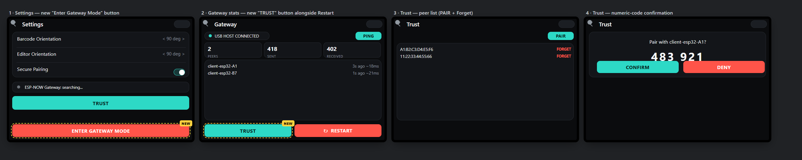
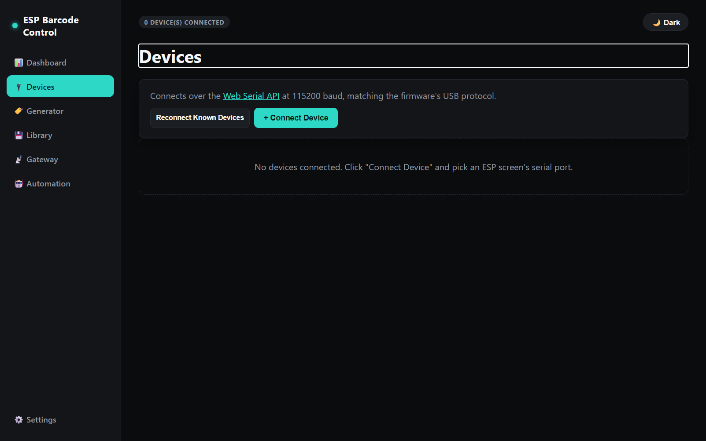
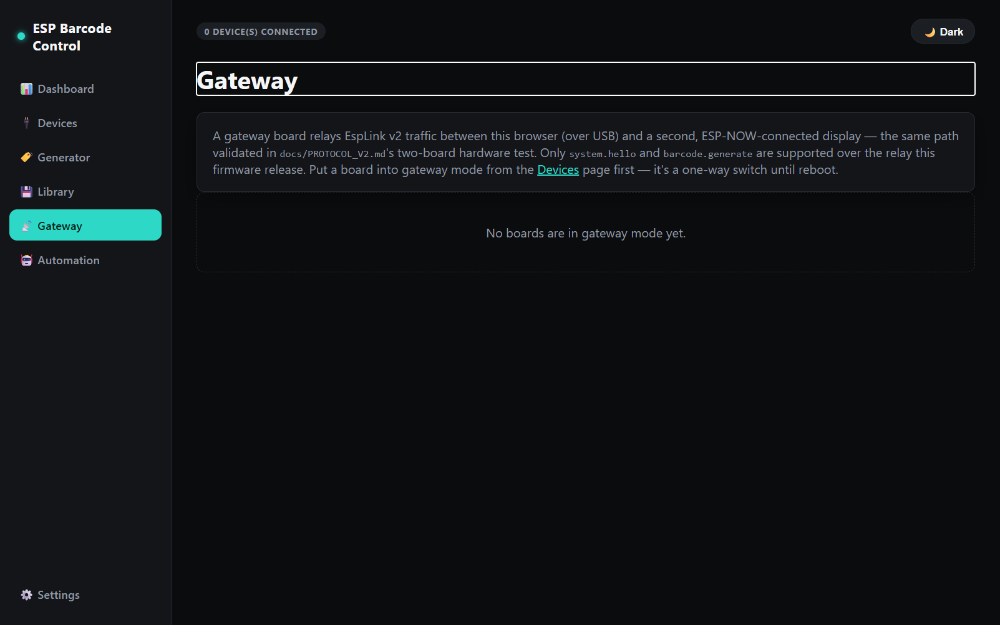

# Gateway Mode and Pairing

This guide covers the two related on-screen workflows for running a board as an ESP-NOW
gateway and for establishing trust ("pairing") between two boards:

1. **Gateway mode** — one board relays EspLink v2 traffic between a USB-connected host and a
   second, ESP-NOW-connected display. See [docs/ARCHITECTURE.md](ARCHITECTURE.md) and
   [docs/PROTOCOL_V2.md](PROTOCOL_V2.md) for the underlying wire protocol.
2. **Pairing (Secure Pairing / Trust)** — boards only relay ESP-NOW traffic to peers they
   explicitly trust. Trust is established with an ECDH/ECDSA handshake and a human-verified
   6-digit numeric code, matching the design in
   [docs/superpowers/specs/2026-08-22-espnow-secure-pairing-design.md](superpowers/specs/2026-08-22-espnow-secure-pairing-design.md).

Both workflows can be driven two ways: **entirely from the device's own touchscreen**, or
**from the Blazor controller running in a browser** (`dotnet/src/EspBarcode.Controller.Web`).
Neither requires the Python/`.NET` CLI tools or hand-written JSON commands.

## On the device touchscreen

The screens below are mock-ups of the actual 480x320 firmware UI (built from the same layout
constants as `src/BarcodeApplication.cpp`), captured because the physical board isn't
photographable from this environment. Panels 1 and 2 are outlined in yellow — these are the
two controls this change adds; panels 3 and 4 already existed.

### 1. Enter Gateway Mode

Previously, gateway mode could only be triggered by a connected host sending the `gateway` USB
command — there was no way to start it from the device itself. **Settings** now has an
**ENTER GATEWAY MODE** button:

1. From **Home**, tap the gear icon to open **Settings**.
2. Scroll to the red **ENTER GATEWAY MODE** button at the bottom.
3. Tap it. The board immediately becomes a USB&lt;-&gt;ESP-NOW relay and Home switches to the
   Gateway banner ("Relaying USB & ESP-NOW").

This is a **one-way switch** — same as triggering it over USB. The only way back to the normal
barcode-editor UI is a reboot (**Gateway → RESTART**, or power-cycling the board). There's no
confirmation dialog, matching how the existing "Restart Device" button behaves — the red color
and irreversible label are the warning.

### 2. Reach Trust from the Gateway screen

Once a board is in gateway mode, it previously had no on-screen way to review trusted peers or
start a new pairing — it was only pushed to the Trust screen automatically when a *peer*
initiated pairing with it. The Gateway stats screen's bottom row now has a **TRUST** button
next to **RESTART**:

1. From the Gateway banner on Home, tap **VIEW STATS**.
2. Tap **TRUST** in the bottom-left of the Gateway screen.

### 3. Trust screen — list and initiate pairing

The Trust screen (reachable from Settings on a client board, or from the Gateway screen as
described above) shows every currently-trusted peer with a **FORGET** action, plus a **PAIR**
button to discover and pair with a new, not-yet-trusted peer in ESP-NOW range.

### 4. Trust screen — numeric-code confirmation

When a pairing attempt is in progress (either because you tapped **PAIR**, or because a peer
initiated pairing with this board), the Trust screen shows a 6-digit numeric code. Compare it
against the code shown on the *other* board's screen — if they match, tap **CONFIRM** on both
boards; if they don't, tap **DENY**. This human-verified code is what defeats a
man-in-the-middle during the ECDH key exchange.

The **Secure Pairing** switch on the Settings screen controls whether pairing/trust
enforcement is required at all; it's independent of the two controls above.

## From the Blazor controller (browser)

`EspBarcode.Controller.Web` already exposes the same two workflows over the Web Serial API —
useful when the device is out of reach but still plugged into a PC.

**Devices** (`/devices`) — connect a board over USB, then use its **Enter Gateway Mode**
button (only shown for boards still in client mode). Same one-way-switch caveat as the
on-device button: the board won't come back to client mode without a reboot.

**Gateway** (`/gateway`) — once a board is relaying, its card here shows live peer/stat
counters and a **Trusted devices** section with **Pair new device**, a numeric-code
confirmation prompt (**Confirm** / **Cancel Pairing**), per-peer **Forget**, and
**Refresh Trust List**. This mirrors the device's own Trust screen one-for-one.

## Firmware changes behind this guide

- `include/BarcodeApplication.h` / `src/BarcodeApplication.cpp` — new
  `consumeGatewayModeToggleRequest()` request flag, a Settings-screen "Enter Gateway Mode"
  button, and a second (Trust) button on the Gateway screen's footer row.
- `src/main.cpp` — the existing Legacy→GatewayRelayMode transition (previously driven only by
  `SerialLegacyEndpoint::gatewayRequested()`) now also checks the new on-screen request.

No wire protocol or trust/crypto behavior changed — this only adds touchscreen entry points to
flows that were already fully implemented and hardware-validated.
