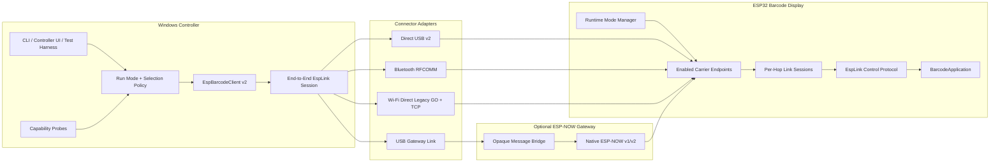
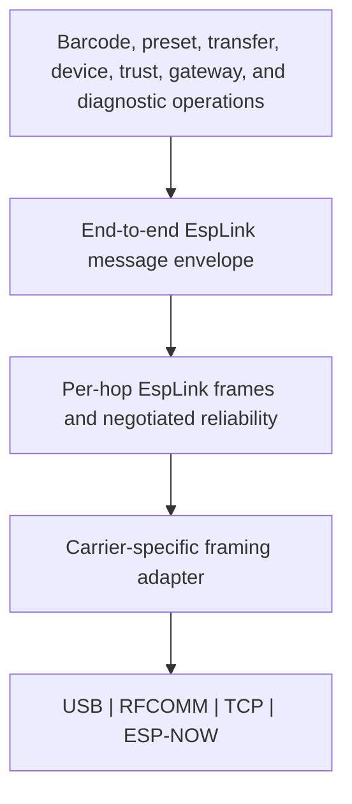
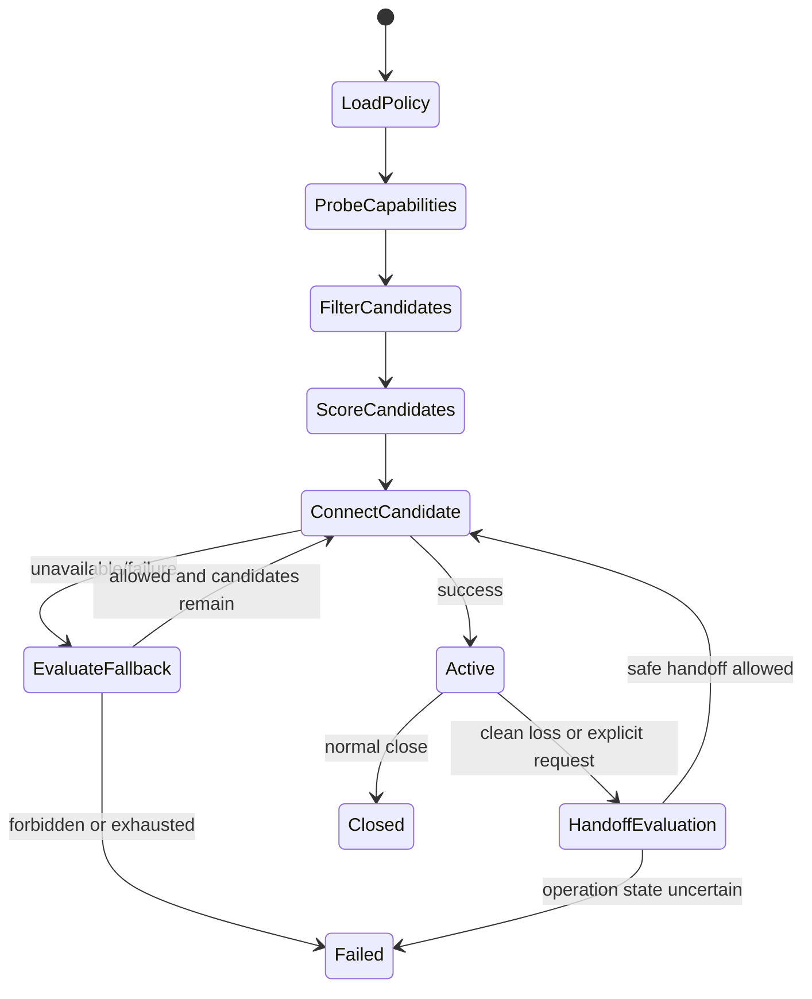
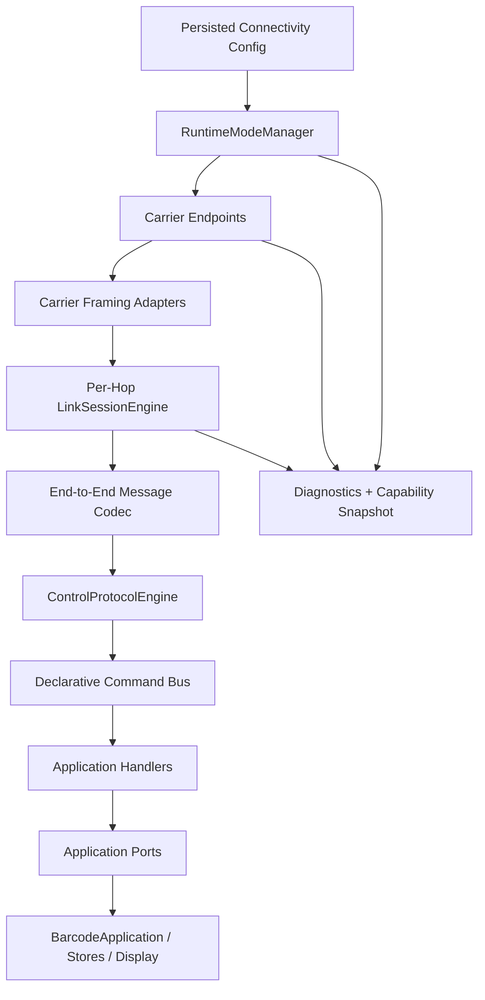
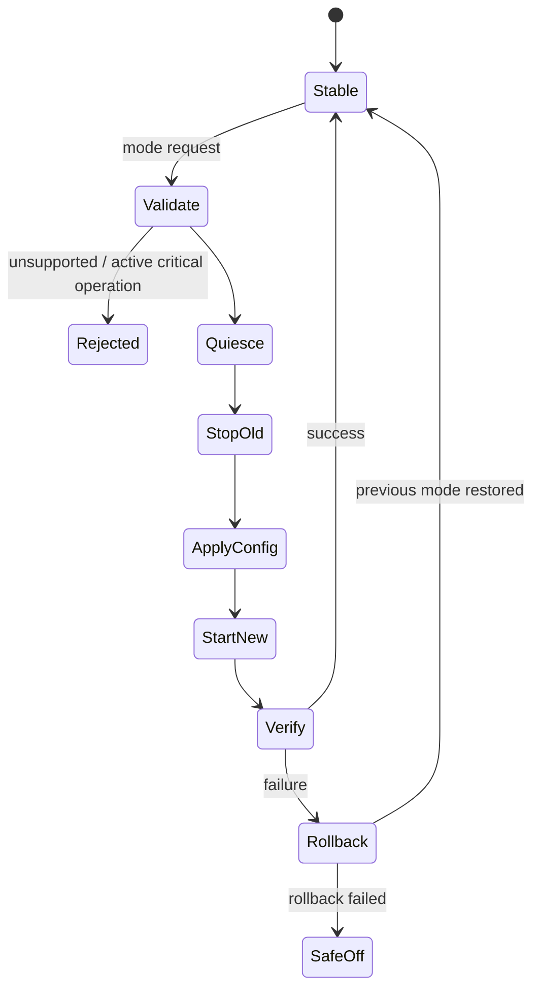

# EspScreenBarcodeGenerator Capability-Driven Multi-Transport ESP-NOW Interoperability Implementation Plan

> **Status:** Proposed comprehensive implementation plan
> **Reviewed baseline:** `origin/main` at `d1565337b3d8f7b6cf8569cf0c443dfd43057072` (`chore: add windows targeting`)
> **Review date:** 2026-08-20
> **Intended repository path:** `docs/superpowers/plans/2026-08-20-multi-transport-esp-link-implementation-plan.md`
> **Primary targets:** ESP32-WROOM-32E display firmware, Windows 10/11 control software, optional ESP32/ESP32-S3 USB gateway
> **Existing compatibility baseline:** firmware `0.1.0`, USB Serial Protocol `1.0`
> **Protocol strategy:** one end-to-end EspLink message protocol, a native ESP-NOW carrier profile, and optimized carrier adapters for RFCOMM, TCP, and USB

---

## 1. Executive decision

The project should introduce a transport-independent protocol named **EspLink Protocol v2** and expose multiple capability-driven run modes. ESP-NOW is the preferred native ESP-to-ESP carrier where a gateway is available and appropriate, but it must not become an artificial performance ceiling for Bluetooth, TCP, or USB.

The supported run modes are:

1. **`auto`**
   - Discovers and evaluates every enabled connector.
   - Filters connectors against explicit requirements.
   - Scores the remaining candidates against an optimization goal.
   - Connects through the best currently usable path.
   - Applies an explicit, observable fallback policy.

2. **`espnow-gateway`**
   - Windows communicates with a second ESP over USB.
   - The gateway communicates with the display over native ESP-NOW.
   - Preferred for low-latency wireless control, deterministic peer addressing, multi-display orchestration, and environments where a gateway is available.
   - Negotiates ESP-NOW v2 when supported and falls back to the v1 packet profile when required.

3. **`wifi-direct`**
   - Windows creates a Wi-Fi Direct legacy group owner.
   - The display joins as a normal Wi-Fi station and opens a private TCP connection to Windows.
   - Preferred for high-throughput direct wireless transfer when creating an isolated IP interface is permitted.
   - Does not require the display and controller to join an existing network.

4. **`bluetooth`**
   - Windows connects directly to the display through Bluetooth Classic RFCOMM/SPP.
   - Preferred when no IP interface and no additional gateway hardware are desired.
   - Uses the same EspLink message protocol through an RFCOMM stream profile.

5. **`usb-v2`**
   - Windows connects directly to the display over the existing USB-to-UART path.
   - Provides a fast, deterministic development, qualification, recovery, and tethered-control path.

6. **`usb-v1`**
   - Preserves the existing newline-delimited JSON protocol through a compatibility adapter.

7. **`standalone`**
   - Disables remote control and keeps all barcode generation and operation on the touchscreen.

8. **`adaptive`** *(post-v2.0 capability)*
   - Maintains more than one eligible link and selects a data path by traffic class.
   - Example: ESP-NOW for low-latency control and Wi-Fi Direct TCP for bulk transfer.
   - Requires explicit coexistence, channel, resource, security, and handoff qualification before release.

No run mode may contain separate barcode semantics. Every mode must invoke the same command handlers, authorization rules, transfer state machine, error catalog, and application ports.

### 1.1 Protocol consistency without carrier misuse

ESP-NOW is an Espressif-specific Wi-Fi action-frame transport. Windows cannot natively carry those action frames over Bluetooth RFCOMM or TCP. Therefore, “one ESP-NOW protocol everywhere” must be implemented as one **ESP-NOW-aligned EspLink protocol**, not by pretending RFCOMM or TCP are ESP-NOW radios.

The protocol is divided into three layers:

```text
End-to-end application message
    - command/result/event/error semantics
    - controller and device identity
    - operation and correlation IDs
    - authorization and transfer semantics

Per-hop EspLink framing
    - negotiated frame budget
    - fragmentation and reassembly
    - sequencing, ACK/NACK, retry, dedupe
    - route and session metadata

Carrier adapter
    - ESP-NOW datagram
    - USB serial stream
    - Bluetooth RFCOMM stream
    - Wi-Fi Direct TCP stream
```

The end-to-end message is invariant. Per-hop framing is optimized for the selected carrier:

- ESP-NOW v1 uses a maximum radio payload of 250 bytes.
- ESP-NOW v2 may use a maximum radio payload of 1,470 bytes when both peers and the deployed ESP-IDF/Arduino stack support it.
- USB and RFCOMM use bounded COBS-framed records sized from negotiated memory and throughput limits.
- TCP uses a length-prefixed frame profile, with an optional COBS compatibility profile for diagnostics.
- A gateway may re-fragment an opaque EspLink message when crossing from a large USB frame budget to a smaller ESP-NOW frame budget.
- A gateway must not parse, validate, or translate barcode-domain bodies merely to reframe them.

This preserves full semantic interoperability while allowing every carrier to run at an appropriate frame size and reliability window.

### 1.2 Capability-driven selection

The software must never infer a deployment policy from a hard-coded environment name. Selection is expressed as capabilities, requirements, preferences, and prohibitions.

Examples:

```text
Requirements
  wireless = true
  externalHardware = forbidden
  ipInterface = forbidden
  multiDevice = optional
  minimumSecurity = authenticated

Optimization
  low-latency
  high-throughput
  balanced
  minimal-host-dependencies
  deterministic
  minimum-power

Allowed transports
  espnow-gateway
  wifi-direct
  bluetooth
  usb-v2

Fallback
  unavailable-only
  connect-failure
  pre-operation
  never
```

The same executable can therefore support very different operating conditions through runtime configuration rather than forks, special builds, or environment-specific branches.

### 1.3 Highest-fit behavior

There is no universally best connector. The selection engine should optimize against the requested traffic and available capabilities:

| Objective | Preferred candidates, subject to availability and policy |
|---|---|
| Lowest wireless command latency | ESP-NOW gateway, then Wi-Fi Direct, then Bluetooth |
| Highest wireless bulk throughput | Wi-Fi Direct TCP, then negotiated ESP-NOW v2, then Bluetooth |
| No additional hardware | Wi-Fi Direct or Bluetooth |
| No IP interface | ESP-NOW gateway or Bluetooth |
| Multi-display orchestration | ESP-NOW gateway |
| Simplest direct pairing | Bluetooth |
| Deterministic tethered operation | USB v2 |
| Maximum compatibility | USB v1 |
| No controller | Standalone |

These are default scoring hints, not unverified performance claims. Actual ranking is refined from measured capabilities and per-host qualification data.

### 1.4 Fallback rules

Fallback must be explicit and safe:

- A connector may fall back before a session is established.
- A connector may fall back after a clean disconnect when no mutation or transfer is in flight.
- A read-only command may be retried on a new link if its idempotency metadata permits it.
- A mutating command may move to another link only when its operation ID can be proven completed, not completed, or safely replayed.
- An active binary transfer may resume on another link only through an authenticated resume token and verified offset/digest state.
- `--require-transport <kind>` disables fallback.
- `--no-fallback` disables fallback.
- Every attempted connector and rejection reason must be visible in diagnostics.

### 1.5 Architectural outcome

The target system will have:

- One protocol core and command catalog.
- One end-to-end message envelope.
- Carrier-specific frame profiles negotiated per hop.
- One domain command model.
- One session, authorization, lease, and transfer model.
- One generated schema and capability catalog.
- One cross-language conformance suite.
- Multiple replaceable transport adapters.
- A capability probe and deterministic transport-selection engine.
- No transport checks inside barcode business logic.
- No direct `Serial`, Bluetooth, Wi-Fi, socket, or ESP-NOW calls inside protocol/domain layers.
- A single high-level Windows client API regardless of connection type.
- Explicit runtime flags and persisted device configuration.
- Separate correctness, compatibility, performance, and coexistence qualification gates.

---

## 2. Baseline review of `origin/main`

### 2.1 Existing strengths

The current repository already has several good foundations:

- `lib/EspBarcodeCore` is intended to remain portable C++17 without Arduino, display, filesystem, or serial dependencies.
- `BarcodeApplication` already provides a useful application façade over barcode generation, display state, presets, and device behavior.
- `docs/ARCHITECTURE.md` explicitly states that the command model should be transport-neutral.
- The USB protocol already has:
  - Request correlation IDs.
  - Stable commands and errors.
  - Chunked uploads and downloads.
  - Base64 transfer encoding.
  - Sequential offsets.
  - CRC-32 validation.
- The .NET client already accepts an injected transport through `IEspBarcodeTransport`.
- The .NET solution now contains the client, CLI, generator, image renderer/viewer, WPF GUI, and test projects.
- The latest commit enables Windows targeting, which is necessary for the platform-specific connectors.

These should be preserved rather than replaced.

### 2.2 Current coupling that must be removed first

The present architecture is transport-neutral in intent, but `UsbProtocol` still combines too many responsibilities:

- Direct reads from global `Serial`.
- Newline framing.
- JSON parsing and serialization.
- Command dispatch.
- Upload-session state.
- Download chunking.
- Response routing.
- Reboot flushing.
- Transport-specific `hello` metadata.

`src/main.cpp` globally constructs one `BarcodeApplication` and one `UsbProtocol`, then directly loops both. The single `UploadState` owned by `UsbProtocol` also assumes exactly one controller and one transport.

On the .NET side, `IEspBarcodeTransport` is synchronous and line-oriented:

```csharp
void WriteLine(string line);
string? ReadLine();
```

That abstraction is sufficient for USB Protocol 1.0, but it is not a durable base for:

- Binary frames.
- Asynchronous Bluetooth and socket APIs.
- Discovery and pairing.
- Multiple routed devices.
- Connection state.
- Cancellation.
- Transfer progress.
- Events.
- Reconnection.
- Concurrent response correlation.

### 2.3 Required first move

Do **not** add three more transports directly to `UsbProtocol`.

First extract:

```text
Carrier I/O
    ↓
Frame codec
    ↓
Link/session engine
    ↓
Domain message codec
    ↓
Command dispatcher
    ↓
BarcodeApplication ports
```

The existing USB implementation should become one adapter around that architecture, not the base class from which every other connector grows.

---

## 3. Goals

### 3.1 Functional goals

- Control the display from Windows without requiring both devices to join an existing shared network.
- Support direct Bluetooth control with no additional hardware.
- Support a Windows-hosted isolated Wi-Fi Direct legacy connection with no existing-network participation.
- Support a second ESP as a USB-to-ESP-NOW gateway.
- Prefer native ESP-NOW when it is the best available fit rather than treating it as a secondary compatibility path.
- Preserve complete standalone touchscreen operation.
- Preserve every existing device command.
- Support full raw matrix upload and download over every new transport.
- Support discovery, pairing, provisioning, connection, disconnection, status, diagnostics, and recovery.
- Allow a caller to change transports without changing barcode-domain code.
- Allow a gateway to route to more than one display without changing device command schemas.
- Keep USB Protocol 1.0 operational through a compatibility adapter during migration.
- Expose explicit run modes, policy profiles, capability requirements, preferences, and fallback controls.
- Support deterministic explicit selection and automatic best-fit selection.
- Support safe transport handoff and transfer resume as separately versioned capabilities.
- Keep all modes usable without Internet access.

### 3.2 Architecture goals

- **Clean / Hexagonal:** domain and application logic depend inward; frameworks and transports remain adapters.
- **SOLID:** abstractions exist at meaningful seams, not around every class.
- **DDD:** model connectivity, trust, sessions, transfers, selection policy, control ownership, and device control as bounded contexts with explicit invariants.
- **Functional:** prefer immutable values, pure codecs, explicit results, and state transitions over hidden mutation and exceptions.
- **Declarative:** define commands, versions, permissions, idempotency, carrier profiles, selection policies, and schemas in authoritative catalogs.
- **DRY:** generate shared constants, descriptors, documentation, and conformance fixtures from authoritative definitions.
- **Fluent:** expose composable Windows builders and typed request APIs.
- **Pluggable:** transports can be added without changing the protocol or barcode application.
- **Extensible:** support future BLE GATT, SoftAP/TCP, WebSocket, native USB, or other carriers without a new command protocol.
- **Embedded-safe:** bounded memory, fixed queues, no heavy work in radio callbacks, and no unbounded reassembly.
- **Performance-aware:** do not force every carrier to use the smallest carrier’s MTU, window, or framing strategy.
- **Policy-neutral:** no core type, class, flag, or branch should encode the name of a deployment site or organization.
- **Capability-driven:** behavior is selected from what the host, device, firmware profile, and policy actually support.

### 3.3 Interoperability goals

For the same logical request, every connector must provide:

- The same command name and request schema.
- The same response/event schema.
- The same stable error code and error semantics.
- The same end-to-end operation and correlation behavior.
- The same idempotency and duplicate rules.
- The same transfer checksums and completion semantics.
- The same protocol negotiation model.
- The same capability vocabulary.
- The same authorization decision.
- The same device-side handler.
- The same canonical application-message test vectors.
- Compatible carrier-profile vectors for each negotiated frame budget.
- Gateway reframing without domain translation.
- Safe session resumption and handoff rules where those capabilities are negotiated.

Full interoperability means semantic and message compatibility. It does not require a 4 KiB TCP frame to be byte-identical to a 250-byte ESP-NOW v1 datagram after fragmentation.

### 3.4 Operational goals

- A user can see the active transport, negotiated profile, and controller on the display.
- A user can see why automatic selection chose or rejected a transport.
- A user can revoke remote control physically.
- The device can recover from interrupted pairing, transfer, disconnect, PC sleep, gateway reset, and device reset.
- USB remains a development and recovery route when physically available.
- No transport can indefinitely starve the touchscreen or display loop.
- Diagnostics identify transport, session, peer, negotiated frame size, retry window, dropped frames, transfer progress, fallback history, and last error without logging barcode payloads by default.
- Explicit mode never silently changes to a different transport.
- Automatic mode never creates a new radio service, pairing relationship, or isolated IP interface unless the policy permits that side effect.
- Runtime configuration can be inspected, exported, reset, and overridden for one invocation.
- Startup remains deterministic even when several transports are compiled in.

### 3.5 Run-mode goals

The device and Windows tooling must share a stable mode vocabulary:

```text
standalone
auto
usb-v1
usb-v2
bluetooth
wifi-direct
espnow-gateway
adaptive
```

Each mode must declare:

- Required firmware feature.
- Required Windows capability.
- Required external hardware.
- Whether it creates an IP interface.
- Whether it uses Bluetooth.
- Whether it uses Wi-Fi.
- Whether it supports multiple displays.
- Whether it supports discovery.
- Whether it supports pairing/provisioning.
- Its negotiated frame and reliability profile.
- Its expected side effects.
- Its fallback eligibility.
- Its qualification status.

`adaptive` is not a synonym for `auto`:

- `auto` selects one active data path.
- `adaptive` may maintain or hand off between multiple paths according to traffic class and measured health.

### 3.6 Performance goals

- Negotiate ESP-NOW v2 payloads when supported instead of always limiting traffic to ESP-NOW v1.
- Retain ESP-NOW v1 interoperability as a fallback profile.
- Use larger bounded stream frames over RFCOMM, TCP, and USB when memory and transport behavior permit.
- Support configurable stop-and-wait and sliding-window reliability profiles.
- Keep command latency independent from large transfer buffering.
- Stream bulk payloads instead of reassembling an entire transfer into protocol memory.
- Allow transport-specific queue depths, frame budgets, keep-alive periods, and retransmission policies behind common semantics.
- Benchmark connection startup, small-command latency, transfer throughput, reconnect, and CPU/memory cost.
- Select on measured capability classes rather than hard-coded marketing assumptions.
- Permit an operator to prioritize latency, throughput, deterministic behavior, minimal dependencies, or power.
- Preserve scanner rendering and touch responsiveness under the highest qualified transfer load.

---

## 4. Non-goals

The first implementation will not:

- Implement a custom Windows kernel Wi-Fi or Bluetooth driver.
- Make Windows transmit native ESP-NOW action frames through its internal Wi-Fi adapter.
- Pretend the ESP32 supports native Wi-Fi Direct/P2P.
- Force RFCOMM, TCP, or USB to use ESP-NOW v1’s 250-byte packet budget.
- Treat byte-for-byte carrier fragmentation as the definition of interoperability.
- Bridge the Wi-Fi Direct connection to another network or to the Internet.
- Replace the barcode generators, rendering engine, preset store, or standalone UI.
- Enable unrestricted anonymous remote control.
- Support multiple simultaneous writers to the display.
- Silently select or fall back to a transport that the caller explicitly denied.
- Retry an uncertain mutating command on another transport without idempotency proof.
- Guarantee Bluetooth/Wi-Fi/ESP-NOW concurrency before coexistence testing.
- Make adaptive multipath a v2.0 release blocker.
- Remove USB Protocol 1.0 in the same release that introduces Protocol 2.0.
- Add compression or application-layer payload encryption before the required JSON/binary profile, trust model, and transport contract are stable.
- Create a large inheritance hierarchy merely to satisfy a pattern.
- Move the entire repository before the protocol extraction is complete.
- Encode deployment-site names into source, build profiles, default policies, or diagnostics.
- Present unmeasured throughput or latency as a release guarantee.
- Require all compiled connectors to be enabled at runtime.
- Require the gateway for direct Bluetooth or Wi-Fi Direct operation.
- Require Bluetooth or Wi-Fi Direct when ESP-NOW gateway operation is preferred and available.

---

## 5. Architecture principles and rules

### 5.1 Dependency rule

Dependencies may point inward only:

```text
Frameworks and device APIs
        ↓
Carrier and persistence adapters
        ↓
Link/session and protocol adapters
        ↓
Application use cases and ports
        ↓
Domain model and protocol value objects
```

The domain cannot include or reference:

- `Arduino.h`
- `Serial`
- `BluetoothSerial`
- `esp_spp_*`
- `esp_now_*`
- `WiFi`
- `StreamSocket`
- `SerialPort`
- `ArduinoJson`
- TFT or touch APIs
- LittleFS
- Windows Runtime APIs
- Windows network policy APIs
- COM-port enumeration
- MAC-address-specific behavior

Serialization belongs in a message-codec adapter. Radio and socket calls belong in carrier adapters. Transport selection belongs in a policy/application service, not the barcode domain.

### 5.2 Protocol invariance, carrier optimization

The application protocol is common; carrier mechanics are not artificially identical.

Invariant across carriers:

- Command and result schemas.
- Operation IDs and correlation.
- Authorization and lease rules.
- Transfer metadata and digests.
- Error taxonomy.
- Capability vocabulary.
- Idempotency.
- Session-authentication semantics.
- End-to-end message payload.

Negotiated per hop:

- Maximum frame bytes.
- Fragment payload bytes.
- Reliability window.
- ACK granularity.
- Keep-alive period.
- Send pacing.
- Stream framing.
- Link-layer security.
- Signal/channel metadata.
- Connection lifecycle.

A gateway is allowed to reframe and re-fragment. It is not allowed to reinterpret barcode-domain bodies.

### 5.3 Selective DDD

Use DDD where invariants matter:

- Session lifecycle.
- Control ownership.
- Pairing and trust.
- Transfer completeness.
- Protocol negotiation.
- Route identity.
- Duplicate handling.
- Capability probing.
- Transport selection.
- Fallback and handoff.
- Runtime mode transitions.

Do not turn simple barcode parameters into elaborate aggregates when validated value objects and pure functions are sufficient.

### 5.4 Functional core, imperative shell

The preferred shape is:

```text
Imperative shell
  - reads bytes/datagrams
  - invokes radio/socket APIs
  - schedules work
  - probes platform capabilities
  - renders UI
  - persists configuration

Functional core
  - decodes frames
  - validates messages
  - evolves session state
  - scores transport candidates
  - selects handlers
  - validates transfers
  - determines safe fallback/handoff
  - returns Result<T, Error>
```

Protocol decoding must never partially mutate a live session. Decode and validate first, then apply an explicit transition.

Transport selection should be a pure evaluation over:

```text
SelectionPolicy
+ TransportCapabilities[]
+ CurrentHealth[]
+ OperationCharacteristics
= SelectionDecision
```

The imperative shell performs the selected probe or connection attempt and feeds the result back into the next transition.

### 5.5 Interface segregation

Do not create one “universal transport” interface that exposes serial ports, MAC addresses, sockets, Bluetooth services, Wi-Fi credentials, and ESP-NOW peers.

Use small roles:

- Capability probe.
- Discovery.
- Pairing/bootstrap.
- Connection.
- Link-frame send/receive.
- Transport diagnostics.
- Gateway routing.
- Runtime mode control.
- Selection policy.
- Connection health.
- Handoff/resume coordination.

Transport-specific options remain in typed connector options rather than a dictionary of loosely typed flags.

### 5.6 Composition over inheritance

Prefer:

- Small interfaces at external seams.
- Value objects.
- Policy objects.
- Function tables.
- `std::variant` or explicit tagged unions in portable C++ where practical.
- Records and discriminated result types in C#.
- Composition roots that select adapters.
- Declarative connector descriptors.
- Explicit state machines.
- Generated protocol facts with handwritten behavior.

Avoid transport base classes with dozens of overridable methods.

### 5.7 Capability-driven configuration

Configuration describes behavior, not a named site.

Good:

```yaml
mode: auto
allow:
  - espnow-gateway
  - wifi-direct
  - bluetooth
requirements:
  wireless: true
  externalHardware: allowed
  ipInterface: allowed
optimization: low-latency
fallback: connect-failure
```

Avoid:

```yaml
mode: special-building-profile
```

A deployment may package a configuration file, command-line arguments, environment variables, or provisioning preset, but the runtime only sees normalized capability requirements and preferences.

### 5.8 Explicit fallback and side effects

Every connector declares side effects:

- Requires OS pairing.
- Requires opening a listening socket.
- Creates an isolated IP interface.
- Requires attached gateway hardware.
- Changes the ESP Wi-Fi channel.
- Enables discoverability.
- Persists credentials.
- Restarts the radio stack.

Automatic selection may perform only side effects allowed by policy.

Fallback is a state transition with a reason, not a catch-all exception handler.

### 5.9 Bounded resources

On firmware:

- Fixed-capacity receive queues.
- Fixed negotiated frame ceilings per compiled profile.
- Fixed maximum sessions.
- Fixed duplicate-result cache.
- Fixed maximum trusted peers.
- Fixed transfer buffer matching the current 32,768-byte raw matrix limit.
- Streaming transfer chunks rather than whole-message buffering.
- No dynamic allocation from ESP-NOW, Bluetooth, or Wi-Fi callbacks.
- No TFT, LittleFS, JSON parsing, or barcode generation inside radio callbacks.
- No unbounded connector discovery.
- No unbounded automatic reconnect.
- No simultaneous radio stacks unless the selected build and runtime profile explicitly qualify them.

### 5.10 Measure before ranking

Default rankings are policy hints. The software must collect and expose:

- Negotiated frame budget.
- Link startup time.
- Recent command RTT.
- Transfer throughput.
- Retry rate.
- Queue pressure.
- Signal/channel information where available.
- Disconnect history.
- Host capability and policy failures.

A future adaptive selector may use measured health, but v2.0 should use deterministic policy plus bounded health inputs rather than opaque machine learning or unstable heuristics.

---

## 6. Target system context



All paths terminate at the same application protocol and command handlers. Only capability discovery, connection establishment, per-hop framing, and carrier reliability differ.

### 6.1 Layered protocol view



### 6.2 Connector topology matrix

| Mode | Windows-to-display topology | Existing shared network required | Additional hardware required | IP interface created | Multi-display fit |
|---|---|---:|---:|---:|---:|
| `usb-v2` | Windows → USB/UART → display | No | No beyond cable already in use | No | One per port |
| `bluetooth` | Windows → RFCOMM/SPP → display | No | No | No | Limited |
| `wifi-direct` | Windows GO → private TCP → display STA | No | No | Yes, isolated | Moderate |
| `espnow-gateway` | Windows → USB → gateway → ESP-NOW → display | No | Yes | No | Strong |
| `standalone` | Touchscreen only | No | No | No | N/A |
| `adaptive` | More than one qualified path | No | Depends | Depends | Strong |

### 6.3 Selection and fallback context



### 6.4 Traffic classes

The protocol should classify traffic without exposing barcode-domain details to the connector:

| Traffic class | Examples | Selection concern |
|---|---|---|
| `control` | hello, status, display, close, backlight | latency and reliability |
| `metadata` | capabilities, preset list, diagnostics | balanced |
| `bulk` | matrix upload/download | throughput and resumability |
| `critical` | trust changes, reboot, commit | certainty and duplicate safety |
| `event` | device state, route change, progress | ordered delivery and liveness |

A connector may tune queues and windows by traffic class. The application semantics remain unchanged.

### 6.5 Ideal and fallback paths

The architecture intentionally supports both:

- A fully enabled system that can prefer ESP-NOW v2, larger windows, multiple routed displays, and optional adaptive handoff.
- A minimal system that uses only one direct connector and the same command protocol.
- A policy-constrained system that disables any connector whose side effects or dependencies are not permitted.
- A compatibility system that retains USB Protocol 1.0.
- A standalone system with no remote radio or host connection.

No variant requires a fork of the barcode application.

---

## 7. Bounded contexts and domain model

### 7.1 Barcode Operations

Existing responsibility:

- Generate barcode modules.
- Validate symbology inputs.
- Fit and render symbols.
- Display and close scan mode.
- Manage presets.
- Control backlight and device presentation.

This remains behind an application port such as `IBarcodeDevice`.

### 7.2 Connectivity and Routing

Responsibilities:

- Describe available transports.
- Discover endpoints.
- Establish and close connections.
- Bind a physical connection to a per-hop link session.
- Route messages directly or through a gateway.
- Expose transport health without leaking transport APIs inward.
- Reframe opaque messages across unequal carrier budgets.
- Preserve end-to-end operation and correlation IDs.

Core values:

```text
TransportKind
CarrierProfile
EndpointId
DeviceId
GatewayId
RouteId
ConnectionId
TransportDescriptor
TransportCapabilities
ConnectionState
```

### 7.3 Capability and Selection Policy

Responsibilities:

- Normalize CLI, configuration-file, UI, and firmware settings.
- Probe Windows, firmware, connector, and gateway capabilities.
- Filter denied or impossible connectors.
- Score eligible connectors.
- Produce an explainable selection decision.
- Apply safe fallback policy.
- Prevent disallowed side effects.
- Record selection and rejection reasons.

Core values:

```text
RunMode
SelectionPolicy
OptimizationGoal
ConnectionRequirement
TransportPreference
FallbackPolicy
SideEffectPermission
CapabilitySnapshot
CandidateScore
SelectionDecision
```

Invariants:

- Explicit transport requirements override automatic preference.
- A denied connector is never attempted.
- A required capability cannot be weakened by fallback.
- Automatic mode cannot perform an unapproved side effect.
- Fallback cannot cross an uncertain mutation boundary.
- Every decision is explainable from normalized inputs.

### 7.4 Link Sessions

Responsibilities:

- Negotiate protocol version and carrier profile.
- Assign per-hop session IDs.
- Reassemble fragmented messages.
- Correlate requests and responses.
- Manage keep-alives and expiry.
- Deduplicate retransmitted messages.
- Return cached results for repeated side-effecting requests.
- Enforce maximum sizes, windows, and timeouts.
- Expose link health.

Core values:

```text
LinkSessionId
LinkFrameId
OperationId
CorrelationId
ProtocolVersion
CarrierCapabilities
NegotiatedCarrierProfile
SessionState
DeliveryPolicy
LinkHealth
```

Per-hop link IDs are not the end-to-end controller operation IDs.

### 7.5 End-to-End Control Sessions

Responsibilities:

- Bind a stable controller identity to the device.
- Preserve operation IDs across gateway reframing and transport handoff.
- Authenticate the controller.
- Own the control lease.
- Own resumable transfers.
- Decide whether a command can be replayed after reconnect.
- Coordinate optional multi-link sessions.

Core values:

```text
ControlSessionId
ControllerId
OperationId
ResumeToken
AuthenticationState
ActiveLinkSet
PreferredLink
```

### 7.6 Control Ownership

One controller may own the write lease at a time.

Aggregate:

```text
ControlLease
  - LeaseId
  - ControllerId
  - ControlSessionId
  - GrantedAt
  - ExpiresAt
  - Permissions
  - RevocationReason
```

Invariants:

- At most one active write lease.
- The local touchscreen can always revoke the remote lease.
- A disconnected or expired control session cannot retain a lease indefinitely.
- A link handoff does not create a second lease.
- Read-only status clients may be allowed later, but they cannot mutate device state.
- Pairing and trust management require physical confirmation or an administrator lease.

### 7.7 Trust and Pairing

Responsibilities:

- Open a bounded physical pairing window.
- Establish controller identity.
- Store and revoke trust records.
- Authenticate sessions.
- Map controller permissions.
- Rotate or forget keys.
- Bind a gateway route to an end-to-end controller/device trust relationship without trusting the gateway route alone.

Core values:

```text
ControllerId
ControllerIdentity
PairingSession
PairingNonce
TrustRecord
PermissionSet
AuthenticationState
```

### 7.8 Binary Transfer

Responsibilities:

- Open a transfer with declared metadata.
- Enforce bounds.
- Accept ordered or resumable chunks.
- Validate offsets.
- Validate final digest.
- Commit atomically.
- Abort and clean up.
- Expose progress.
- Resume through a new link only when authenticated state proves continuity.

Aggregate:

```text
TransferSession
  - TransferId
  - Direction
  - MediaType
  - TotalBytes
  - ReceivedRanges
  - ExpectedSha256
  - State
  - OwnerControlSessionId
  - ResumeTokenHash
```

A transfer belongs to exactly one authenticated control session. A different physical transport may continue it only through a deliberate resume flow.

### 7.9 Runtime Mode Management

Responsibilities:

- Activate and deactivate carrier stacks.
- Enforce mutually exclusive radio states.
- Apply persisted configuration.
- Transition safely between modes.
- Coordinate transfer cancellation, lease release, queue draining, and endpoint shutdown.
- Expose current mode and compiled capabilities.
- Gate experimental coexistence and adaptive behavior.

Core values:

```text
RuntimeMode
RuntimeModeState
ModeTransition
ModeTransitionReason
CompiledFeatureSet
PersistedConnectivityConfig
RadioResourceState
```

### 7.10 Gateway Routing

Responsibilities:

- Maintain gateway-local identity.
- Discover and pair ESP-NOW peers.
- Map stable device identities to transient routes and MAC addresses.
- Reassemble messages received from the host link when needed.
- Re-fragment messages for the ESP-NOW link profile.
- Preserve the opaque application payload.
- Isolate route failures.
- Expose gateway-local management and diagnostics.

The gateway owns link sessions on both sides but does not own barcode-domain decisions.

---

## 8. EspLink Protocol v2

### 8.1 Design constraints

EspLink v2 must satisfy two goals simultaneously:

1. Provide one end-to-end command, identity, authorization, transfer, error, and correlation protocol across every connector.
2. Allow each carrier to use a frame size, stream framing, reliability policy, and send window appropriate to that carrier.

Therefore:

- ESP-NOW is the native datagram profile.
- ESP-NOW v1 remains the minimum interoperability profile.
- ESP-NOW v2 is preferred when both peers and the deployed stack support it.
- USB, RFCOMM, and TCP negotiate larger bounded frames.
- Carrier fragmentation is not part of application semantics.
- Gateways may re-fragment opaque messages.
- Domain commands are never implemented in a transport.
- The display advertises hard memory ceilings.
- The controller must respect the narrowest hop on a routed path.
- Transfers stream independently of control-message reassembly.

### 8.2 Protocol layers

```text
Layer 4: Domain body
  JSON control body or binary transfer bytes

Layer 3: End-to-end message envelope
  stable across direct links, gateways, reconnect, and optional handoff

Layer 2: Per-hop EspLink frame
  link session, route, fragment, ACK/NACK, CRC, negotiated frame budget

Layer 1: Carrier framing
  ESP-NOW datagram
  COBS-delimited USB/RFCOMM
  length-prefixed TCP
```

The application handler consumes a complete Layer 3 message. It never consumes carrier bytes or partial fragments.

### 8.3 End-to-end message envelope

Use a compact binary envelope before the JSON or binary body. This keeps controller/session/correlation identity independent from JSON and lets a gateway route or reframe without parsing domain bodies.

Proposed fixed header:

| Offset | Size | Field | Meaning |
|---:|---:|---|---|
| 0 | 2 | `magic` | ASCII `EM` |
| 2 | 1 | `major` | Message-envelope major version |
| 3 | 1 | `minor` | Message-envelope minor version |
| 4 | 1 | `kind` | Command, result, event, error, transfer |
| 5 | 1 | `flags` | Idempotent, replayable, critical, reserved |
| 6 | 1 | `serviceId` | System, barcode, preset, transfer, device, trust, connectivity, gateway, diagnostics |
| 7 | 1 | `codecId` | JSON UTF-8, binary, future negotiated codec |
| 8 | 4 | `controlSessionId` | Stable authenticated control session |
| 12 | 4 | `bodyLength` | Exact body bytes following the envelope |
| 16 | 8 | `operationId` | End-to-end operation identity |
| 24 | 8 | `correlationId` | Operation being answered; zero for a new command/event |

Rules:

- Multi-byte fields are little-endian and encoded explicitly.
- `operationId` is unique within the controller identity and persisted across a safe reconnect when required.
- A gateway preserves the complete envelope and body.
- A carrier retry never changes the operation ID.
- A transport handoff never changes the operation ID.
- An application result/error uses a new operation ID and sets `correlationId` to the request operation ID.
- `bodyLength` is validated against negotiated message limits before allocation.
- The body is opaque to gateways except for gateway-local service messages addressed to the gateway route.

### 8.4 Per-hop EspLink frame

The hop frame is common in structure but variable in maximum size.

#### Header

| Offset | Size | Field | Meaning |
|---:|---:|---|---|
| 0 | 2 | `magic` | ASCII `EL` (`0x45 0x4C`) |
| 2 | 1 | `major` | Link-frame major version |
| 3 | 1 | `minor` | Link-frame minor version |
| 4 | 1 | `frameType` | Data, ACK, NACK, keep-alive, close, reset |
| 5 | 1 | `flags` | ACK required, retransmission, priority, secured, reserved |
| 6 | 1 | `trafficClass` | Control, metadata, bulk, critical, event |
| 7 | 1 | `profileId` | Negotiated carrier profile identifier |
| 8 | 2 | `routeId` | Direct/current target, gateway peer route, or gateway-local route |
| 10 | 2 | `headerLength` | `32` for v2.0 |
| 12 | 4 | `linkSessionId` | Per-hop session; changes on reconnect/handoff |
| 16 | 4 | `linkMessageId` | Logical Layer 3 message identity on this hop |
| 20 | 4 | `linkCorrelationId` | Hop-level ACK/NACK or response correlation |
| 24 | 2 | `fragmentIndex` | Zero-based fragment index |
| 26 | 2 | `fragmentCount` | Total fragments in this hop-level message |
| 28 | 2 | `payloadLength` | Bytes in this fragment |
| 30 | 2 | `reserved` | Must be zero in v2.0 |
| 32 | N | `payload` | Fragment of the Layer 3 message |
| 32 + N | 4 | `frameCrc32` | IEEE CRC-32 over header and payload |

Rules:

- Raw frame length is `36 + payloadLength`.
- `rawFrameLength <= negotiatedMaxFrameBytes`.
- `payloadLength <= negotiatedMaxFrameBytes - 36`.
- `negotiatedMaxFrameBytes` is per hop, not global.
- `fragmentCount` must fit the negotiated message ceiling.
- Unknown reserved bits are rejected for the current major version unless declared ignorable.
- CRC is checked before reassembly or session mutation.
- A parser returns `Result<Frame, FrameError>` and never exposes a partially decoded frame.
- A gateway may decode Layer 2, preserve Layer 3 bytes, and create new Layer 2 fragments for another hop.

#### Route IDs

| Route | Meaning |
|---:|---|
| `0x0000` | Direct/current endpoint |
| `0x0001`–`0xFFFE` | Gateway-assigned peer route |
| `0xFFFF` | Gateway-local management |

Direct connectors use route `0x0000`. A gateway maps stable DeviceIds to transient route IDs and reports route changes explicitly.

### 8.5 Carrier profiles

Initial profiles:

| Profile | Raw frame ceiling | Framing | Reliability | Intended use |
|---|---:|---|---|---|
| `espnow-v1` | 250 | One raw frame per ESP-NOW datagram | App ACK/NACK | Compatibility |
| `espnow-v2` | 1,470 | One raw frame per ESP-NOW datagram | App ACK/NACK | Preferred ESP-NOW path |
| `stream-small` | 1,024 | COBS + `0x00` | Ordered reliable stream | Conservative RFCOMM/USB |
| `stream-standard` | 4,096 | COBS + `0x00` | Ordered reliable stream | Default USB/RFCOMM after measurement |
| `stream-large` | 16,384 | Length prefix or COBS | Ordered reliable stream | Capable USB/TCP endpoints |
| `tcp-standard` | 16,384 | 32-bit length prefix | TCP | Wi-Fi Direct TCP |
| `tcp-large` | 65,535 maximum, lower device cap | 32-bit length prefix | TCP | Optional host/gateway path |

These are protocol profile ceilings, not mandatory allocations. The display may advertise lower limits based on build and current free memory.

ESP-NOW notes:

- ESP-NOW v1 maximum payload is 250 bytes.
- ESP-NOW v2 maximum payload is 1,470 bytes in current ESP-IDF versions that support v2.
- Runtime negotiation should query/report the actual ESP-NOW version.
- A v2-capable peer must retain a v1-compatible profile for older peers.
- The plan must not assume the current Arduino/PlatformIO dependency already exposes v2 until the dependency spike confirms it.

### 8.6 Carrier framing

#### ESP-NOW

```text
ESP-NOW payload = one raw EspLink hop frame
```

No COBS or length prefix is added.

#### USB serial and Bluetooth RFCOMM

```text
COBS(raw EspLink hop frame) + 0x00 delimiter
```

Benefits:

- Deterministic resynchronization.
- No reliance on stream read boundaries.
- Shared codec for serial-like transports.
- Low bounded overhead.
- Corrupt records can be discarded without terminating the connection.

#### Wi-Fi Direct TCP

Preferred:

```text
uint32_le frameLength + raw EspLink hop frame
```

Requirements:

- Reject zero, undersized, or oversized lengths.
- Read exactly the declared frame before decode.
- Enforce a bounded receive timeout.
- Validate CRC after read.
- Close or resynchronize according to the negotiated profile.

Optional diagnostic compatibility:

```text
COBS(raw EspLink hop frame) + 0x00
```

The TCP connector should not use COBS by default merely to look identical to serial. Interoperability resides above carrier framing.

### 8.7 Domain message body

JSON remains the required v2 control codec because it preserves the current model, is inspectable, and is supported across C++, C#, and diagnostic tooling.

Command body:

```json
{
  "schema": "esbg.control/2.0",
  "name": "barcode.generate",
  "body": {
    "type": "qr",
    "data": "SCAN-TEST-001",
    "display": true
  }
}
```

Result body:

```json
{
  "schema": "esbg.control/2.0",
  "name": "barcode.generate",
  "body": {
    "displayed": true,
    "width": 29,
    "height": 29
  }
}
```

Error body:

```json
{
  "schema": "esbg.control/2.0",
  "name": "barcode.generate",
  "error": {
    "code": "render.module_size_too_small",
    "message": "The symbol cannot fit at the required module size.",
    "details": {
      "requiredModules": 177,
      "availablePixels": 320
    }
  }
}
```

Message kind, service, operation ID, and correlation live in the binary envelope and are not duplicated unless a diagnostic export deliberately includes them.

### 8.8 Declarative command and profile catalogs

Create authoritative catalogs such as:

```yaml
name: barcode.generate
service: barcode
since: 2.0
permission: control
trafficClass: control
idempotency: replay-result
requestSchema: schemas/barcode.generate.request.schema.json
resultSchema: schemas/barcode.generate.result.schema.json
```

Carrier profile:

```yaml
name: espnow-v2
since: 2.0
framing: datagram
maxFrameBytes: 1470
reliability:
  required:
    - application-ack
    - duplicate-suppression
  optional:
    - selective-ack
    - sliding-window
```

The catalogs should generate:

- C++ command identifiers and descriptor tables.
- C# command identifiers and descriptors.
- Protocol documentation tables.
- Permission metadata.
- Idempotency metadata.
- Traffic-class metadata.
- Schema references.
- Profile constants.
- Capability names.
- Golden example payloads.
- Unknown-command/profile tests.
- Version/capability declarations.

The generator must not generate business logic, connector code, scoring algorithms, or security policy.

### 8.9 Required command namespaces

#### System

```text
system.hello
system.welcome
system.capabilities
system.status
system.close
system.reboot
system.ping
system.resume
```

#### Barcode

```text
barcode.generate
barcode.display
barcode.close
barcode.home
barcode.current
```

#### Presets

```text
preset.save
preset.load
preset.delete
preset.list
```

#### Transfer

```text
transfer.open
transfer.chunk
transfer.status
transfer.commit
transfer.abort
transfer.read
transfer.resume
```

#### Device

```text
device.backlight.set
device.screen.wake
device.screen.sleep
device.info
```

#### Connectivity

```text
connectivity.capabilities
connectivity.mode.get
connectivity.mode.set
connectivity.policy.get
connectivity.policy.set
connectivity.profiles.list
connectivity.transition.status
```

#### Trust

```text
trust.pair.begin
trust.pair.confirm
trust.pair.cancel
trust.controllers.list
trust.controller.forget
trust.session.authenticate
trust.lease.acquire
trust.lease.release
```

#### Gateway

```text
gateway.info
gateway.discovery.start
gateway.discovery.stop
gateway.peers.list
gateway.peer.pair
gateway.peer.forget
gateway.route.select
gateway.radio.configure
gateway.routes.health
```

Gateway commands are valid only on route `0xFFFF`.

#### Diagnostics

```text
diagnostics.snapshot
diagnostics.transport
diagnostics.session
diagnostics.selection
diagnostics.counters.reset
diagnostics.benchmark
```

### 8.10 Session and carrier handshake

The first Layer 3 message on a new hop is `system.hello`. The link session is untrusted until negotiation and authentication complete.

Example body:

```json
{
  "schema": "esbg.control/2.0",
  "name": "system.hello",
  "body": {
    "controllerId": "01J60F7J7XAF4R3YYFJQ5V2Y2E",
    "controllerName": "WIN-PC-17",
    "supportedVersions": ["2.0"],
    "codecs": ["json", "binary"],
    "carrier": {
      "kind": "bluetooth",
      "framing": ["cobs"],
      "maxFrameBytes": 4096,
      "maxInFlightFrames": 4,
      "reliability": ["ordered-stream"],
      "supportsResume": true
    },
    "maxMessageBytes": 8192,
    "features": [
      "binary-transfer",
      "resume",
      "control-lease",
      "selection-diagnostics"
    ],
    "nonce": "base64..."
  }
}
```

The device responds with `system.welcome`:

```json
{
  "schema": "esbg.control/2.0",
  "name": "system.welcome",
  "body": {
    "deviceId": "01J60F6XM3DRAKG71ED49HVVX7",
    "deviceName": "ESBG-7C2A",
    "firmware": "0.2.0",
    "selectedVersion": "2.0",
    "controlSessionId": 189421104,
    "carrier": {
      "profile": "stream-standard",
      "maxFrameBytes": 4096,
      "maxFragmentPayloadBytes": 4060,
      "maxInFlightFrames": 1,
      "framing": "cobs",
      "reliability": "ordered-stream"
    },
    "maxMessageBytes": 8192,
    "maxTransferBytes": 32768,
    "authentication": "required",
    "capabilitiesRevision": "sha256..."
  }
}
```

For a gateway route, the welcome response includes:

```json
{
  "path": {
    "hops": [
      {
        "kind": "usb",
        "profile": "stream-standard",
        "maxFrameBytes": 4096
      },
      {
        "kind": "espnow",
        "profile": "espnow-v2",
        "maxFrameBytes": 1470,
        "window": 4
      }
    ],
    "effectiveMaxMessageBytes": 8192,
    "preferredTransferChunkBytes": 4096
  }
}
```

Handshake invariants:

- No control command is accepted before version and carrier negotiation.
- No mutating command is accepted before authentication and lease acquisition.
- Unsupported major versions fail explicitly.
- Minor versions negotiate to the highest mutually supported additive profile.
- A reconnect creates a new per-hop link session.
- A control session may resume only with a valid authenticated resume token.
- Capability responses use common vocabulary with transport-specific details nested separately.
- The selected frame budget is the minimum of both endpoints’ advertised ceilings for that hop.
- A gateway reports the effective routed path and does not overstate target capabilities.

### 8.11 Capability model

Required capability groups:

```text
protocol
carrier
framing
reliability
security
routing
transfer
runtime-mode
coexistence
diagnostics
performance
```

Example transport capabilities:

```json
{
  "kind": "espnow-gateway",
  "available": true,
  "requiresExternalHardware": true,
  "createsIpInterface": false,
  "supportsMultipleDevices": true,
  "supportsDiscovery": true,
  "supportsPairing": true,
  "profiles": ["espnow-v1", "espnow-v2"],
  "qualification": "qualified",
  "limitations": []
}
```

Capability states should distinguish:

```text
compiled-out
unsupported-hardware
disabled
blocked
unavailable
available
degraded
experimental
qualified
```

The selector must not collapse all failures into `unavailable`.

### 8.12 Fragmentation and reassembly

Negotiated profile:

- `maxFrameBytes`: per hop.
- `maxFragmentPayloadBytes = maxFrameBytes - 36`.
- Default maximum control message: 8,192 bytes.
- Default maximum transfer-control body: 4,096 bytes.
- Transfer binary data is streamed in chunks and is not one giant logical message.
- Default maximum concurrently reassembled control messages:
  - Display: 2.
  - Gateway per side: 8 total, bounded per route.
  - Windows: configurable, at least 16.
- Reassembly deadline is profile-specific.
- Reassembly key:
  - Connection.
  - Link session ID.
  - Link message ID.
  - Route ID.
- Fragments may arrive more than once.
- A duplicate fragment with different bytes is a protocol violation.
- Incomplete messages are discarded after timeout.
- No domain parser sees a partial Layer 3 message.

Profile examples:

| Profile | Max frame | Max payload | Typical control-message fragments |
|---|---:|---:|---:|
| ESP-NOW v1 | 250 | 214 | Many |
| ESP-NOW v2 | 1,470 | 1,434 | Usually one or few |
| Stream 1 KiB | 1,024 | 988 | Few |
| Stream 4 KiB | 4,096 | 4,060 | Usually one |
| TCP 16 KiB | 16,384 | 16,348 | One for all current control messages |

Fragmentation output is profile-specific. Reassembled Layer 3 bytes must be identical.

### 8.13 Reliability profiles

#### Ordered reliable stream

Used by RFCOMM, TCP, and USB:

- Carrier preserves byte order and performs lower-layer retransmission.
- EspLink still validates length, CRC, and operation dedupe.
- Per-frame ACK is disabled by default.
- Command completion is confirmed by a correlated result or error.
- Keep-alive and session expiry remain active.
- A large write is segmented by the stream implementation without changing EspLink semantics.
- Backpressure is surfaced rather than buffered without bound.

#### ESP-NOW compatibility profile

- One frame is one ESP-NOW payload.
- One frame in flight per peer.
- Application ACK required for data frames.
- Bounded retransmission and jittered backoff.
- Duplicate frames are acknowledged again and deduplicated.
- NACK may report the next expected fragment.
- Compatible with 250-byte ESP-NOW v1 payloads.

#### ESP-NOW performance profile

Available only after qualification:

- Prefer ESP-NOW v2 frame ceiling.
- Sliding window greater than one.
- Selective ACK bitmap.
- Adaptive send pacing based on callbacks, queue depth, and retry rate.
- Separate priority queues for control and bulk traffic.
- Control frames may preempt transfer frames.
- Retry exhaustion degrades one route, not the entire gateway.
- Window and frame size remain bounded and negotiated.
- A peer may downgrade to compatibility profile without changing application messages.

ESP-NOW callbacks only copy metadata/data into bounded queues. Parsing, reassembly, authentication, and command work occur in normal tasks.

### 8.14 Idempotency and duplicate suppression

Any carrier can reconnect or duplicate work at the application boundary. The command model must therefore declare behavior independent of ESP-NOW.

Command catalog values:

| Value | Meaning |
|---|---|
| `query` | Safe to execute repeatedly |
| `idempotent` | Repeating produces the same externally visible state |
| `replay-result` | Execute once and cache/replay the result for duplicate operation IDs |
| `reject-duplicate` | Duplicate returns a specific error |
| `resume-required` | Retry only through explicit status/resume flow |

The display keeps a bounded recent-result cache keyed by `(controllerId, operationId)`. For a duplicate `replay-result` command, the device returns the original result without executing the handler again.

Commands such as `preset.save`, `transfer.commit`, trust mutation, and `system.reboot` must never execute twice because a connector retried or fell back.

### 8.15 Binary transfer protocol

Protocol 2.0 removes Base64 from the canonical transfer path.

#### Open

```json
{
  "schema": "esbg.control/2.0",
  "name": "transfer.open",
  "body": {
    "transferId": 42,
    "direction": "upload",
    "mediaType": "application/vnd.esbg.matrix.packed-v1",
    "totalBytes": 3840,
    "sha256": "hex...",
    "metadata": {
      "width": 240,
      "height": 128,
      "quietZone": 4
    },
    "resumeAllowed": true
  }
}
```

#### Chunk

`transfer.chunk` uses `codecId = binary`. Its body begins with:

| Size | Field |
|---:|---|
| 4 | `transferId` |
| 4 | `offset` |
| 2 | `count` |
| 2 | `flags` |
| N | bytes |

Chunk size:

- Negotiated independently from the radio frame.
- May span several hop frames.
- Should fit the target’s streaming buffer.
- May be larger over TCP/USB than over ESP-NOW.
- Is selected from the effective routed-path capabilities.
- Does not require the display to hold the whole transfer twice.

#### Commit

`transfer.commit` succeeds only if:

- Every required byte is present.
- No range conflicts.
- Total length matches.
- SHA-256 matches.
- Media metadata validates.
- The transfer belongs to the active authenticated control session.

#### Resume and handoff

A transfer may resume after a clean reconnect or safe handoff when:

- The controller presents a valid resume token.
- The device confirms transfer identity, owner, total bytes, digest, and committed ranges.
- The new link is authenticated to the same controller identity.
- No conflicting controller owns the transfer.
- The sender resumes from device-reported verified state.

The current 32,768-byte raw matrix limit remains the initial device limit. The v1 adapter translates Base64 `upload_*` and `download` operations at the edge.

### 8.16 Error taxonomy

Stable categories:

```text
protocol.*
session.*
authentication.*
authorization.*
lease.*
transport.*
selection.*
mode.*
routing.*
transfer.*
barcode.*
preset.*
device.*
gateway.*
internal.*
```

Examples:

```text
protocol.bad_magic
protocol.unsupported_version
protocol.frame_too_large
protocol.crc_mismatch
protocol.fragment_conflict
protocol.message_too_large
session.not_established
session.expired
authentication.required
authorization.denied
lease.already_owned
selection.no_eligible_transport
selection.side_effect_forbidden
selection.required_transport_unavailable
selection.fallback_exhausted
mode.transition_blocked
mode.coexistence_unqualified
transfer.offset_conflict
transfer.digest_mismatch
transfer.resume_denied
routing.unknown_route
transport.unavailable
transport.blocked
transport.degraded
```

Transport-specific implementation details may appear in diagnostics, but domain callers receive stable cross-transport error codes.

### 8.17 Versioning

- Major version changes may break frame or message compatibility.
- Minor versions are additive.
- Carrier profiles are separately versioned and negotiated.
- Unknown JSON properties are ignored unless a schema marks them closed for a security reason.
- Unknown commands return `protocol.unknown_command`.
- Unknown frame types fail cleanly.
- Unknown optional capabilities are ignored; required capabilities fail negotiation.
- Commands and capabilities declare `since` and optional `deprecatedSince`.
- Golden vectors are versioned and never silently rewritten.
- A protocol change requires:
  - Updated schema/catalog.
  - C++ and C# conformance tests.
  - Profile-specific frame vectors.
  - Compatibility statement.
  - Documentation.
  - Migration notes.

### 8.18 Protocol 1.0 compatibility

Create a `LegacyNdjsonV1Adapter` that:

- Reads current newline-delimited JSON.
- Converts it to the v2 application command model.
- Invokes the same command handlers.
- Converts v2 results/events/errors back to exact v1 response shapes.
- Converts Base64 v1 transfer chunks to binary transfer operations.
- Preserves current line limits and behavior.
- Has golden regression tests against current documented request/response examples.

Protocol 1.0 remains an adapter. No new business feature should be implemented only inside it.

An explicit USB negotiation command may switch a direct serial connection from v1 NDJSON to v2 COBS after acknowledgement. Automatic byte-sniffing is optional and must not be enabled unless proven unambiguous.

### 8.19 Gateway reframing

A gateway has two independent Layer 2 sessions:

```text
Windows ↔ gateway link session
Gateway ↔ display link session
```

It receives a complete or streamable Layer 3 message, preserves the envelope and body, and emits profile-appropriate Layer 2 frames on the other side.

Gateway invariants:

- Preserve end-to-end operation and correlation IDs.
- Preserve message bytes exactly.
- Never translate barcode, preset, device, transfer, or trust bodies.
- Enforce its own link limits before accepting host data.
- Report effective route limits to the host.
- Keep route-local dedupe and retries separate.
- Do not acknowledge an end-to-end critical operation merely because the gateway accepted bytes.
- Surface target result/error as the operation completion.

### 8.20 Handoff and adaptive multipath

#### v2.0 required behavior

- One active data link per control session.
- Safe reconnect to the same transport.
- Optional handoff only when no command or transfer is uncertain.
- Explicit transfer resume.

#### Later negotiated behavior

`link.handoff.prepare`:

- Authenticates a second link to the same controller.
- Produces a short-lived handoff token.
- Drains or checkpoints the current link.
- Moves the active link atomically.
- Preserves the control lease and operation dedupe state.

`adaptive` traffic routing:

```text
control / critical → lowest qualified latency path
bulk               → highest qualified throughput path
events             → current primary path
```

Requirements:

- Both links bind to the same control session.
- Every operation has one authoritative completion path.
- Duplicate execution remains impossible.
- Radio/channel coexistence is explicitly qualified.
- The UI shows all active links.
- Failure of the secondary link does not invalidate the primary link.
- The feature is disabled unless compiled, enabled, and qualified.

Adaptive multipath is an architectural extension point, not a reason to delay the single-link v2 foundation.

---

## 9. Firmware target architecture

### 9.1 Components



### 9.2 Proposed portable C++ modules

```text
lib/EspLinkCore/
  include/esbg/link/
    ByteView.h
    CobsCodec.h
    Crc32.h
    EndToEndEnvelope.h
    Frame.h
    FrameCodec.h
    FrameError.h
    FragmentAssembler.h
    LinkCapabilities.h
    LinkSession.h
    LinkSessionId.h
    OperationId.h
    Result.h
    RouteId.h
    TrafficClass.h
    profiles/
      CarrierProfile.h
      ReliabilityPolicy.h
      StreamProfile.h
      EspNowProfile.h
  src/
    CobsCodec.cpp
    Crc32.cpp
    EndToEndEnvelope.cpp
    FrameCodec.cpp
    FragmentAssembler.cpp
    LinkSession.cpp

lib/EspControlCore/
  include/esbg/control/
    CommandCatalog.h
    CommandDispatcher.h
    CommandEnvelope.h
    ControlLease.h
    ControlSession.h
    ProtocolError.h
    TransferSession.h
    TrustRecord.h
  src/
    CommandDispatcher.cpp
    ControlLease.cpp
    ControlSession.cpp
    TransferSession.cpp

lib/EspConnectivityCore/
  include/esbg/connectivity/
    CapabilitySnapshot.h
    CompiledFeatureSet.h
    ConnectivityConfig.h
    ModeTransition.h
    RunMode.h
    RuntimeModeManager.h
    TransportDescriptor.h
  src/
    ConnectivityConfig.cpp
    RuntimeModeManager.cpp

include/transports/
  ICarrierEndpoint.h
  ICarrierFramer.h
  ITransportDiagnostics.h
  serial/
  bluetooth/
  wifi/
  espnow/

src/transports/
  SerialLegacyEndpoint.cpp
  SerialCobsEndpoint.cpp
  BluetoothSppEndpoint.cpp
  WiFiDirectLegacyTcpEndpoint.cpp
  EspNowEndpoint.cpp
```

Selection of a Windows connector remains a Windows concern. The firmware mode manager activates only the carrier stacks compiled into that firmware.

### 9.3 Core interfaces

Carrier endpoint:

```cpp
namespace esbg::transport {

struct CarrierFailure {
    TransportErrorCode code;
    FixedString<96> message;
};

class ICarrierEndpoint {
public:
    virtual ~ICarrierEndpoint() = default;

    virtual TransportDescriptor descriptor() const = 0;
    virtual Result<void, CarrierFailure> begin() = 0;
    virtual void poll(CarrierEventSink& sink) = 0;
    virtual Result<void, CarrierFailure> send(ByteView carrierRecord) = 0;
    virtual Result<void, CarrierFailure> stop(CloseReason reason) = 0;
};

}
```

Carrier framing:

```cpp
class ICarrierFramer {
public:
    virtual ~ICarrierFramer() = default;

    virtual Result<EncodedRecord, FrameError>
        encode(const LinkFrame& frame) = 0;

    virtual void accept(
        ByteView carrierBytes,
        LinkFrameSink& sink,
        FrameErrorSink& errors) = 0;
};
```

The link engine sends and receives decoded `LinkFrame` values. A serial/RFCOMM framer owns COBS. A TCP framer owns the length prefix. ESP-NOW supplies one datagram to the raw-frame decoder.

Application boundary:

```cpp
namespace esbg::control {

class IBarcodeDevice {
public:
    virtual ~IBarcodeDevice() = default;

    virtual Result<GenerateResult, DomainError>
        generate(const GenerateBarcode& command) = 0;

    virtual Result<void, DomainError>
        closeBarcode() = 0;

    virtual Result<DeviceStatus, DomainError>
        status() const = 0;
};

}
```

Runtime mode boundary:

```cpp
namespace esbg::connectivity {

class IRuntimeModeManager {
public:
    virtual ~IRuntimeModeManager() = default;

    virtual CapabilitySnapshot capabilities() const = 0;
    virtual RuntimeModeState state() const = 0;

    virtual Result<ModeTransition, ModeError>
        requestMode(RuntimeMode requested, TransitionOptions options) = 0;

    virtual void poll() = 0;
};

}
```

### 9.4 Replace `UsbProtocol`

Refactor current behavior into:

```text
UsbProtocol
    becomes
SerialLegacyEndpoint
    + LegacyNdjsonV1Adapter
    + ControlProtocolEngine
    + TransferCoordinator
    + ResponseRouter
```

Specific changes:

- Remove all direct `Serial` calls from command handlers.
- Move line buffering to `SerialLegacyEndpoint`.
- Move JSON request conversion to `LegacyNdjsonV1Adapter`.
- Move command dispatch to `ControlProtocolEngine`.
- Move upload state to a per-control-session `TransferSession`.
- Move `ESP.restart()` behind an `IDeviceControl` application port.
- Route responses through the control session that originated the request.
- Make `hello` report negotiated transport metadata rather than a hard-coded USB string.
- Preserve v1 behavior with regression fixtures before deleting or renaming the old class.
- Introduce operation IDs before adding retrying radio transports.
- Keep the legacy adapter active even when a different radio mode is selected, subject to build and control-lease policy.

### 9.5 Composition root

`src/main.cpp` should construct the selected feature bundle explicitly:

```cpp
void setup() {
    auto device = makeBarcodeDevice();
    auto stores = makeStores();
    auto control = makeControlProtocol(device, stores);
    auto connectivity = makeConnectivity(
        compiledFeatures(),
        loadConnectivityConfig(),
        control);

    connectivity.add(makeLegacySerialEndpoint());

#if ESBG_ENABLE_USB_V2
    connectivity.add(makeSerialV2Endpoint());
#endif
#if ESBG_ENABLE_BLUETOOTH
    connectivity.add(makeBluetoothEndpoint());
#endif
#if ESBG_ENABLE_WIFI_DIRECT_LEGACY
    connectivity.add(makeWiFiDirectTcpEndpoint());
#endif
#if ESBG_ENABLE_ESPNOW
    connectivity.add(makeEspNowEndpoint());
#endif

    application.begin();
    connectivity.begin();
}

void loop() {
    connectivity.poll();
    application.loop();
    scheduler.runReadyWork();
}
```

The exact factories can remain static and allocation-aware. `main.cpp` is the composition root, not a location for protocol rules or selection branches.

### 9.6 Task and callback model

Recommended execution model:

```text
Bluetooth / Wi-Fi / ESP-NOW callback
    ↓ copy only
Bounded carrier queue
    ↓
Carrier pump
    ↓
Framing and CRC validation
    ↓
Link session / reassembly
    ↓
End-to-end envelope validation
    ↓
Command queue
    ↓
Application handler on controlled task/loop
    ↓
Response message queue
    ↓
Link fragmentation
    ↓
Carrier send pump
```

Rules:

- Callbacks never parse JSON.
- Callbacks never access TFT or touch.
- Callbacks never read/write LittleFS.
- Callbacks never generate a barcode.
- Queues expose drop counters and high-water marks.
- Overflow fails a frame/session explicitly; it does not overwrite memory.
- Long operations yield to the display/UI loop.
- Only one application mutation executes at a time initially.
- Control traffic can preempt bulk transfer frames.
- Mode transitions run through an explicit state machine.
- A radio endpoint is fully stopped before its memory/resources are reused unless coexistence is the selected qualified profile.

### 9.7 Runtime modes

Required stable enum:

```cpp
enum class RuntimeMode : uint8_t {
    Standalone,
    Auto,
    UsbV1,
    UsbV2,
    Bluetooth,
    WiFiDirect,
    EspNow,
    Adaptive
};
```

Firmware interpretation:

- `Standalone`: remote endpoints disabled except optional recovery serial.
- `Auto`: activate endpoints according to persisted device policy and host-initiated bootstrap.
- `UsbV1`: legacy serial only.
- `UsbV2`: direct EspLink serial.
- `Bluetooth`: Bluetooth SPP endpoint.
- `WiFiDirect`: Wi-Fi station/TCP endpoint for a Windows legacy group.
- `EspNow`: native ESP-NOW display endpoint.
- `Adaptive`: experimental coexistence or handoff profile.

The display itself does not know whether an ESP-NOW peer is attached to Windows by USB. It exposes native `EspNow`; the Windows connector is named `espnow-gateway`.

### 9.8 Radio resource policy

The ESP32 shares one 2.4 GHz RF module between Wi-Fi and Bluetooth. Initial production behavior should use one active radio family:

```text
Off
Bluetooth
WiFi
```

`WiFi` may be configured as:

```text
WiFiDirectStation
EspNow
WiFiDirectStationWithEspNowSameChannel  // experimental
```

Rules:

- Bluetooth and Wi-Fi coexistence is disabled by default.
- Wi-Fi Direct and ESP-NOW are exclusive by default.
- ESP-NOW plus an active Wi-Fi station may be enabled only on one compatible channel and only after qualification.
- USB may remain active with any radio mode when compiled, but one write lease still applies.
- `Adaptive` is rejected with `mode.coexistence_unqualified` unless the exact build/hardware profile is marked qualified.
- A mode switch ends per-hop sessions, but an authenticated control session may resume only through the defined resume flow.
- The UI remains responsive during radio startup, scan, and teardown.

### 9.9 Mode transition state machine



Transition invariants:

- Active transfer must commit, abort, or checkpoint.
- Control lease is notified and released unless a safe authenticated handoff is in progress.
- Transient keys, buffers, and connection state are cleared.
- Persisted trust records are not deleted by a normal mode switch.
- Failure returns to the previous stable mode or `Standalone`.
- A transition has a correlation ID and diagnostic record.
- Power loss during transition recovers from persisted desired and last-known-good mode.

### 9.10 Build profiles

Suggested PlatformIO environments:

```text
esp32dev-display-full
esp32dev-display-direct
esp32dev-display-bluetooth
esp32dev-display-wifi-direct
esp32dev-display-espnow
esp32dev-display-minimal
esp32dev-display-legacy
esp32dev-gateway-uart
esp32s3-gateway-native-usb
native-link-tests
native-connectivity-tests
```

Meaning:

| Profile | Included capabilities |
|---|---|
| `display-full` | All features that fit measured flash/RAM budgets |
| `display-direct` | Bluetooth + Wi-Fi Direct + USB, no ESP-NOW |
| `display-bluetooth` | Bluetooth + USB |
| `display-wifi-direct` | Wi-Fi Direct + USB |
| `display-espnow` | ESP-NOW + USB |
| `display-minimal` | Standalone + one selected connector |
| `display-legacy` | Current v1 behavior only |
| `gateway-uart` | USB-to-UART + ESP-NOW |
| `gateway-native-usb` | USB CDC + ESP-NOW |

Feature flags:

```text
ESBG_ENABLE_PROTOCOL_V1
ESBG_ENABLE_PROTOCOL_V2
ESBG_ENABLE_USB_V2
ESBG_ENABLE_BLUETOOTH
ESBG_ENABLE_WIFI_DIRECT_LEGACY
ESBG_ENABLE_ESPNOW
ESBG_ENABLE_ESPNOW_V2
ESBG_ENABLE_APP_AUTH
ESBG_ENABLE_END_TO_END_AEAD
ESBG_ENABLE_DIAGNOSTICS
ESBG_ENABLE_BENCHMARKS
ESBG_ENABLE_AUTO_MODE
ESBG_ENABLE_ADAPTIVE_MODE
ESBG_ENABLE_WIFI_BT_COEXISTENCE
ESBG_ENABLE_WIFI_ESPNOW_COEXISTENCE
```

A full profile is accepted only if flash, IRAM, DRAM, task stacks, queue budgets, and runtime latency remain safe. Otherwise produce separate signed firmware profiles from the same source and generated protocol catalog.

### 9.11 Persisted connectivity configuration

Example device configuration:

```json
{
  "schema": "esbg.connectivity/1.0",
  "desiredMode": "auto",
  "allowedModes": [
    "usb-v2",
    "bluetooth",
    "wifi-direct",
    "espnow"
  ],
  "preference": [
    "espnow",
    "wifi-direct",
    "bluetooth",
    "usb-v2"
  ],
  "fallback": "connect-failure",
  "sideEffects": {
    "allowDiscoverable": true,
    "allowSavedCredentials": true,
    "allowRadioRestart": true,
    "allowCoexistence": false
  },
  "limits": {
    "maxTrustedControllers": 8,
    "maxSavedWifiProfiles": 4,
    "maxEspNowPeers": 8
  }
}
```

Configuration precedence:

```text
safe hardware defaults
    < compiled build defaults
    < persisted device configuration
    < authenticated one-session override
    < physical UI action
```

A remote override cannot enable a feature compiled out of the build or bypass physical-confirmation policy.

### 9.12 Firmware command and UI flags

Compile-time definitions select available code. Runtime commands select behavior.

Examples:

```text
connectivity.mode.set mode=bluetooth persist=true
connectivity.mode.set mode=espnow persist=false
connectivity.policy.set fallback=never
connectivity.policy.set allowCoexistence=false
connectivity.profiles.list
diagnostics.transport
diagnostics.benchmark durationMs=5000
```

The on-device UI should expose the same normalized values rather than a separate configuration model.

### 9.13 Resource admission

Before activating a mode, the firmware checks:

- Feature compiled.
- Required radio/API available.
- Minimum free heap.
- Largest free block.
- Required queue/storage capacity.
- No incompatible active mode.
- No blocked transition.
- Stored credentials/peer information valid.
- Required security profile available.

Failure is a typed `ModeError`, not a reboot loop.

### 9.14 Firmware capability report

`connectivity.capabilities` returns:

- Compiled features.
- Current mode.
- Allowed modes.
- Qualified coexistence modes.
- ESP-NOW runtime version.
- Maximum frame budgets by carrier.
- Maximum windows.
- Trust-store limits.
- Saved-profile limits.
- Current resource headroom.
- Disabled/degraded reasons.
- Firmware build identifier and capability revision.

This is the source of truth for Windows selection after a bootstrap connection exists.

---

## 10. Windows target architecture

### 10.1 Project boundaries

Keep protocol, selection, and domain client code platform-neutral where practical. Isolate WinRT and hardware-specific dependencies.

Suggested projects:

```text
dotnet/src/
  EspBarcode.Protocol/
    end-to-end envelope
    EspLink hop frame codec
    COBS
    TCP length framing
    CRC
    message models
    command/profile catalogs
    schema serialization context
    conformance vectors

  EspBarcode.Client/
    typed high-level client
    control sessions
    transfers
    operation correlation
    control lease
    handoff/resume policy
    legacy façade

  EspBarcode.Connectivity/
    run modes
    capability model
    selection policy
    scoring
    fallback state machine
    diagnostics
    configuration normalization

  EspBarcode.Transport.Abstractions/
    discovery and connection contracts
    carrier descriptors
    capability probes
    diagnostics

  EspBarcode.Transport.Serial/
    direct serial v1/v2
    shared serial connector

  EspBarcode.Transport.Bluetooth.Windows/
    WinRT RFCOMM discovery, pairing, and StreamSocket adapter
    optional Win32 backend behind the same interface

  EspBarcode.Transport.WiFiDirect.Windows/
    Wi-Fi Direct legacy publisher
    TCP listener
    group lifecycle
    firewall/interface diagnostics

  EspBarcode.Transport.EspNowGateway/
    gateway discovery
    serial link
    route management
    ESP-NOW path capabilities

  EspBarcode.Controller.Windows/
    optional WPF/WinUI controller
    run-mode selection
    pairing/provisioning
    diagnostics and benchmark UI
```

Avoid a separate package for every trivial type. The split exists to keep Windows-only APIs out of portable assemblies and to keep the selection engine independent from connector implementations.

Targeting:

- Protocol/client/connectivity abstractions: `net10.0`.
- Windows connectors/UI: `net10.0-windows10.0.19041.0` or the minimum version proven by selected APIs.
- Existing WPF projects remain Windows-specific.
- Do not force WinRT references into the standalone generator or portable tests.

### 10.2 Capability probes

```csharp
public interface ITransportCapabilityProbe
{
    TransportKind Kind { get; }

    ValueTask<TransportCapabilityReport> ProbeAsync(
        CapabilityProbeOptions options,
        CancellationToken cancellationToken);
}
```

A report distinguishes:

```csharp
public enum CapabilityAvailability
{
    CompiledOut,
    Unsupported,
    Disabled,
    Blocked,
    Unavailable,
    Available,
    Degraded,
    Experimental,
    Qualified
}
```

Common report fields:

```csharp
public sealed record TransportCapabilityReport(
    TransportKind Kind,
    CapabilityAvailability Availability,
    bool RequiresExternalHardware,
    bool CreatesIpInterface,
    bool SupportsWireless,
    bool SupportsMultipleDevices,
    bool SupportsDiscovery,
    bool SupportsPairing,
    SecurityCapability Security,
    ImmutableArray<CarrierProfileDescriptor> Profiles,
    ImmutableArray<TransportLimitation> Limitations,
    ImmutableDictionary<string, string> SafeDiagnostics);
```

Probes must be bounded and side-effect-free by default. Creating a Wi-Fi Direct group or making the ESP discoverable is an action, not a probe.

### 10.3 Connection abstractions

```csharp
public interface ILinkConnector
{
    TransportKind Kind { get; }

    IAsyncEnumerable<DiscoveredEndpoint> DiscoverAsync(
        DiscoveryOptions options,
        CancellationToken cancellationToken);

    ValueTask<Result<ILinkConnection, TransportFailure>> ConnectAsync(
        EndpointSelection endpoint,
        ConnectionOptions options,
        CancellationToken cancellationToken);
}

public interface ILinkConnection : IAsyncDisposable
{
    TransportDescriptor Descriptor { get; }
    NegotiatedCarrierProfile Profile { get; }

    ValueTask<Result<Unit, TransportFailure>> SendFrameAsync(
        ReadOnlyMemory<byte> rawFrame,
        CancellationToken cancellationToken);

    IAsyncEnumerable<ReadOnlyMemory<byte>> ReceiveFramesAsync(
        CancellationToken cancellationToken);

    IAsyncEnumerable<LinkHealthSample> ObserveHealthAsync(
        CancellationToken cancellationToken);
}
```

Each connector returns decoded raw EspLink hop frames. Carrier framing remains inside the connector:

- Serial/RFCOMM: COBS.
- TCP: length prefix.
- ESP-NOW gateway host hop: COBS.
- Gateway route: reported as a two-hop path.

### 10.4 Selection abstractions

```csharp
public sealed record ConnectionRequirements(
    bool WirelessRequired,
    ExternalHardwarePolicy ExternalHardware,
    IpInterfacePolicy IpInterface,
    bool MultipleDevicesRequired,
    SecurityLevel MinimumSecurity,
    ImmutableHashSet<TransportKind> Allowed,
    ImmutableHashSet<TransportKind> Denied);

public sealed record SelectionPolicy(
    RunMode Mode,
    OptimizationGoal Optimization,
    ImmutableArray<TransportKind> PreferenceOrder,
    FallbackPolicy Fallback,
    SideEffectPolicy SideEffects,
    ConnectionRequirements Requirements);

public interface ITransportSelector
{
    SelectionDecision Evaluate(
        SelectionPolicy policy,
        IReadOnlyCollection<TransportCapabilityReport> capabilities,
        OperationCharacteristics operation);
}
```

`SelectionDecision` includes:

- Eligible candidates.
- Rejected candidates and reasons.
- Per-candidate score components.
- Selected candidate.
- Allowed fallback order.
- Required side effects.
- Whether explicit user approval is required.

The decision is deterministic for the same inputs.

### 10.5 Client architecture

```text
EspBarcodeClient
    ↓ typed command
EndToEndMessageCodec
    ↓ message envelope + body
EspLinkControlSession
    ↓ per-hop frames
ILinkConnection
```

Responsibilities:

- `ILinkConnection`: one carrier path.
- `EspLinkLinkSession`: hop negotiation, fragmentation, ACK/NACK, link health.
- `EspLinkControlSession`: controller authentication, operation IDs, dedupe, resume/handoff.
- `EspBarcodeClient`: typed barcode/preset/device/transfer methods.
- `ControlLeaseClient`: lease acquisition/release.
- `TransferClient`: binary streaming, progress, checkpoint/resume.
- `TransportSelector`: policy evaluation.
- `ConnectionOrchestrator`: probe, discover, connect, fallback, and handoff execution.

### 10.6 Fluent construction

Automatic balanced mode:

```csharp
await using var client = await EspBarcodeClientBuilder
    .Create()
    .UseProtocol(EspLinkVersion.V2)
    .UseAutomaticSelection(options => options
        .Allow(
            TransportKind.EspNowGateway,
            TransportKind.WiFiDirect,
            TransportKind.Bluetooth,
            TransportKind.UsbV2)
        .OptimizeFor(OptimizationGoal.Balanced)
        .FallbackOn(FallbackTrigger.ConnectFailure)
        .AllowSideEffects(
            SideEffect.BluetoothDiscovery,
            SideEffect.WiFiDirectGroupCreation))
    .WithRequestTimeout(TimeSpan.FromSeconds(5))
    .ConnectAsync(deviceSelection, cancellationToken);
```

Low-latency preference with explicit fallback:

```csharp
await using var client = await EspBarcodeClientBuilder
    .Create()
    .UseProtocol(EspLinkVersion.V2)
    .UseAutomaticSelection(options => options
        .Prefer(
            TransportKind.EspNowGateway,
            TransportKind.WiFiDirect,
            TransportKind.Bluetooth)
        .OptimizeFor(OptimizationGoal.LowLatency)
        .Require(requirements => requirements
            .Wireless()
            .MinimumSecurity(SecurityLevel.Authenticated))
        .FallbackOn(
            FallbackTrigger.Unavailable,
            FallbackTrigger.ConnectFailure))
    .ConnectAsync(deviceSelection, cancellationToken);
```

Required Bluetooth with no fallback:

```csharp
await using var client = await EspBarcodeClientBuilder
    .Create()
    .UseBluetoothRfcomm(options => options
        .WithServiceUuid(EspBarcodeServiceIds.Rfcomm)
        .RequireAuthenticatedConnection())
    .WithoutFallback()
    .ConnectAsync(deviceSelection, cancellationToken);
```

Gateway performance profile:

```csharp
await using var client = await EspBarcodeClientBuilder
    .Create()
    .UseEspNowGateway(options => options
        .DiscoverGateway()
        .SelectDeviceById(deviceId)
        .PreferEspNowVersion(EspNowVersion.Auto)
        .PreferReliability(ReliabilityPreference.Throughput)
        .AllowCompatibilityDowngrade())
    .ConnectAsync(deviceSelection, cancellationToken);
```

The builder validates incompatible settings and returns a typed configuration error rather than failing later with null or implicit state.

### 10.7 Command-line flags

The CLI should expose one normalized surface:

```text
--transport auto|usb-v1|usb-v2|bluetooth|wifi-direct|espnow-gateway
--profile balanced|low-latency|high-throughput|deterministic|minimal-dependencies
--prefer <comma-separated transports>
--allow <comma-separated transports>
--deny <comma-separated transports>
--require-transport <transport>
--fallback never|unavailable|connect-failure|pre-operation
--no-fallback
--wireless
--no-external-hardware
--allow-external-hardware
--no-ip-interface
--allow-ip-interface
--allow-create-ip-interface
--allow-discovery
--allow-pairing
--device <device-id-or-name>
--gateway <auto|port|gateway-id>
--espnow-version auto|v1|v2
--frame-size auto|<bytes>
--window auto|<count>
--timeout <duration>
--connect-timeout <duration>
--retries <count>
--diagnostics
--explain-selection
```

Examples:

```powershell
espbarcode connect --transport auto --profile low-latency --explain-selection

espbarcode generate qr "SCAN-TEST-001" `
  --transport auto `
  --prefer espnow-gateway,wifi-direct,bluetooth `
  --fallback connect-failure

espbarcode upload matrix.pbm `
  --transport auto `
  --profile high-throughput `
  --allow wifi-direct,espnow-gateway,bluetooth

espbarcode status `
  --transport bluetooth `
  --require-transport bluetooth `
  --no-fallback

espbarcode generate code128 "LOT-2026-00042" `
  --transport auto `
  --no-ip-interface `
  --allow espnow-gateway,bluetooth
```

`--frame-size` and `--window` are diagnostic/qualification overrides. Production defaults remain negotiated and bounded.

### 10.8 Configuration file

Example:

```yaml
schema: esbg.windows-connectivity/1.0

mode: auto
optimization: low-latency

allow:
  - espnow-gateway
  - wifi-direct
  - bluetooth
  - usb-v2

prefer:
  - espnow-gateway
  - wifi-direct
  - bluetooth
  - usb-v2

requirements:
  wireless: true
  externalHardware: allowed
  ipInterface: allowed
  minimumSecurity: authenticated

sideEffects:
  bluetoothDiscovery: allowed
  bluetoothPairing: prompt
  wifiDirectGroupCreation: prompt
  gatewayDiscovery: allowed

fallback:
  triggers:
    - unavailable
    - connect-failure
  maxAttempts: 3
  preserveExplicitSelection: true

performance:
  frameSize: auto
  window: auto
  espNowVersion: auto
```

Configuration precedence:

```text
application defaults
    < machine configuration
    < user configuration
    < invocation flags
```

Explicit command-line requirements cannot be weakened by lower-precedence configuration.

### 10.9 Environment variables

For automation:

```text
ESPBARCODE_TRANSPORT
ESPBARCODE_PROFILE
ESPBARCODE_ALLOW
ESPBARCODE_DENY
ESPBARCODE_PREFER
ESPBARCODE_FALLBACK
ESPBARCODE_DEVICE
ESPBARCODE_GATEWAY
ESPBARCODE_ESPNOW_VERSION
ESPBARCODE_CONNECT_TIMEOUT
```

Secrets, Wi-Fi passphrases, and long-term trust material must not be passed through ordinary environment variables by default.

### 10.10 Connection orchestration algorithm

1. Normalize configuration and invocation flags.
2. Reject contradictory requirements.
3. Load connector registrations.
4. Probe connector capabilities without side effects.
5. Filter compiled-out, blocked, denied, or requirement-incompatible connectors.
6. Score remaining candidates.
7. Return the explanation when `--explain-selection` is requested.
8. Ask for approval before a side effect marked `prompt`.
9. Discover/select an endpoint.
10. Connect with bounded timeout.
11. Negotiate carrier profile.
12. Authenticate controller identity.
13. Acquire control lease when mutation is needed.
14. Record the selected path and negotiated limits.
15. On failure, evaluate the exact fallback state.
16. Never retry an uncertain mutation on a new connector.
17. Return a structured aggregate failure if all candidates fail.

### 10.11 Operation-aware selection

Initial v2.0 behavior selects one connector for a client session. The operation still informs scoring before connection:

```csharp
public sealed record OperationCharacteristics(
    TrafficClass TrafficClass,
    long? ExpectedBytes,
    bool Mutating,
    IdempotencyKind Idempotency,
    bool ResumeSupported);
```

Examples:

- `status`: latency-oriented.
- `generate`: latency-oriented with a mutation boundary.
- `download`: throughput-oriented and resumable.
- `transfer.commit`: certainty-oriented.
- `diagnostics.benchmark`: connector-specific.

A later adaptive client may establish an alternate link for bulk traffic, but it must use the same operation and resume semantics.

### 10.12 Fallback execution

Allowed automatic fallback states:

```text
before discovery
after connector unavailable
after clean connection failure
after clean disconnect with no in-flight operation
after read-only timeout when operation status is known
after transfer checkpoint with authenticated resume
```

Forbidden automatic fallback states:

```text
unknown result of mutating command
unknown transfer commit state
trust mutation in progress
device reboot requested but unconfirmed
active pairing transcript
mode transition in an unknown state
```

The client should first issue `system.status` or operation-status reconciliation when possible rather than guessing.

### 10.13 Functional results

Expected protocol/domain failures are values:

```csharp
Result<GenerateBarcodeResult, EspBarcodeError>
Result<SelectionDecision, SelectionError>
Result<ConnectedEspBarcodeClient, ConnectionAggregateError>
```

Exceptions are reserved for:

- Programmer errors.
- Cancellation.
- Process/runtime failures that cannot be represented locally.

Transport errors carry:

- Stable category.
- Optional platform/native code.
- Safe diagnostics.
- Retryability.
- Fallback eligibility.
- Side-effect state.
- Whether the remote operation may have executed.

### 10.14 Backward compatibility

Retain current v1 public behavior through either:

- A `LegacyEspBarcodeClient`, or
- A compatibility façade that wraps the new application client through `LegacyNdjsonV1Transport`.

Do not silently change synchronous behavior to hidden blocking over async APIs. Add explicit async v2 methods and deprecate sync APIs only after migration documentation and tests exist.

### 10.15 Windows UI

The controller UI should provide:

- Device picker by stable DeviceId.
- Run mode selection.
- Optimization profile.
- Allowed/denied connectors.
- Side-effect approval.
- Selection explanation.
- Pair/provision actions.
- Connection path visualization.
- Negotiated frame/window/profile.
- Fallback history.
- Transfer progress and resume state.
- Safe disconnect.
- Benchmark and diagnostics export.
- Clear indication when a connector is blocked, unsupported, disabled, experimental, or degraded.

The UI and CLI must use the same `SelectionPolicy` and orchestration services.

---

## 11. Bluetooth-based Windows connector

### 11.1 Role and best fit

Bluetooth Classic RFCOMM/SPP provides the direct Windows-to-display path that:

- Requires no additional gateway.
- Requires no IP interface.
- Does not require an existing shared network.
- Preserves the controller’s existing Wi-Fi association.
- Provides an ordered reliable byte stream.
- Maps naturally to the EspLink stream profile.

It is the preferred fallback when an ESP-NOW gateway is unavailable or disallowed and creating a Wi-Fi Direct group is undesirable.

It is not assumed to be the highest-throughput connector. Frame size, write batching, congestion behavior, and actual throughput must be measured on the target Windows Bluetooth adapters and the display firmware.

### 11.2 Topology

```mermaid
sequenceDiagram
    participant PC as Windows Client
    participant RFC as RFCOMM Stream
    participant ESP as Display SPP Server
    participant LINK as EspLink Link Session
    participant CTRL as EspLink Control Session
    participant APP as Barcode Application

    PC->>ESP: Discover and pair
    PC->>RFC: Connect to project service UUID
    PC->>LINK: COBS(EspLink system.hello)
    LINK-->>PC: Negotiated stream profile
    PC->>CTRL: Authenticate and acquire control lease
    PC->>CTRL: barcode.generate
    CTRL->>APP: Typed command
    APP-->>CTRL: Typed result
    CTRL-->>PC: Correlated result
```

### 11.3 Firmware implementation

Preferred production adapter:

- ESP-IDF Bluetooth Classic SPP APIs exposed through the current PlatformIO/Arduino environment or a thin ESP-IDF component wrapper.
- A project-owned SPP service name and UUID.
- Secure Simple Pairing.
- Explicit start, stop, connect, disconnect, congestion, authentication, and pairing callbacks.
- Callback-to-queue handoff.
- One active RFCOMM control link initially.
- Shared COBS stream decoder/encoder.
- Negotiated `stream-small` or `stream-standard` profile.
- Bounded write batching.
- Bounded reconnect/discoverability windows.
- Transport diagnostics:
  - Connected peer address/identity.
  - Pairing state.
  - Congestion.
  - Negotiated frame size.
  - Bytes/frames.
  - Queue pressure.
  - Disconnect reason.
  - Last activity.
  - Measured RTT/throughput class.

`BluetoothSerial` may be used for the smallest feasibility spike, but production code should not hide pairing, authorization, service identity, and connection lifecycle behind an opaque transparent serial abstraction.

### 11.4 Windows implementation

Use:

```text
Windows.Devices.Bluetooth
Windows.Devices.Bluetooth.Rfcomm
RfcommDeviceService
StreamSocket
DataReader / DataWriter or stream wrappers
DeviceInformation / DeviceWatcher
```

Flow:

1. Probe whether Bluetooth Classic and RFCOMM APIs are available.
2. Enumerate paired devices exposing the project RFCOMM service.
3. If pairing is requested, place the display in a bounded pairing mode.
4. Pair through Windows using an authenticated method.
5. Resolve the project service UUID.
6. Require the strongest mutually supported socket protection level.
7. Connect a `StreamSocket`.
8. Feed socket bytes into `CobsStreamFrameDecoder`.
9. Negotiate a bounded stream carrier profile.
10. Authenticate the EspLink controller identity.
11. Acquire the control lease.
12. Start liveness and health sampling.

Do not depend on a Windows-created virtual COM port for the primary connector. A virtual COM path may remain a compatibility backend behind `EspBarcode.Transport.Serial`.

### 11.5 Backend isolation

The connector assembly should expose:

```csharp
public interface IBluetoothRfcommBackend
{
    ValueTask<BluetoothCapabilityReport> ProbeAsync(...);
    IAsyncEnumerable<BluetoothEndpoint> DiscoverAsync(...);
    ValueTask<Result<IBluetoothRfcommStream, TransportFailure>>
        ConnectAsync(...);
}
```

Initial backend:

```text
WinRT RFCOMM + StreamSocket
```

Optional fallback backend:

```text
Win32 Winsock Bluetooth
```

Backend choice must not change EspLink, selection policy, or the high-level client.

### 11.6 Packaging and host capability

The connector must report, rather than obscure:

- Bluetooth radio disabled.
- Bluetooth Classic unavailable.
- RFCOMM service access denied.
- Pairing blocked.
- Packaged-app capability missing.
- Service UUID not found.
- Endpoint security denial.
- Socket protection mismatch.
- Adapter/driver failure.
- Reconnect failure after sleep or radio reset.

Qualification questions:

- Can the Windows configuration pair with a custom SPP service?
- Can the application enumerate and open the service?
- Is packaged identity required for the selected API path?
- Is MSIX installation available?
- Are only signed applications permitted?
- Is Bluetooth Classic enabled?
- Does reconnect work after sleep, reboot, and radio restart?
- Does the selected backend work without a virtual COM port?

If the WinRT/package path is unavailable, the same connector contract supports another approved backend. No protocol redesign is permitted as a workaround.

### 11.7 Pairing and UX

Device:

- `Connections → Bluetooth`.
- `Pair new controller`.
- Discoverable for a bounded period, default 120 seconds.
- Display name `ESBG-<device suffix>`.
- Show OS pairing state and EspLink trust state separately.
- Require touch confirmation before granting trust.
- Turn discoverability off after success or timeout.
- Provide `Forget controller` and `Forget all`.

Windows:

- List only devices exposing the project service UUID by default.
- Display device name, stable DeviceId after handshake, connection state, and trust status.
- Separate OS Bluetooth pairing from EspLink controller trust.
- Never auto-grant a write lease solely because the OS paired successfully.
- Explain whether failure occurred during radio probe, OS pairing, RFCOMM service resolution, socket connection, EspLink negotiation, authentication, or lease acquisition.

### 11.8 Performance profile

Initial defaults:

```text
framing: COBS
raw frame ceiling: 1,024 bytes until measured
in-flight EspLink frames: 1
carrier ACK: none beyond RFCOMM
command completion: correlated EspLink result
transfer chunk: negotiated, initially 2–4 KiB
```

Qualification may promote the connector to `stream-standard` when:

- The display maintains required free heap.
- COBS decoder buffering is bounded.
- Windows writes do not trigger pathological fragmentation.
- Congestion is handled.
- Touch/UI latency remains acceptable.
- Maximum transfer and soak tests pass.

The connector may use smaller control writes and larger bulk writes without changing application operations.

### 11.9 Runtime flags

Examples:

```powershell
espbarcode connect --transport bluetooth --require-transport bluetooth

espbarcode connect `
  --transport auto `
  --prefer bluetooth,wifi-direct `
  --no-external-hardware `
  --no-ip-interface

espbarcode upload matrix.pbm `
  --transport bluetooth `
  --frame-size auto `
  --window 1 `
  --diagnostics
```

Bluetooth-specific options:

```text
--bluetooth-device <id-or-name>
--bluetooth-service <uuid>
--bluetooth-backend auto|winrt|winsock
--bluetooth-pair
--bluetooth-no-pair
--bluetooth-discovery-timeout <duration>
--bluetooth-protection authenticated|encrypted
```

### 11.10 Fallback behavior

Bluetooth may be selected when:

- Direct operation is required.
- No external gateway should be used.
- No IP interface may be created.
- A paired/trusted display is available.
- Throughput requirements fit the measured profile.

Bluetooth may be bypassed or fallen back from when:

- RFCOMM is unsupported or blocked.
- Pairing is denied.
- Service resolution fails.
- Connection fails before any operation is sent.
- The link cleanly disconnects with no uncertain mutation.
- The operation requires a qualified throughput class the connector cannot satisfy.

### 11.11 Bluetooth acceptance criteria

- Pair and connect with no USB and no shared network.
- Operate without a virtual COM-port dependency.
- Complete every control command.
- Upload and download the maximum supported matrix.
- Negotiate and enforce the selected stream profile.
- Recover after a dropped RFCOMM connection.
- Reconnect after both controller and device reboot.
- Reject an untrusted paired controller.
- Revoke a live controller from the touchscreen.
- Remain responsive while transferring.
- Record no barcode payloads in default logs.
- Report capability/policy denials distinctly from timeouts.
- Pass shared transport contract, protocol conformance, selection, and fallback tests across the qualified Windows host matrix.

---

## 12. Wi‑Fi-Direct-based Windows connector

### 12.1 Supported interpretation

The ESP32 cannot act as a native Wi‑Fi Direct/P2P peer. The supported design is:

> **Windows Wi‑Fi Direct Legacy Group Owner + ESP32 station + private TCP**

Windows advertises a Wi‑Fi Direct group in legacy mode, acting as an access point for a non-Wi‑Fi-Direct device. The ESP joins as a normal Wi-Fi station.

Use accurate names:

```text
WindowsWiFiDirectLegacyConnector
WiFiDirectLegacyTcpEndpoint
```

Do not name the ESP endpoint `WiFiDirectPeer`.

### 12.2 Role and best fit

This connector is the preferred direct wireless candidate when:

- No additional gateway is desired.
- Creating an isolated local IP interface is allowed.
- Bulk transfer throughput is prioritized.
- The Windows Wi-Fi adapter and policy support legacy group-owner mode.
- The display can dedicate its Wi-Fi radio to the connection.

It does not require the display to join an existing network. It does create a temporary Windows-hosted wireless group and IP interface, which must be represented as an explicit side effect.

### 12.3 Topology

```mermaid
sequenceDiagram
    participant APP as Windows Client
    participant GO as Wi-Fi Direct Legacy GO
    participant ESP as ESP32 Wi-Fi STA
    participant TCP as Private TCP Link
    participant LINK as EspLink Link Session
    participant CTRL as EspLink Control Session

    APP->>GO: Start legacy group with SSID/passphrase
    ESP->>GO: Join as standard Wi-Fi station
    ESP->>TCP: Connect to scoped Windows listener
    APP->>LINK: Length-prefixed EspLink system.hello
    LINK-->>APP: Negotiated TCP profile
    APP->>CTRL: Authenticate and acquire lease
    APP->>CTRL: Control and transfer operations
```

### 12.4 Windows implementation

Use a Windows-specific connector based on:

```text
WiFiDirectAdvertisementPublisher
WiFiDirectLegacySettings
StreamSocketListener
NetworkInformation
```

Required behavior:

1. Probe whether the Wi-Fi adapter and driver support Wi-Fi Direct legacy group-owner behavior.
2. Verify the Wi-Fi radio is enabled.
3. Verify policy permits group creation.
4. Start an autonomous group owner only after side-effect approval.
5. Enable legacy mode.
6. Create or accept an ephemeral SSID and strong passphrase.
7. Bind a TCP listener only to the group interface.
8. Keep the publisher alive for the session.
9. Accept only the expected display during pairing/provisioning.
10. Apply EspLink authentication after TCP connection.
11. Disable cross-connectivity, Internet sharing, and bridging.
12. Stop listener and group deterministically.
13. Surface every publisher state transition.
14. Remove stale configuration on failure.

The connector must distinguish:

- Unsupported adapter/driver.
- Wi-Fi radio disabled.
- Group creation blocked.
- Group creation failure.
- Mobile Hotspot conflict.
- Existing Wi-Fi Direct session conflict.
- TCP listener bind failure.
- Firewall denial.
- Device join timeout.
- Wrong device joined.
- Device authentication failure.
- Group teardown failure.

### 12.5 ESP firmware implementation

The display endpoint runs as a normal 2.4 GHz Wi-Fi station:

1. Load a saved Windows group profile or enter provisioning.
2. Connect only while `WiFiDirect` mode is active.
3. Obtain an address through the group owner.
4. Determine the Windows endpoint:
   - Preferred: DHCP gateway address plus configured project port.
   - Fallback: bounded UDP discovery on the private interface.
   - Optional: endpoint information provisioned with the profile.
5. Open a TCP client connection to Windows.
6. Use the length-prefixed EspLink TCP framer.
7. Perform link negotiation and controller authentication.
8. Maintain keep-alive and reconnect with bounded backoff.
9. Tear down station state when leaving the mode.
10. Clear ephemeral credentials when configured not to persist them.

The device must not:

- Join arbitrary known networks automatically.
- Enable SoftAP for this connector.
- Bridge interfaces.
- Enable Internet sharing.
- Continue scanning indefinitely.
- Hold the UI hostage while reconnecting.
- Persist credentials when the runtime policy says ephemeral.
- Treat WPA association as authorization to control the device.

### 12.6 Credential provisioning

Supported provisioning paths:

#### Standalone entry

- Windows displays the generated SSID and passphrase.
- User enters them through the existing on-screen keyboard.
- Device may save a bounded profile under a friendly controller name.
- User may delete profiles from the display.

#### Trusted Bluetooth bootstrap

- A currently trusted Bluetooth session provisions the ephemeral or persistent group profile.
- The display then transitions to Wi-Fi Direct.
- The Bluetooth link closes or remains only if an explicitly qualified coexistence profile permits it.

#### Direct USB bootstrap

- A trusted USB session provisions the group profile.
- Useful for setup and qualification.
- Not required for normal operation.

#### Pre-provisioned configuration

- A deployment configuration may contain a non-secret SSID pattern, fixed port, or policy.
- Long-lived passphrases should not be compiled into public firmware.
- Device-specific secrets should be provisioned securely.

The Wi-Fi connector remains independently usable without Bluetooth or USB bootstrap.

### 12.7 Network boundary

This path creates an isolated local wireless network between Windows and the display. It must:

- Bind application listeners only to the group interface.
- Disable routing and bridge creation.
- Disable Internet Connection Sharing.
- Avoid listening on all host interfaces.
- Validate the remote device identity at the EspLink layer.
- Tear down the interface when the session ends unless explicitly configured to remain available.
- Expose the interface, SSID, channel, address, and listener binding in safe diagnostics.

The capability probe and qualification matrix must evaluate:

- Group-owner support on target adapters.
- Driver behavior.
- Policy restrictions.
- Firewall behavior.
- Concurrent connection to another Wi-Fi network.
- Mobile Hotspot interaction.
- Sleep, lock, and power behavior.
- Interface cleanup after abnormal process exit.
- Multiple Wi-Fi adapters.
- IPv4/IPv6 binding behavior.
- Whether the group channel can be aligned with an experimental ESP-NOW coexistence profile.

### 12.8 TCP link profile

Preferred initial profile:

```text
framing: uint32 little-endian length prefix
raw frame ceiling: 16,384 bytes or lower device-advertised cap
reliability: TCP
in-flight EspLink frames: carrier-managed
TCP_NODELAY: enabled for control path if measurement supports it
keep-alive: EspLink application keep-alive plus bounded socket settings
transfer chunks: 8–16 KiB, capped by display buffer
```

Rules:

- Control messages are not delayed behind unbounded bulk writes.
- Use separate bounded queues for control and bulk.
- Socket write coalescing is measured, not guessed.
- TCP backpressure propagates to the transfer stream.
- The display never allocates the maximum host frame size merely because Windows supports it.
- A route advertises the lower of host and display limits.

### 12.9 Performance and optional ESP-NOW coexistence

Wi-Fi Direct TCP is expected to be the strongest direct candidate for bulk transfer, but the ranking remains measurement-based.

A later `adaptive` profile may combine:

```text
Wi-Fi Direct TCP for bulk
ESP-NOW for control
```

Only when:

- Display Wi-Fi station and ESP-NOW use the same channel.
- Gateway is configured to that channel.
- Coexistence and queue behavior are qualified.
- Control and transfer sessions bind to one controller identity.
- The display has sufficient memory.
- Link handoff/multipath semantics are enabled.
- The feature is explicitly selected.

This is not required for initial Wi-Fi Direct support.

### 12.10 Runtime flags

Examples:

```powershell
espbarcode connect `
  --transport wifi-direct `
  --require-transport wifi-direct `
  --allow-create-ip-interface

espbarcode upload matrix.pbm `
  --transport auto `
  --profile high-throughput `
  --prefer wifi-direct,espnow-gateway,bluetooth `
  --allow-create-ip-interface

espbarcode status `
  --transport auto `
  --deny wifi-direct
```

Wi-Fi-Direct-specific options:

```text
--wifi-direct-ssid <value|auto>
--wifi-direct-passphrase <secure-reference|prompt|ephemeral>
--wifi-direct-port <port>
--wifi-direct-interface <id|auto>
--wifi-direct-persist-profile
--wifi-direct-ephemeral
--wifi-direct-group-timeout <duration>
--wifi-direct-keep-group
--wifi-direct-framing length|cobs
```

`--wifi-direct-keep-group` is opt-in and must still stop on process shutdown unless a dedicated service owns the group.

### 12.11 Fallback behavior

Wi-Fi Direct may be selected when:

- High wireless throughput is requested.
- No additional gateway is desired.
- Group creation is allowed.
- A compatible Windows adapter exists.
- The display can dedicate the Wi-Fi radio.

It may be bypassed or fallen back from when:

- Group-owner capability is unsupported.
- Policy blocks group creation.
- Side-effect permission is denied.
- Listener/firewall setup fails.
- The display cannot join.
- Authentication fails.
- The connector cannot meet a required deterministic or no-IP-interface policy.

An explicit `--transport wifi-direct --require-transport wifi-direct` failure must not silently become Bluetooth.

### 12.12 Radio interaction

Initial release:

- Wi-Fi Direct and ESP-NOW are mutually exclusive on the display.
- Bluetooth coexistence is disabled by default.
- Switching mode:
  - Checks active operation/transfer state.
  - Notifies the controller.
  - Releases or checkpoints the control session.
  - Stops the previous endpoint.
  - Clears transient queues.
  - Applies credentials/channel.
  - Starts the new endpoint.
  - Rolls back on failure.
  - Returns the UI to a visible state.

### 12.13 Wi-Fi Direct acceptance criteria

- Windows creates a private legacy group without requiring an existing shared network.
- The display joins only the intended group.
- No Internet sharing, route, or bridge exists.
- The TCP listener binds only to the intended interface.
- TCP carries the common EspLink message protocol through the negotiated profile.
- Every control and transfer operation passes.
- Maximum transfer completes with bounded memory and acceptable UI responsiveness.
- Group teardown leaves no stale listener, route, or interface ownership.
- Failure states are actionable and categorized.
- Policy or driver denial is reported as capability failure, not a generic timeout.
- Reconnect after process restart, device restart, sleep, and radio reset is qualified.
- Shared protocol, transport contract, selection, fallback, security, and scanner tests pass across the target host/adapter matrix.

---

## 13. Second ESP with ESP-NOW over USB

### 13.1 Role and best fit

The gateway path provides native ESP-NOW between Espressif devices while presenting a standard USB connection to Windows.

It is the preferred candidate when:

- Native ESP-NOW characteristics are desired.
- Low-latency wireless control is prioritized.
- Multiple displays should be discovered and routed from one controller.
- The display should not create an IP interface.
- A dedicated gateway can be attached to the Windows host.
- The gateway hardware and USB class are permitted.

The connector remains optional. When external hardware is forbidden or absent, the selector marks it ineligible and considers direct connectors.

### 13.2 Topology

```mermaid
sequenceDiagram
    participant PC as Windows Client
    participant HOST as USB EspLink Session
    participant GW as ESP Gateway
    participant RADIO as ESP-NOW Link Session
    participant DEV as Barcode Display

    PC->>GW: gateway.peers.list on route FFFF
    GW-->>PC: Peer and route inventory
    PC->>HOST: End-to-end EspLink message for display route
    HOST->>GW: Host-profile link frames
    GW->>GW: Preserve message; reframe for ESP-NOW profile
    GW->>RADIO: ESP-NOW v1/v2 frames
    RADIO->>DEV: Reassembled end-to-end message
    DEV-->>RADIO: Result/error message
    GW->>GW: Preserve message; reframe for host profile
    GW-->>PC: Correlated result/error
```

The frame bytes on the two hops may differ because the frame budgets differ. The end-to-end message envelope and body remain identical.

### 13.3 Gateway role

The gateway is a link bridge and router, not a second barcode command implementation.

It may:

- Expose gateway-local management on route `0xFFFF`.
- Discover and pair ESP-NOW peers.
- Maintain DeviceId-to-route-to-MAC mappings.
- Manage channel, peer, PMK, LMK, and ESP-NOW version state.
- Negotiate host and radio carrier profiles independently.
- Reassemble bounded end-to-end messages from the host hop.
- Re-fragment opaque messages for the radio hop.
- Apply the ESP-NOW reliability profile.
- COBS-decode/encode USB stream frames.
- Expose radio and route diagnostics.
- Maintain route-specific health and capability records.
- Prioritize control traffic over bulk traffic.

It must not:

- Interpret `barcode.*`, `preset.*`, `device.*`, or normal `transfer.*` bodies.
- Reimplement barcode command validation.
- Translate domain errors.
- Execute display commands locally.
- Claim end-to-end completion when only host-hop delivery succeeded.
- Log barcode payloads by default.
- Let one failing route exhaust all gateway queues.
- Hide a downgrade from ESP-NOW v2 to v1.

### 13.4 Gateway hardware profiles

Support at least:

#### Classic ESP32 gateway

- USB-to-UART bridge.
- ESP-NOW.
- Widely available development boards.
- COBS-framed serial host link.
- Appropriate for proof of concept and compatibility.

#### ESP32-S3 native-USB gateway

- Native USB CDC or a composite USB device.
- ESP-NOW.
- Stable USB identity.
- Potential for higher host-link throughput and cleaner device discovery.
- Recommended production gateway profile when the selected board, firmware stack, and host policy are qualified.

Optional future native USB interfaces:

```text
CDC ACM
WinUSB
HID vendor reports
composite CDC + diagnostics
```

The proof of concept should not require a custom kernel driver. Any future USB class remains behind the same host-link abstraction.

### 13.5 Gateway firmware structure

```text
gateway/
  platformio.ini
  include/
    GatewayApplication.h
    GatewayConfig.h
    GatewayCapabilities.h
    PeerRegistry.h
    RouteTable.h
    MessageBridge.h
    RouteHealth.h
  src/
    main.cpp
    GatewayApplication.cpp
    GatewayCapabilities.cpp
    PeerRegistry.cpp
    RouteTable.cpp
    MessageBridge.cpp
    UsbCobsEndpoint.cpp
    EspNowEndpoint.cpp
  test/
    test_route_table.cpp
    test_peer_registry.cpp
    test_gateway_reframing.cpp
    test_gateway_forwarding.cpp
    test_route_isolation.cpp
    test_profile_downgrade.cpp
```

Shared dependencies:

```text
lib/EspLinkCore
lib/EspConnectivityCore
protocol/catalog
protocol/vectors
```

The gateway consumes the same envelope/frame codecs and profile catalogs as display firmware and .NET.

### 13.6 ESP-NOW version negotiation

The gateway and display advertise:

```text
espNowRuntimeVersion
supportedPayloadProfiles
maxPeers
maxEncryptedPeers
supportedChannels
currentChannel
maxWindow
encryptionAvailable
```

Selection rules:

1. Prefer `espnow-v2` when both peers advertise support and the deployed stack exposes the required APIs.
2. Fall back to `espnow-v1` when either peer requires it.
3. Never send a payload larger than the selected peer profile.
4. Report the selected profile to Windows.
5. Cache peer capability with a revision and revalidate after firmware change.
6. Permit an explicit `--espnow-version v1` compatibility override.
7. Fail explicit `--espnow-version v2` when v2 cannot be negotiated; do not silently downgrade when the user requires v2.

Calculated frame payload ceilings:

```text
espnow-v1: 250 - 36 = 214 bytes
espnow-v2: 1470 - 36 = 1434 bytes
```

Any additional security wrapper overhead must reduce the advertised maximum rather than overflow the ESP-NOW payload.

### 13.7 Radio initialization and channel policy

Display and gateway use:

- Wi-Fi station interface without joining an existing network for normal ESP-NOW-only mode.
- Explicit selected 2.4 GHz channel.
- Unicast peers for normal traffic.
- ESP-NOW link encryption for trusted peers.
- Broadcast only during bounded discovery/pairing.
- Queued send/receive callbacks.
- Persistent peer records.
- Clear route-down events to Windows.

Channel rules:

- Pairing discovers or negotiates a common channel.
- Selected channel is stored with the peer.
- Gateway can scan bounded channels during explicit discovery.
- Normal operation does not roam channels continuously.
- A mode change invalidates active radio link sessions.
- If the display joins a Wi-Fi group in a coexistence profile, ESP-NOW must use that active Wi-Fi channel.
- Gateway diagnostics show local channel and peer channel expectation.
- Channel mismatch is a typed route error.
- The selector may prefer a different connector if the required channel cannot be established.

### 13.8 ESP-NOW reliability

#### Compatibility mode

```text
frame size: up to 250 bytes
window: 1
ACK: per data frame
retry: bounded
backoff: bounded jitter
priority: control before bulk
```

This is the first correctness milestone.

#### Performance mode

```text
frame size: up to 1,470 bytes
window: negotiated, initially 2–4
ACK: cumulative or selective bitmap
retry: bounded per missing frame
send pacing: callback/queue/health aware
priority: control and critical preempt bulk
```

Qualification must verify:

- Callback ordering assumptions.
- Send pacing.
- Queue pressure.
- Duplicate handling.
- Peer fairness.
- Route isolation.
- Scanner/UI responsiveness.
- Long transfers.
- Channel interference.
- Recovery after gateway/display reset.

The implementation must follow Espressif guidance that ESP-NOW callbacks run in the Wi-Fi task context: callbacks copy and enqueue only.

### 13.9 Host USB link

The Windows-to-gateway hop uses EspLink stream framing:

```text
COBS(raw link frame) + 0x00
```

Recommended profiles:

| Gateway | Initial host profile | Upgrade target |
|---|---|---|
| UART bridge | `stream-small` or `stream-standard` | measured |
| Native USB CDC | `stream-standard` | `stream-large` |
| Future WinUSB | length-prefixed/USB-native records | measured |

The host hop must not be constrained to the ESP-NOW radio frame size. The gateway re-frames messages for the radio hop.

### 13.10 Peer pairing

Recommended flow:

1. User opens `Connections → ESP-NOW → Pair gateway` on the display.
2. Display starts a bounded discovery advertisement.
3. Windows asks the gateway to scan.
4. Gateway reports discovered DeviceIds, channels, profile support, and signal information.
5. User selects the display.
6. Gateway and display establish a trust transcript.
7. Controller and display show the same short authentication string.
8. User confirms on the display and Windows.
9. Gateway and display derive/store per-peer keys.
10. Gateway assigns a stable local route for the DeviceId.
11. Normal traffic switches to encrypted unicast.
12. Discovery stops.

A pre-shared-key diagnostic profile may exist only behind an explicit insecure-development build flag. It cannot be a production default or automatic fallback.

### 13.11 Multi-display routing

The gateway should support multiple display routes from the start of the model, even if the first milestone tests one.

Requirements:

- Stable DeviceId, transient route ID.
- One per-route radio session.
- Per-route queues and retry state.
- Weighted fair scheduling.
- Control traffic priority.
- Route-specific frame/window negotiation.
- One failed route does not block others.
- Peer limit surfaced.
- Route restored by DeviceId after gateway restart.
- Windows may create one `EspBarcodeClient` per route.
- One controller may hold leases on several displays independently.
- Broadcast domain commands are not supported initially.

### 13.12 Windows gateway connector

`EspNowGatewayConnector` composes:

```text
Serial/USB connector
    + COBS stream adapter
    + Gateway management client
    + route-aware EspLink connection
    + selection capability probe
```

Responsibilities:

- Discover eligible serial/native-USB gateways.
- Verify gateway identity and firmware/protocol version.
- List routes/peers.
- Pair/forget peers.
- Select or explicitly address a display route.
- Report effective two-hop capabilities.
- Expose one `ILinkConnection` per selected route.
- Surface gateway-local and peer-specific diagnostics separately.
- Reconnect after USB reset and re-resolve route by DeviceId.
- Report profile downgrade.
- Report external-hardware requirement to the selector.

The high-level `EspBarcodeClient` remains unaware of MAC addresses and radio APIs.

### 13.13 Runtime flags

Examples:

```powershell
espbarcode connect `
  --transport espnow-gateway `
  --gateway auto `
  --espnow-version auto `
  --profile low-latency

espbarcode upload matrix.pbm `
  --transport espnow-gateway `
  --gateway COM12 `
  --device 01J60F6XM3DRAKG71ED49HVVX7 `
  --espnow-version v2 `
  --window auto

espbarcode connect `
  --transport auto `
  --prefer espnow-gateway,wifi-direct,bluetooth `
  --allow-external-hardware `
  --no-ip-interface
```

Gateway-specific options:

```text
--gateway auto|<port>|<gateway-id>
--gateway-route auto|<route>|<device-id>
--gateway-scan
--gateway-pair
--espnow-version auto|v1|v2
--espnow-channel auto|1..13
--espnow-window auto|1..N
--espnow-encryption required|preferred
--espnow-profile compatibility|performance|auto
```

### 13.14 Fallback behavior

The gateway connector may be selected when:

- A qualified gateway is discovered.
- External hardware is allowed.
- The target display route is paired/available.
- No IP interface is desired.
- Low-latency or multi-device behavior is preferred.

It may be bypassed or fallen back from when:

- No gateway is connected.
- The gateway is blocked or unrecognized.
- Target route is unavailable.
- Channel negotiation fails.
- Required ESP-NOW version cannot be met.
- Pairing/trust fails.
- The operation’s throughput requirement cannot be met by the qualified radio profile.

A gateway disconnect during an uncertain mutation follows operation reconciliation rules; it is not automatically replayed through Bluetooth or Wi-Fi Direct.

### 13.15 Ideal high-performance profile

The highest-fit ESP-NOW profile should aim for:

- ESP-NOW v2.
- Largest mutually supported bounded frame.
- Sliding window.
- Selective ACK.
- Control preemption.
- Native USB gateway host link.
- Route-specific health.
- Encrypted unicast.
- Multiple displays.
- Transfer streaming.
- Optional same-channel Wi-Fi/ESP-NOW adaptive path after qualification.

Every optimization is negotiated. Compatibility mode remains available from the same codebase.

### 13.16 Gateway acceptance criteria

- Windows and display use the same end-to-end EspLink messages as direct connectors.
- Gateway local management is isolated to route `0xFFFF`.
- Gateway re-frames without domain translation.
- ESP-NOW v2 is used when supported.
- ESP-NOW v1 downgrade works when allowed.
- Explicit v2 requirement fails clearly when unavailable.
- A 32,768-byte matrix transfers successfully.
- Lost, duplicated, reordered, and corrupt frames are handled deterministically.
- Gateway reset and display reset recover cleanly.
- One failed peer does not break other routes.
- Pairing produces encrypted unicast.
- Channel mismatch is diagnosed explicitly.
- ESP-NOW callbacks never execute protocol or application work.
- Native-USB and UART gateway profiles pass their host-link contract.
- Shared C++/.NET message vectors and profile-specific frame vectors pass.
- Selection and fallback diagnostics correctly represent the external-hardware dependency.
- Qualified performance and compatibility profiles have separate benchmark results.

---

## 14. Common pairing, trust, and authorization

Transport security alone is not the domain authorization model.

- Bluetooth pairing says the OS accepted a Bluetooth peer.
- WPA association says the display joined the Windows-created Wi-Fi group.
- ESP-NOW LMK says two ESP peers can encrypt radio frames.
- USB attachment says a physical serial path exists.
- None alone says a controller may generate, erase, reboot, reconfigure, or manage trust on the barcode device.

### 14.1 Stable identities

Display first boot:

- Generate a stable random `DeviceId`.
- Generate/store device identity material.
- Derive the human-readable suffix from DeviceId rather than a mutable MAC alone.

Windows first run:

- Generate a stable `ControllerId`.
- Store controller secrets through protected Windows storage.
- Allow deliberate identity reset with clear consequences.

Gateway first boot:

- Generate a stable `GatewayId`.
- Store peer/route records.
- Authenticate itself to Windows separately from each display route.

### 14.2 Security profiles

Required baseline:

```text
carrier security where available
+ EspLink controller authentication
+ physical confirmation for first trust
+ operation replay protection
+ one-writer control lease
```

Preferred production profile:

```text
mutual controller/device authentication
+ carrier encryption
+ end-to-end message authentication
+ optional end-to-end AEAD body protection
```

The optional end-to-end AEAD profile is valuable across a gateway because the gateway can route encrypted opaque bodies. It must remain negotiated and cannot be implemented by duplicating command schemas.

### 14.3 Common trust handshake

Recommended production handshake:

- Exchange ephemeral ECDH public keys.
- Bind the transcript to DeviceId, ControllerId, protocol version, and intended permissions.
- Derive a shared transcript secret.
- Derive a short authentication string from the transcript.
- Display the same code on Windows and the display.
- Require physical confirmation.
- Derive a long-term controller link key with HKDF.
- Store a bounded `TrustRecord`.
- Authenticate future sessions with a nonce-based HMAC or negotiated authenticated key exchange.
- Derive separate keys for authentication, optional AEAD, and resume tokens.
- Never reuse ESP-NOW LMK, WPA passphrase, or Bluetooth link keys as the application identity key.

This provides one trust model across all carriers without trusting a MAC address, COM port, SSID, route ID, or Windows device name.

### 14.4 Gateway trust boundaries

The model distinguishes:

```text
Windows ↔ gateway trust
Gateway ↔ display ESP-NOW trust
Windows controller ↔ display application trust
```

A trusted gateway is not automatically an authorized barcode controller.

Preferred behavior:

- Windows authenticates the gateway for gateway-local management.
- The display authenticates the end-to-end controller identity.
- A gateway route cannot mint a controller identity.
- Optional end-to-end AEAD prevents the gateway from reading domain bodies.
- Gateway diagnostics remain available only according to gateway permissions.

### 14.5 Permissions

Initial roles:

| Permission | Capabilities |
|---|---|
| `observe` | hello, capabilities, status, safe diagnostics subset |
| `control` | barcode display/generation, backlight, transfer |
| `manage` | presets, controller profiles, connectivity settings |
| `admin` | reboot, forget controllers, security reset, gateway peer management |

The display UI grants a trusted controller a role during pairing or through an existing administrator session.

### 14.6 Control lease

- One write lease at a time.
- Lease binds to controller identity and control session, not a physical transport.
- Lease expires after disconnect, failed resume window, or inactivity.
- Device UI can revoke immediately.
- A handoff to a second authenticated link does not create a second lease.
- A new controller receives `lease.already_owned`, including safe owner metadata such as friendly name but no secrets.
- User may approve takeover physically.
- Read-only diagnostics can remain available if policy permits.
- Local touch actions take priority by default.

### 14.7 Resume tokens

Resume tokens:

- Are short-lived.
- Bind to ControllerId, DeviceId, control session, permissions, and expiry.
- Are single-use or rotation-based.
- Are stored as hashes on the device.
- Do not survive an explicit revoke/forget.
- Do not bypass carrier-profile negotiation.
- May resume transfer state only when the transfer metadata matches.
- Are never logged.

### 14.8 Key storage

Firmware:

- NVS or LittleFS abstraction behind `ITrustRepository`.
- Prefer NVS encryption, secure boot, and flash-encryption features where the deployment hardware supports them.
- Never expose keys in transfer download, diagnostics, or logs.

Windows:

- DPAPI, Credential Locker, or another approved protected store.
- Store identity/trust by stable DeviceId.
- Do not store raw secrets in JSON/YAML settings.
- Scope machine/user storage deliberately.

Gateway:

- Persist PMK/LMK and route records through an encrypted or access-controlled store when available.
- Protect Windows-to-gateway identity separately.
- A physical reset can erase all trust.

### 14.9 Recovery

Every compiled profile must provide applicable recovery actions:

- Forget one controller.
- Forget all controllers.
- Clear Wi-Fi Direct profiles.
- Clear ESP-NOW peers.
- Reset gateway trust.
- Restore connectivity settings.
- Return to `Standalone`.
- Use development/recovery serial when present.
- Require visible confirmation before destructive reset.
- Never provide secret recovery through unauthenticated diagnostics.

### 14.10 Security downgrade policy

Automatic selection may choose a different carrier, but it cannot silently reduce the required application security level.

Examples:

- `minimumSecurity=authenticated` may use any carrier after EspLink authentication.
- `minimumSecurity=end-to-end-aead` rejects connectors/builds lacking the negotiated AEAD profile.
- `espnow-encryption=required` rejects an unencrypted radio route.
- Explicit insecure development profiles require a separate build flag and visible warning.
- A failure to meet security requirements is not fallback-eligible unless another candidate meets the same requirements.

---

## 15. Device connection UX

Add a `Connections` area without disturbing barcode generation.

```text
Connections
  ├── Run mode
  │     ├── Standalone
  │     ├── Auto
  │     ├── USB v1
  │     ├── USB v2
  │     ├── Bluetooth
  │     ├── Wi-Fi Direct
  │     ├── ESP-NOW
  │     └── Adaptive (only when qualified)
  ├── Optimization
  │     ├── Balanced
  │     ├── Low latency
  │     ├── High throughput
  │     ├── Deterministic
  │     └── Minimal dependencies
  ├── Allowed modes
  ├── Preference order
  ├── Fallback
  ├── Status
  ├── Active controller
  ├── Pair / Provision
  ├── Trusted controllers
  ├── Saved Wi-Fi Direct profiles
  ├── ESP-NOW gateways
  ├── Revoke control
  ├── Transition status
  └── Diagnostics
```

### 15.1 Persistent status indicator

Show a compact indicator when remote control is active:

```text
BT · WIN-PC-17 · CONTROL
WFD · WIN-PC-17 · CONTROL
NOW · GW-02 / WIN-PC-17 · CONTROL
USB2 · WIN-PC-17 · CONTROL
AUTO→NOW · CONTROL
```

Optional second line outside scan mode:

```text
v2 · 1470 B · W4 · 2.4 GHz CH6
```

Do not overlay barcode quiet zones. In full-screen scan mode, use a reserved control strip only if it does not affect scanner qualification; otherwise use a hardware/touch gesture and restore status after close.

### 15.2 Selection explanation

When `Auto` cannot connect, show a concise explanation:

```text
ESP-NOW: no gateway detected
Wi-Fi Direct: group creation disabled
Bluetooth: paired device available
Selected: Bluetooth
```

Detailed diagnostics remain available on a separate screen.

The device usually cannot probe Windows-side capabilities until a bootstrap path exists, so the Windows controller is authoritative for host-side selection. The display remains authoritative for compiled firmware features and current radio/resource state.

### 15.3 Safe mode switching

Before changing mode:

1. Validate that the target mode is compiled and permitted.
2. Warn if a critical operation or transfer is active.
3. Commit, abort, or checkpoint explicitly.
4. Notify the controller when possible.
5. Release or prepare handoff of the control session.
6. Stop the old endpoint.
7. Clear transient queues and credentials according to policy.
8. Apply target configuration.
9. Start and verify the new endpoint.
10. Roll back on failure.
11. Return to `Standalone` when rollback fails.
12. Show the final stable state.

### 15.4 Provisioning input

Reuse the current on-screen keyboard for:

- Wi-Fi Direct SSID.
- Passphrase.
- Friendly controller names.
- Optional pairing codes.
- Gateway names.
- Preference ordering labels when needed.

Provide show/hide passphrase, ephemeral/persist choice, and clear-profile actions. Never display stored secrets after provisioning.

### 15.5 Fallback controls

Device policy options:

```text
Fallback
  ├── Never
  ├── If unavailable
  ├── If connection fails
  └── Before operation only
```

Side-effect controls:

```text
Allow discoverability
Allow new pairing
Allow saved credentials
Allow radio restart
Allow coexistence
```

A physical UI action may temporarily enable a side effect for the current pairing/provisioning session without changing the long-term default.

### 15.6 Recovery UX

Always provide:

- Return to `Standalone`.
- Revoke active controller.
- Stop discoverability.
- Cancel connection attempt.
- Forget one controller.
- Forget all controllers.
- Delete one Wi-Fi profile.
- Delete all Wi-Fi profiles.
- Forget one gateway.
- Restore connectivity defaults.
- Export safe diagnostics.
- Show firmware build/profile and compiled features.

### 15.7 Adaptive-mode UX

When adaptive mode is eventually enabled, show:

```text
Primary: ESP-NOW (control)
Secondary: Wi-Fi Direct (bulk)
Control session: WIN-PC-17
```

Provide one action to collapse back to a single selected link. Do not expose low-level frame routing in the normal UI.

---

## 16. Observability and diagnostics

### 16.1 Structured diagnostics

Common fields:

```text
timestamp
deviceId
controllerId
gatewayId
runMode
transport
carrierProfile
connectionId
linkSessionId
controlSessionId
routeId
operationId
correlationId
trafficClass
service
command
duration
outcome
errorCode
```

Payloads are excluded by default.

### 16.2 Selection diagnostics

Each automatic-selection attempt records:

```text
policyRevision
optimizationGoal
requirements
allowedTransports
deniedTransports
candidate
capabilityState
score
rejectionReasons
requiredSideEffects
attemptOrder
connectionOutcome
fallbackTrigger
finalSelection
```

`diagnostics.selection` returns an explainable decision without exposing secrets.

Example:

```json
{
  "selected": "espnow-gateway",
  "optimization": "low-latency",
  "candidates": [
    {
      "transport": "espnow-gateway",
      "eligible": true,
      "score": 92,
      "reasons": ["gateway-qualified", "no-ip-interface", "espnow-v2"]
    },
    {
      "transport": "wifi-direct",
      "eligible": false,
      "reasons": ["ip-interface-denied"]
    },
    {
      "transport": "bluetooth",
      "eligible": true,
      "score": 65,
      "reasons": ["direct", "no-ip-interface", "lower-throughput-class"]
    }
  ]
}
```

### 16.3 Counters

Per connector/link/session/route:

- Capability probes.
- Discovery attempts.
- Connection attempts.
- Connections.
- Disconnects.
- Fallbacks.
- Handoffs.
- Frames sent/received.
- CRC failures.
- COBS failures.
- Length-prefix failures.
- Oversized frames.
- Reassembly timeouts.
- Duplicate frames/messages.
- ACKs/NACKs.
- Retries.
- Retry exhaustion.
- Queue high-water marks.
- Queue drops.
- Bytes transferred.
- Transfer aborts/resumes.
- Authentication failures.
- Lease conflicts.
- Mode transitions/rollbacks.
- Last activity.
- Signal/channel details where available.

### 16.4 Negotiated profile diagnostics

Expose:

- Carrier kind.
- Profile name/version.
- Raw frame ceiling.
- Fragment payload ceiling.
- In-flight window.
- ACK strategy.
- Transfer chunk size.
- Keep-alive.
- Link security.
- ESP-NOW runtime version.
- ESP-NOW channel.
- TCP interface/address binding.
- Bluetooth backend and service UUID.
- USB gateway identity and route.
- Qualification state.

### 16.5 Performance metrics

Measure without logging payloads:

- Probe duration.
- Discovery duration.
- Pairing/provisioning duration.
- Connect duration.
- Protocol handshake duration.
- Authentication duration.
- Lease-acquisition duration.
- Small command RTT p50/p95/p99.
- Generate-to-visible duration.
- Transfer throughput.
- Retry rate.
- Recovery after dropped frame.
- Reconnect duration.
- Mode-transition duration.
- UI loop delay.
- Free-heap and queue pressure.

Metrics are tagged by connector, carrier profile, firmware build, gateway build, Windows adapter/backend, and operation traffic class.

### 16.6 Diagnostic commands

```text
diagnostics.snapshot
diagnostics.transport
diagnostics.session
diagnostics.selection
diagnostics.routes
diagnostics.resources
diagnostics.benchmark
diagnostics.counters.reset
```

They must not:

- Include keys.
- Include passphrases.
- Include full barcode payloads.
- Include raw transfer contents.
- Leak unrelated controller identities to an unauthenticated caller.
- Enable an experimental mode.
- Change transport policy unless a separate authenticated command is issued.

### 16.7 Trace correlation

Use end-to-end `operationId` and `correlationId` as the distributed trace spine. Per-hop `linkMessageId` remains local to a link.

A gateway log can correlate:

```text
client operation
→ host link message
→ gateway reframe
→ ESP-NOW retry/window
→ display handler
→ result operation
→ gateway reframe
→ client result
```

### 16.8 Diagnostics export

Export a bounded JSON bundle containing:

- Version/build identifiers.
- Compiled capabilities.
- Normalized policy without secrets.
- Capability reports.
- Selection explanation.
- Negotiated profiles.
- Recent safe errors.
- Counter snapshots.
- Resource high-water marks.
- Benchmark summaries.
- Qualification identifiers.

The export must redact identifiers according to user-selected privacy level.

---

## 17. Repository layout and source-of-truth files

Recommended incremental layout:

```text
protocol/
  README.md
  wire/
    esplink-message-v2.md
    esplink-frame-v2.md
    esplink-v2.yaml
  catalog/
    commands.yaml
    errors.yaml
    capabilities.yaml
    carrier-profiles.yaml
    run-modes.yaml
    permissions.yaml
  schemas/
    control-body.schema.json
    commands/
    results/
    events/
  vectors/
    messages/
    frames/
      espnow-v1/
      espnow-v2/
      stream-small/
      stream-standard/
      tcp-standard/
    transfers/
    invalid/

lib/
  EspBarcodeCore/
  EspLinkCore/
  EspControlCore/
  EspConnectivityCore/

include/
  transports/
  adapters/

src/
  transports/
  adapters/
  main.cpp

gateway/
  platformio.ini
  include/
  src/
  test/

dotnet/
  src/
    EspBarcode.Protocol/
    EspBarcode.Client/
    EspBarcode.Connectivity/
    EspBarcode.Transport.Abstractions/
    EspBarcode.Transport.Serial/
    EspBarcode.Transport.Bluetooth.Windows/
    EspBarcode.Transport.WiFiDirect.Windows/
    EspBarcode.Transport.EspNowGateway/
    EspBarcode.Controller.Windows/
  tests/
    EspBarcode.Protocol.Tests/
    EspBarcode.Client.Tests/
    EspBarcode.Connectivity.Tests/
    EspBarcode.Transport.ContractTests/
    EspBarcode.Transport.Bluetooth.Windows.Tests/
    EspBarcode.Transport.WiFiDirect.Windows.Tests/
    EspBarcode.Transport.EspNowGateway.Tests/
    EspBarcode.Controller.Windows.Tests/

tools/
  EspBarcode.ProtocolGen/
  EspBarcode.Diagnostics/

docs/
  adr/
  connectivity/
  qualification/
  superpowers/
    plans/
```

### 17.1 ADRs

Create:

```text
docs/adr/0001-esplink-v2-message-protocol.md
docs/adr/0002-negotiated-carrier-profiles.md
docs/adr/0003-windows-wifi-direct-legacy-group-owner.md
docs/adr/0004-capability-driven-run-modes.md
docs/adr/0005-controller-trust-and-control-lease.md
docs/adr/0006-protocol-v1-compatibility-adapter.md
docs/adr/0007-gateway-reframing-without-domain-translation.md
docs/adr/0008-esp-now-v1-v2-negotiation.md
docs/adr/0009-selection-fallback-and-uncertain-operations.md
docs/adr/0010-radio-coexistence-and-adaptive-mode.md
docs/adr/0011-carrier-specific-stream-framing.md
```

### 17.2 Generated artifacts

The protocol generator should produce deterministic output and CI should fail when committed generated files are stale.

Generate:

- Command IDs/descriptors.
- Error IDs/descriptors.
- Capability IDs.
- Carrier-profile IDs and constants.
- Run-mode descriptors.
- Permission and idempotency metadata.
- JSON Schema bindings.
- Documentation tables.
- Golden example skeletons.

Do not generate:

- Command handlers.
- Connector implementations.
- Scoring behavior beyond declarative weights/defaults.
- Domain decisions.
- Security policy.
- Platform capability probes.
- Mode transition behavior.

### 17.3 Configuration schema

Authoritative schemas:

```text
protocol/schemas/connectivity/windows-policy.schema.json
protocol/schemas/connectivity/device-config.schema.json
protocol/schemas/connectivity/gateway-config.schema.json
```

All CLI, UI, environment-variable, and persisted settings normalize into the same internal value objects.

### 17.4 Qualification artifacts

```text
docs/qualification/
  host-capability-matrix.md
  bluetooth-results.csv
  wifi-direct-results.csv
  espnow-results.csv
  gateway-results.csv
  coexistence-results.csv
  performance-results.csv
  scanner-results.csv
  release-qualification.md
```

These record measured evidence without encoding a named site into product behavior.

### 17.5 CI jobs

Required:

```text
protocol-cpp-conformance
protocol-dotnet-conformance
profile-vector-conformance
connectivity-policy-tests
firmware-native-tests
firmware-build-matrix
gateway-build-matrix
dotnet-portable-tests
dotnet-windows-build
fuzz-smoke
schema-and-generated-files
markdown-and-link-validation
```

Hardware-in-loop jobs may run on dedicated runners but must publish machine-readable result artifacts.

---

## 18. Implementation sequence

The phases preserve a working device, build independently testable seams, and deliver useful fallback modes before advanced coexistence.

### Phase 0: Freeze the baseline and run capability spikes

#### Work

- [ ] Record baseline commit and current firmware/protocol versions.
- [ ] Capture current v1 request/response examples as golden fixtures.
- [ ] Capture current raw upload/download behavior.
- [ ] Capture current firmware flash, heap, stack, and loop latency.
- [ ] Add initial architecture ADRs.
- [ ] Run a minimal Bluetooth RFCOMM spike across representative Windows configurations.
- [ ] Run a minimal Wi-Fi Direct legacy group-owner spike across representative Wi-Fi adapters.
- [ ] Run an ESP-NOW v1 unicast spike between the display and a gateway.
- [ ] Determine whether the selected PlatformIO/Arduino/ESP-IDF dependency exposes ESP-NOW v2.
- [ ] Run an ESP-NOW v2 payload spike when available.
- [ ] Benchmark host USB-to-UART and native-USB gateway candidates.
- [ ] Confirm gateway hardware profiles.
- [ ] Record radio coexistence feature availability without enabling it in production.

#### Spike payload

Every connector spike need only exchange:

```json
{"name":"system.ping"}
```

and receive a correlated result. Do not build barcode features inside spikes.

#### Exit criteria

- Bluetooth API/backend/package requirements are known.
- Wi-Fi Direct driver/policy behavior is known.
- ESP-NOW v1 and v2 availability is known.
- Baseline radio range, latency, and error rate are recorded.
- Gateway USB choices are understood.
- Current v1 behavior is protected by fixtures.
- No core architecture assumption depends on an untested platform feature.

---

### Phase 1: Define EspLink v2, carrier profiles, and configuration schemas

#### Work

- [ ] Add end-to-end message-envelope specification.
- [ ] Add per-hop frame specification.
- [ ] Add command, error, capability, permission, run-mode, and carrier-profile catalogs.
- [ ] Add JSON Schemas.
- [ ] Add COBS, TCP length framing, and CRC definitions.
- [ ] Add golden message vectors.
- [ ] Add profile-specific frame vectors for:
  - [ ] ESP-NOW v1.
  - [ ] ESP-NOW v2.
  - [ ] Stream small.
  - [ ] Stream standard.
  - [ ] TCP standard.
- [ ] Add vectors for gateway re-fragmentation.
- [ ] Add vectors for:
  - [ ] Single-fragment JSON request.
  - [ ] Multi-fragment JSON request.
  - [ ] Binary transfer chunk.
  - [ ] ACK.
  - [ ] Selective ACK/NACK.
  - [ ] Invalid CRC.
  - [ ] Unsupported version/profile.
  - [ ] Oversized frame.
- [ ] Add protocol/profile versioning rules.
- [ ] Add selection-policy and runtime-config schemas.
- [ ] Implement deterministic catalog validation/generation.

#### Exit criteria

- C++ and C# decode the same Layer 3 messages to the same values.
- Each language produces profile-specific Layer 2 vectors exactly.
- Reassembly yields identical Layer 3 bytes across profiles.
- Invalid vectors fail with the same stable error category.
- A gateway-reframing vector preserves the envelope/body exactly.
- No carrier implementation must parse a domain body.

---

### Phase 2: Extract firmware application behavior from `UsbProtocol`

#### Work

- [ ] Add `ControlProtocolEngine`.
- [ ] Add `CommandDispatcher`.
- [ ] Add declarative handler registration.
- [ ] Add `ControlSession`.
- [ ] Add `ControlLease`.
- [ ] Add per-control-session `TransferSession`.
- [ ] Add operation IDs and duplicate-result cache.
- [ ] Add `IBarcodeDevice`, `IPresetRepository`, `IDeviceControl`, `ITrustRepository`, and clock/random ports.
- [ ] Wrap `BarcodeApplication` behind application ports.
- [ ] Move all current command handlers out of serial I/O.
- [ ] Add `LegacyNdjsonV1Adapter`.
- [ ] Replace direct response serialization with a response router.
- [ ] Preserve v1 exact behavior.

#### Tests

- [ ] Every documented v1 command.
- [ ] Invalid JSON.
- [ ] Unknown command.
- [ ] Oversized line.
- [ ] Upload interruption.
- [ ] Duplicate commit.
- [ ] Download sequence.
- [ ] Reboot authorization seam.
- [ ] Concurrent-session lease rejection.
- [ ] Session cleanup after disconnect.
- [ ] Operation replay result.
- [ ] Uncertain mutation reconciliation.

#### Exit criteria

- Protocol/domain tests run natively without Arduino.
- `ControlProtocolEngine` contains no `Serial`.
- `SerialLegacyEndpoint` contains no barcode command logic.
- Existing Python and .NET USB tooling works unchanged.
- Two simulated control sessions cannot corrupt each other’s transfer state.

---

### Phase 3: Implement portable C++ EspLink and connectivity cores

#### Work

- [ ] End-to-end envelope codec.
- [ ] COBS codec.
- [ ] TCP length-framing codec.
- [ ] Hop-frame codec.
- [ ] CRC.
- [ ] Fragment assembler.
- [ ] Link-session state machine.
- [ ] Operation duplicate-result cache.
- [ ] ACK/NACK models.
- [ ] Stop-and-wait reliability.
- [ ] Sliding-window reliability model behind a feature flag.
- [ ] Carrier-profile negotiation.
- [ ] Runtime mode value objects and transition state machine.
- [ ] Device connectivity-config parser/validator.
- [ ] Bounded queues and memory policies.
- [ ] Fuzz/property tests.
- [ ] Fault-injection endpoint.

#### Exit criteria

- No Arduino dependencies in portable libraries.
- Sanitizer tests pass.
- Truncation, corruption, duplication, reordering, timeout, and profile downgrade are covered.
- Maximum memory consumption is documented and bounded.
- Mode transitions are pure/testable before hardware adapters exist.

---

### Phase 4: Implement .NET protocol, client, and connectivity policy core

#### Work

- [ ] Add `EspBarcode.Protocol`.
- [ ] Add `EspBarcode.Connectivity`.
- [ ] Decode/encode all shared vectors.
- [ ] Add `ILinkConnector`, `ILinkConnection`, and capability probes.
- [ ] Add `EspLinkLinkSession`.
- [ ] Add `EspLinkControlSession`.
- [ ] Add async operation correlation.
- [ ] Add typed commands/results.
- [ ] Add transfer streaming and resume model.
- [ ] Add connection state/events.
- [ ] Add cancellation.
- [ ] Add selection policy, scoring, explanation, and aggregate errors.
- [ ] Add connection orchestrator and safe fallback state machine.
- [ ] Add fluent client builder.
- [ ] Add configuration file, environment-variable, and CLI normalization.
- [ ] Add legacy v1 façade/transport.
- [ ] Keep portable projects free of WinRT.

#### Exit criteria

- All message/profile vectors pass in C#.
- In-memory loopback runs the full command suite.
- Multiple concurrent queries correlate correctly.
- Mutations are serialized through lease/session policy.
- Selection decisions are deterministic and explainable.
- Contradictory policies fail before probing.
- Existing v1 .NET tests remain green.

---

### Phase 5: Implement direct USB v2 and the shared transport contract

#### Work

- [ ] Add shared COBS stream adapter in C++ and C#.
- [ ] Add display `SerialCobsEndpoint` behind explicit v1-to-v2 negotiation.
- [ ] Add .NET `SerialV2Connector`.
- [ ] Add direct USB capability probe.
- [ ] Define reusable transport contract tests.
- [ ] Run contract against memory loopback and serial v2.
- [ ] Add profile negotiation and benchmark command.
- [ ] Add explicit v1/v2 coexistence documentation.

#### Exit criteria

- The same v2 client works over direct serial.
- Larger negotiated stream frames work without changing message semantics.
- Transport contract is ready for Bluetooth, TCP, and gateway links.
- V1 and v2 coexistence is deterministic.
- USB v2 provides a reference HIL path for later connectors.

---

### Phase 6: Implement ESP-NOW display endpoint and gateway compatibility profile

#### Work

- [ ] Add display `EspNowEndpoint`.
- [ ] Add gateway PlatformIO project.
- [ ] Add gateway USB COBS endpoint.
- [ ] Add peer registry and route table.
- [ ] Add message bridge and re-framing.
- [ ] Add ESP-NOW v1 profile.
- [ ] Add one-frame-in-flight reliability.
- [ ] Add encrypted unicast peer support.
- [ ] Add gateway management service.
- [ ] Add .NET `EspNowGatewayConnector`.
- [ ] Add multi-peer routing tests.
- [ ] Add channel diagnostics.
- [ ] Add hardware fault injection.
- [ ] Add selector capability report.

#### Exit criteria

- Full command suite passes Windows → USB → gateway → ESP-NOW v1 → display.
- Maximum raw matrix transfer passes.
- Gateway preserves end-to-end messages without domain translation.
- Route failure is isolated.
- Reset/reconnect behavior is deterministic.
- Selector can choose or reject the connector based on gateway presence and policy.

---

### Phase 7: Add ESP-NOW performance profile

#### Work

- [ ] Integrate ESP-NOW v2 where supported.
- [ ] Add runtime version/profile negotiation.
- [ ] Add selective ACK.
- [ ] Add sliding window.
- [ ] Add adaptive send pacing.
- [ ] Add control/bulk priority queues.
- [ ] Add native-USB gateway profile.
- [ ] Add compatibility downgrade.
- [ ] Add explicit v2-required failure behavior.
- [ ] Benchmark frame sizes and windows.
- [ ] Record route-specific performance and resource use.

#### Exit criteria

- V2 is selected when both peers support it.
- V1 downgrade remains interoperable.
- Explicit v2 requirement never silently downgrades.
- Control latency remains bounded during maximum transfer.
- Performance profile is measurably better or remains experimental.
- The compatibility profile remains the correctness fallback.

---

### Phase 8: Implement Bluetooth connector

#### Work

- [ ] Add production SPP server endpoint.
- [ ] Add bounded discovery/pairing mode.
- [ ] Add project service record/UUID.
- [ ] Add Windows RFCOMM capability probe.
- [ ] Add WinRT RFCOMM connector.
- [ ] Add alternate backend seam.
- [ ] Add package/capability configuration where required.
- [ ] Add trust handshake and lease flow.
- [ ] Add device status/pairing UI.
- [ ] Add negotiated stream profiles.
- [ ] Apply transport contract.
- [ ] Run the target Windows host/adapter matrix.
- [ ] Add selection and fallback tests.

#### Exit criteria

- No USB, gateway, or shared network is required.
- Full command and transfer suite passes.
- Untrusted controllers are rejected.
- Reconnect and physical revoke pass.
- Blocked/unsupported states are typed capability results.
- Packaging and deployment are documented.
- Automatic selection can use Bluetooth only when policy allows it.

---

### Phase 9: Implement Wi-Fi Direct legacy connector

#### Work

- [ ] Add Windows group-owner capability probe.
- [ ] Add legacy publisher.
- [ ] Add SSID/passphrase handling.
- [ ] Add interface-scoped TCP listener.
- [ ] Add ESP Wi-Fi station/TCP endpoint.
- [ ] Add profile storage and touchscreen provisioning.
- [ ] Add gateway-address and bounded UDP discovery.
- [ ] Add deterministic group teardown.
- [ ] Add firewall/interface/policy diagnostics.
- [ ] Add negotiated TCP profile.
- [ ] Apply transport contract.
- [ ] Test target host/adapter combinations.
- [ ] Add selection, side-effect, and fallback tests.

#### Exit criteria

- The display joins only the private Windows-created group.
- No bridge or Internet sharing exists.
- Full command and transfer suite passes.
- Group lifecycle is deterministic.
- Unsupported/blocked states fail clearly.
- High-throughput profile is measured.
- Automatic selection never creates a group without side-effect permission.

---

### Phase 10: Unify trust, runtime modes, and UX

#### Work

- [ ] Add common controller identity.
- [ ] Add ECDH/SAS pairing profile.
- [ ] Add persistent trust records.
- [ ] Add permission roles.
- [ ] Add one-writer control lease.
- [ ] Add resume tokens.
- [ ] Add optional end-to-end AEAD profile.
- [ ] Add remote-control status indicator.
- [ ] Add physical revoke/takeover.
- [ ] Add runtime mode state machine.
- [ ] Add persisted device policy.
- [ ] Add mode preference and fallback UI.
- [ ] Add forget/reset flows.
- [ ] Add safe diagnostics and exports.

#### Exit criteria

- Authorization is identical across transports.
- Trust is based on controller identity, not carrier identity.
- No stale lease survives disconnect or failed resume.
- Runtime mode changes are safe and recoverable.
- User can return to standalone operation without a controller.
- Security requirements cannot be weakened by fallback.

---

### Phase 11: Complete automatic selection and safe fallback

#### Work

- [ ] Integrate all connector capability probes.
- [ ] Implement scoring profiles.
- [ ] Implement `--allow`, `--deny`, `--prefer`, and `--require-transport`.
- [ ] Implement side-effect permission prompts.
- [ ] Implement aggregate connection failures.
- [ ] Implement fallback before operation.
- [ ] Implement reconnect and operation reconciliation.
- [ ] Implement transfer checkpoint/resume on a new link.
- [ ] Add selection explanation UI/CLI.
- [ ] Add fault-injection fallback scenarios.
- [ ] Add policy schema migration.

#### Exit criteria

- Same inputs produce the same selection decision.
- Explicit mode never silently falls back.
- Auto mode records every rejection and attempt.
- No uncertain mutation is replayed on another connector.
- Read-only and resumable operations follow catalog policy.
- Every environment can be represented by flags/configuration rather than code changes.

---

### Phase 12: Optional handoff, coexistence, and adaptive mode

#### Work

- [ ] Implement authenticated second-link binding.
- [ ] Implement handoff prepare/commit/rollback.
- [ ] Qualify Wi-Fi station + ESP-NOW same-channel operation.
- [ ] Evaluate Bluetooth/Wi-Fi coexistence.
- [ ] Implement traffic-class routing behind `ESBG_ENABLE_ADAPTIVE_MODE`.
- [ ] Add failure isolation.
- [ ] Add adaptive path diagnostics.
- [ ] Add resource and RF qualification matrix.
- [ ] Keep feature disabled when any qualification gate fails.

#### Exit criteria

- Single-link modes remain unaffected.
- One control lease spans the active link set.
- Critical operations have one authoritative completion path.
- Bulk and control routes are visible and diagnosable.
- Coexistence does not regress touch, rendering, scanner behavior, or security.
- Feature remains experimental until full evidence exists.

---

### Phase 13: Qualification, documentation, and release

#### Work

- [ ] Cross-transport hardware-in-loop matrix.
- [ ] Automatic-selection and fallback matrix.
- [ ] Scanner regression with remote commands on all connectors.
- [ ] Long-duration soak.
- [ ] RF coexistence measurements.
- [ ] Transfer performance measurements.
- [ ] Power-cycle and sleep/resume tests.
- [ ] Security review and threat model.
- [ ] Protocol and connector documentation.
- [ ] Connectivity configuration guide.
- [ ] Deployment and recovery runbooks.
- [ ] Troubleshooting guide.
- [ ] Signed/checksummed firmware profiles.
- [ ] Gateway firmware artifacts.
- [ ] Windows packaging/release artifacts.
- [ ] Migration guide from v1.
- [ ] Capability and qualification matrices.

#### Exit criteria

- Every released connector has recorded qualification evidence.
- Compatibility and performance profiles are identified separately.
- All release criteria below pass.
- Known platform limitations are explicit.
- No unverified performance, policy, or coexistence claim remains.

---

## 19. Testing strategy

### 19.1 Test pyramid

```text
Pure unit/property tests
    ↑ largest
Catalog/schema validation
Message conformance tests
Carrier-profile frame conformance
Selection-policy tests
Transport contract tests
Component loopback tests
Firmware native tests
Hardware-in-loop tests
Target-host capability acceptance
Scanner optical qualification
    ↓ smallest but mandatory
```

### 19.2 Cross-language message conformance

Every Layer 3 vector is consumed by:

- Portable C++.
- .NET.
- Optional Python diagnostic tooling.

Required properties:

- Exact envelope fields.
- Exact body bytes.
- Same operation and correlation IDs.
- Same codec and service IDs.
- Same rejection category.
- Same re-encoded Layer 3 bytes.
- Same JSON schema validation outcome.

### 19.3 Carrier-profile frame conformance

Each profile has separate vectors:

```text
espnow-v1
espnow-v2
stream-small
stream-standard
tcp-standard
```

Required properties:

- Exact frame fields.
- Exact CRC.
- Exact COBS representation where applicable.
- Exact TCP length prefix where applicable.
- Correct profile-specific fragmentation.
- Correct profile-specific ACK/NACK behavior.
- Reassembly yields the same Layer 3 message bytes.
- A gateway re-fragments without changing Layer 3 bytes.

Do not assert that fragmentation output is identical across different frame budgets.

### 19.4 Property and fuzz tests

Frame decoder:

- Arbitrary truncation.
- Arbitrary byte flips.
- Invalid lengths.
- Invalid fragment counts.
- Unknown versions/profiles.
- Malformed COBS blocks.
- Invalid TCP length prefixes.
- Oversized encoded blocks.
- CRC mismatch.
- Reserved bits.
- Integer overflow.
- Maximum profile boundaries.

Assembler:

- Any fragment order.
- Duplicates.
- Conflicting duplicates.
- Missing fragments.
- Link-session changes.
- Route changes.
- Timeout.
- Memory exhaustion.
- Maximum fragment count.
- Re-fragmentation across unequal profiles.

Message envelope:

- Invalid magic.
- Invalid body length.
- Unknown kind/service/codec.
- Operation ID replay.
- Correlation mismatch.
- Truncated body.
- Oversized body.
- Unknown required capability.

Transfer:

- Overlap.
- Gap.
- Wrong digest.
- Wrong total length.
- Resume at valid/invalid offsets.
- Resume from different controller.
- Commit twice.
- Abort twice.
- Disconnect during commit.
- Handoff during chunk transfer.
- Route loss.

### 19.5 Selection-policy tests

Table-driven tests should cover:

- Explicit transport available.
- Explicit transport unavailable.
- `--require-transport`.
- Allowed and denied sets.
- No external hardware.
- External hardware required.
- No IP interface.
- Wireless required.
- Multi-device required.
- Minimum security.
- Side-effect forbidden.
- Side-effect prompt.
- Optimization profiles.
- Tied candidates.
- Degraded candidate.
- Experimental candidate.
- Qualified candidate.
- No eligible candidate.
- Aggregate connector failure.
- Fallback unavailable-only.
- Fallback connect-failure.
- No fallback.
- Uncertain mutation.
- Resumable transfer.
- Explicit v2 ESP-NOW requirement.
- ESP-NOW v1 downgrade allowed.
- Configuration precedence.

Every decision asserts:

- Selected transport.
- Candidate order.
- Rejection reasons.
- Score components.
- Required side effects.
- Fallback eligibility.

### 19.6 Transport contract suite

Apply the same tests to:

```text
InMemory
SerialV2
BluetoothRfcomm
WiFiDirectLegacyTcp
EspNowGateway
```

Contract:

- Probe capability.
- Discover when supported.
- Connect.
- Negotiate carrier profile.
- Handshake.
- Round-trip one frame.
- Round-trip fragmented message.
- Preserve ordering where promised.
- Surface disconnect.
- Honor cancellation.
- Reject oversized frame.
- Recover/resynchronize after corrupt stream block.
- Close idempotently.
- Report descriptor and diagnostics.
- Avoid post-disposal callbacks.
- Respect side-effect policy.
- Expose uncertain-operation state.
- Support bounded reconnect.
- Report qualification state.

### 19.7 Gateway bridge contract

- Host and radio link sessions are independent.
- Layer 3 bytes are preserved.
- Route ID is mapped correctly.
- Gateway-local service is isolated.
- ESP-NOW v1/v2 downgrade is reported.
- Large host frames are re-fragmented.
- Small radio responses are reframed for host profile.
- Critical completion is not acknowledged early.
- Route failure is isolated.
- Fair scheduling prevents starvation.
- Queue limits are enforced.
- Gateway reset produces deterministic route recovery.

### 19.8 Hardware-in-loop matrix

| Scenario | Serial v2 | Bluetooth | Wi-Fi Direct | ESP-NOW gateway |
|---|---:|---:|---:|---:|
| Hello/capabilities | Required | Required | Required | Required |
| Profile negotiation | Required | Required | Required | Required |
| Status/query | Required | Required | Required | Required |
| Generate/display/close | Required | Required | Required | Required |
| Preset CRUD | Required | Required | Required | Required |
| Maximum matrix upload | Required | Required | Required | Required |
| Matrix download hash match | Required | Required | Required | Required |
| Reconnect after device reset | Required | Required | Required | Required |
| Controller sleep/resume | N/A or required | Required | Required | Required |
| Duplicate operation | Required | Required | Required | Required |
| Corrupt carrier data | Required | Required | Required | Required |
| Physical lease revoke | Required | Required | Required | Required |
| Untrusted controller rejection | Required | Required | Required | Required |
| Mode switch cleanup | Required | Required | Required | Required |
| Selection diagnostics | Required | Required | Required | Required |
| Long-duration soak | Required | Required | Required | Required |
| Resource high-water marks | Required | Required | Required | Required |

### 19.9 Automatic-selection and fallback matrix

| Initial candidate | Failure point | Operation state | Expected behavior |
|---|---|---|---|
| ESP-NOW gateway | Gateway absent | None | Select next eligible connector |
| ESP-NOW gateway | Route absent | None | Select next eligible connector |
| Wi-Fi Direct | Group creation denied | None | Select next eligible connector if permitted |
| Bluetooth | Pairing blocked | None | Select next eligible connector if permitted |
| Any | Connect timeout | None | Follow `connect-failure` policy |
| Any | Clean disconnect | No operation | Reconnect/fallback allowed |
| Any | Query timeout | Idempotent/status known | Reconcile or retry |
| Any | Generate result unknown | Mutation uncertain | Do not replay automatically |
| Any | Transfer in progress | Checkpoint verified | Resume on eligible link |
| Any | Transfer commit unknown | Critical uncertain | Query status; no blind replay |
| Explicit transport | Any | Any | Fail unless caller explicitly allowed fallback |

### 19.10 Host capability matrix

Record for each representative Windows configuration:

- Windows version/build.
- Application packaging model.
- Bluetooth adapter and driver.
- RFCOMM backend.
- Wi-Fi adapter and driver.
- Wi-Fi Direct group-owner capability.
- Firewall behavior.
- Endpoint/security-policy result.
- USB gateway enumeration.
- Sleep/lock/power behavior.
- Multiple-adapter behavior.
- Qualification status.

The product consumes capability results, not machine model names.

### 19.11 ESP-NOW matrix

| Dimension | Values |
|---|---|
| Version | v1, v2 |
| Gateway | UART ESP32, native-USB ESP32-S3 |
| Window | 1, 2, 4, measured maximum |
| Frame size | compatibility maximum, negotiated performance maximum |
| Encryption | required, unavailable failure |
| Channel | representative permitted channels |
| Peers | 1, several up to qualified limit |
| Faults | loss, duplicate, corruption, reset, channel mismatch |
| Traffic | control only, bulk only, mixed |

### 19.12 Fault injection

Provide a test endpoint capable of:

- Dropping every Nth frame.
- Duplicating frames.
- Reordering within a bounded window.
- Corrupting CRC.
- Corrupting length prefix.
- Delaying ACKs.
- Disconnecting mid-transfer.
- Resetting link session IDs.
- Simulating queue overflow.
- Simulating route loss.
- Simulating profile downgrade.
- Simulating host policy denial.
- Simulating side-effect refusal.
- Simulating mode-transition failure.
- Simulating gateway restart.

The same link/session scenarios should execute against C++ and C# cores.

### 19.13 Performance tests

For each qualified connector/profile:

- Cold and warm discovery.
- Connection establishment.
- Protocol negotiation.
- Authentication.
- Small command RTT.
- Generate-to-visible.
- Sequential control burst.
- Maximum matrix upload/download.
- Mixed control and bulk traffic.
- Retry recovery.
- Reconnect.
- Mode transition.
- CPU utilization on Windows.
- Display free heap and loop latency.
- Gateway queue pressure.
- RF/channel conditions.

Results must include p50/p95/p99 where enough samples exist.

### 19.14 Soak tests

Minimum scenarios:

- Repeated generate/display/close.
- Repeated pair/connect/disconnect.
- Continuous status/events.
- Repeated maximum transfer.
- Gateway multi-route traffic.
- Automatic fallback cycles.
- Controller sleep/resume.
- Display and gateway power cycling.
- Mode changes.
- Memory/resource leak checks.

### 19.15 Scanner qualification

Remote transport work must not regress optical behavior.

For each released connector/profile:

1. Connect and acquire lease.
2. Generate the existing scanner test corpus.
3. Display each symbol.
4. Scan with the target Zebra handheld configurations.
5. Record success, time, retries, display brightness, orientation, and scanner mode.
6. Repeat while transfer/connection keep-alives are active.
7. Repeat under maximum qualified control/bulk load.
8. Confirm no UI status element intrudes into the barcode layout.
9. Compare against standalone and USB-v1 baselines.

### 19.16 Release evidence

A released connector must have:

- Automated conformance result.
- Transport-contract result.
- HIL result.
- Host-capability result.
- Security result.
- Performance result.
- Soak result.
- Scanner result.
- Known limitations.
- Firmware/Windows/gateway build identifiers.

---

## 20. Resource and performance budgets

Initial budgets are constraints and measurement targets, not claims. They must be recorded by firmware build, gateway build, connector, carrier profile, and Windows host configuration.

### 20.1 Firmware resource budgets

Track per display build profile:

- Flash usage.
- IRAM usage.
- Static RAM.
- Minimum free heap.
- Largest free block.
- Task stack high-water marks.
- Inbound/outbound queue sizes.
- Reassembly allocation.
- Transfer buffer allocation.
- Bluetooth stack cost.
- Wi-Fi stack cost.
- ESP-NOW incremental cost.
- Coexistence cost.
- Loop latency while idle and transferring.
- Touch response latency.
- Barcode generation/render duration.
- Mode-transition peak memory.

Release rules:

- No unbounded allocation.
- No allocation in radio callbacks.
- No reassembly larger than negotiated limits.
- Maintain a documented heap safety margin.
- Fail a transfer before exhausting memory.
- Keep touch/UI servicing within measured responsiveness targets.
- Reject a mode when required resources are unavailable.
- Full firmware profile must not be preferred over smaller profiles merely for convenience.

### 20.2 Gateway resource budgets

Track:

- Flash/RAM.
- USB receive/transmit buffering.
- Per-route queue allocation.
- Peer registry.
- Reassembly buffers.
- ESP-NOW send queue.
- Retry state.
- Route health state.
- Maximum active routes.
- Fair-scheduler latency.
- Native USB vs UART overhead.

A route must have a fixed budget. One peer cannot consume unbounded shared memory.

### 20.3 Windows resource budgets

Track:

- Connector startup allocations.
- Receive buffer pool.
- In-flight operation count.
- Transfer buffer pool.
- CPU utilization.
- UI responsiveness.
- File streaming memory.
- Gateway multi-route scaling.
- Diagnostic retention.
- Connection cleanup after failure.

Use pooled/bounded buffers for high-volume paths. Do not retain raw barcode payloads in diagnostics.

### 20.4 Performance dimensions

Measure:

- Capability probe time.
- Discovery time.
- Pair/provision time.
- Connect time.
- Protocol handshake.
- Authentication.
- Lease acquisition.
- Small command round-trip p50/p95/p99.
- Generate-to-visible.
- Transfer throughput.
- Control latency during transfer.
- Recovery after one dropped frame.
- Reconnect.
- Fallback decision and reconnect.
- Mode transition.
- Gateway route switch.
- Multi-device fairness.
- Scanner success under traffic.

Transport-specific thresholds are set only after baseline measurement.

### 20.5 Qualitative connector matrix

| Connector | Startup | Small-command fit | Bulk-transfer fit | External hardware | IP interface | Multi-device | Primary caveat |
|---|---|---|---|---:|---:|---:|---|
| USB v2 | Fast | Excellent | Strong | Cable | No | Per port | Tethered |
| ESP-NOW gateway | Moderate | Strong candidate | Strong with v2/window | Yes | No | Strong | Gateway and channel |
| Wi-Fi Direct TCP | Moderate/slow | Strong candidate | Strongest direct candidate | No | Yes | Moderate | Adapter/policy/group lifecycle |
| Bluetooth RFCOMM | Moderate | Good | Moderate | No | No | Limited | SPP availability/throughput |
| USB v1 | Fast | Compatible | Base64/line limited | Cable | No | Per port | Legacy protocol |
| Standalone | Immediate | N/A | N/A | No | No | N/A | No remote control |

This matrix guides initial scoring but never substitutes for measured qualification.

### 20.6 Carrier frame budgets

Initial negotiated ceilings:

| Profile | Initial ceiling | Promotion condition |
|---|---:|---|
| ESP-NOW v1 | 250 bytes | Fixed by protocol |
| ESP-NOW v2 | 1,470 bytes | Runtime support and HIL qualification |
| RFCOMM conservative | 1,024 bytes | Baseline |
| RFCOMM standard | 4,096 bytes | Memory/congestion/soak pass |
| UART USB | 1,024–4,096 bytes | Baud/bridge/buffer measurement |
| Native USB | 4,096–16,384 bytes | Driver/firmware measurement |
| Wi-Fi Direct TCP | 16,384 bytes | Display memory cap and HIL pass |

The selected ceiling is always the lower of both endpoints and any routed-hop effective limit.

### 20.7 ESP-NOW performance plan

#### Correctness baseline

- v1 250-byte frames.
- 214-byte frame payload.
- Window 1.
- Per-frame application ACK.
- Bounded retries.
- Explicit channel.
- Copy/enqueue callbacks only.

#### Performance promotion

- v2 1,470-byte frames.
- Up to 1,434-byte frame payload before additional security overhead.
- Window 2, then 4, then larger only if evidence supports it.
- Selective ACK.
- Control/bulk priority.
- Adaptive pacing.
- Route fairness.
- Native-USB gateway host link.

Promotion requires:

- Lower total transfer time.
- No command-latency regression beyond threshold.
- No increase in unrecoverable errors.
- Safe heap/queue margins.
- Scanner/UI responsiveness.
- Soak and reset recovery.

### 20.8 Stream performance plan

USB/RFCOMM:

- COBS framing.
- Bounded write aggregation.
- One protocol result per operation.
- Transfer streaming.
- Backpressure.
- Control priority over bulk.

TCP:

- Length-prefix framing.
- Bounded frame size.
- Interface-scoped listener.
- `TCP_NODELAY` evaluated for control latency.
- Socket buffer sizes measured.
- No unbounded write queue.
- Transfer chunks sized to display capacity.

### 20.9 Selection performance profiles

Default scoring goals:

#### `balanced`

- Prefer qualified, already-available connectors.
- Avoid unnecessary side effects.
- Balance startup, latency, throughput, and dependencies.
- Do not create a Wi-Fi group unless allowed.

#### `low-latency`

- Weight small-command RTT and control priority.
- Prefer qualified ESP-NOW gateway or USB v2 when available.
- Consider Wi-Fi Direct next.
- Use Bluetooth when direct/no-IP requirements dominate.

#### `high-throughput`

- Weight measured transfer throughput and resumability.
- Prefer Wi-Fi Direct TCP or capable USB.
- Consider ESP-NOW v2 performance profile.
- Reject connectors below an explicitly required throughput class.

#### `deterministic`

- Weight stable availability, bounded reconnect, and known path.
- Prefer explicit USB or paired gateway/direct connector.
- Penalize active discovery and group creation.

#### `minimal-dependencies`

- Penalize additional gateway hardware, packaging requirements, new group creation, and provisioning steps.
- Select from direct connectors that satisfy requirements.

### 20.10 Benchmark command

`diagnostics.benchmark` should support:

```text
ping
control-roundtrip
frame-throughput
transfer-upload
transfer-download
mixed-control-bulk
reconnect
```

Options:

```text
duration
sampleCount
payloadBytes
window
frameBytes
includeWarmup
```

Benchmark overrides are temporary and bounded. They cannot exceed compiled/device safety ceilings.

### 20.11 Performance regression gates

CI/HIL comparison should flag:

- Firmware resource growth above threshold.
- Command RTT regression.
- Transfer throughput regression.
- Retry-rate increase.
- Queue-drop increase.
- UI loop delay increase.
- Connection startup regression.
- Memory leak across soak.
- Scanner pass-rate regression.

Results should be compared by profile, not merged into one transport average.

---

## 21. Security and threat considerations

### 21.1 Threats

- Untrusted nearby controller.
- Previously trusted controller no longer authorized.
- Replay of a mutating command.
- Duplicate execution after retry or fallback.
- Rogue Bluetooth peer.
- Rogue Wi-Fi Direct group.
- Rogue ESP-NOW peer.
- Unauthorized gateway route.
- Compromised or substituted gateway.
- Pairing-window abuse.
- Selection-policy manipulation.
- Silent security downgrade during fallback.
- Side-effect creation without user approval.
- Secret leakage through logs or diagnostics.
- Device theft and stored credentials.
- Denial of service through fragment exhaustion.
- Malformed frame, length, COBS, or JSON memory exhaustion.
- Route starvation in a multi-peer gateway.
- Uncertain command replay after connection loss.
- Resume-token theft.
- Coexistence mode exposing unexpected interfaces.
- Listener binding to the wrong Windows interface.

### 21.2 Required controls

- Physical pairing window.
- Stable controller and device identity.
- Mutual session authentication.
- One-writer lease.
- Link encryption where supported.
- Optional end-to-end AEAD profile.
- Message operation IDs and duplicate-result cache.
- Nonces and replay protection.
- Strict maximum sizes.
- Bounded sessions/reassembly.
- Per-peer rate limits.
- Pairing timeout.
- Forget/reset controls.
- Protected Windows key storage.
- No default payload logging.
- No Wi-Fi bridging or Internet sharing.
- Interface-scoped TCP listener.
- No anonymous reboot, mode change, or trust management.
- Fuzzed parsers.
- Security requirements preserved across selection/fallback.
- Explicit insecure-development builds only.
- Visible experimental/coexistence status.

### 21.3 Selection and fallback security

The selector treats security as a hard requirement before performance scoring.

Rules:

- A higher-scoring connector is ineligible if it cannot meet `minimumSecurity`.
- Automatic fallback cannot downgrade authentication, encryption, permission, or physical-confirmation requirements.
- A connector marked `Blocked` is not retried as though it were transiently unavailable.
- Explicit `--require-transport` failures are returned directly.
- Side effects marked `prompt` require approval.
- An uncertain mutation cannot be replayed through another transport.
- A resume token binds to the same controller identity.
- A gateway route is not proof of display authorization.

### 21.4 Wi-Fi Direct controls

- Strong ephemeral passphrase by default.
- Bounded group lifetime.
- Listener bound only to group interface.
- No routing/bridge/ICS.
- EspLink authentication after association.
- Expected DeviceId check.
- Tear down on completion.
- Redact passphrase from logs and diagnostics.
- Persist credentials only when policy permits.
- Detect unexpected interface changes.

### 21.5 Bluetooth controls

- Bounded discoverability.
- Authenticated pairing.
- Project service UUID.
- Strongest mutually supported RFCOMM protection.
- EspLink authentication after socket connection.
- No trust grant from OS pairing alone.
- Revoke and forget from device UI.
- Rate-limit repeated pairing attempts.

### 21.6 ESP-NOW controls

- Bounded broadcast discovery.
- Encrypted unicast for trusted peers.
- PMK/LMK management.
- Application authentication in addition to radio encryption.
- Channel diagnostics.
- Per-route replay and dedupe.
- Route isolation.
- Gateway identity authentication.
- No blind broadcast control commands.
- Explicit downgrade reporting.

### 21.7 USB controls

- Physical attachment is not sufficient authorization for v2 administrative commands.
- Legacy v1 behavior may remain compatible, but new sensitive operations require authenticated v2 or physical confirmation.
- Gateway identity is verified before route management.
- USB descriptor/serial identity is a discovery hint, not trust.

### 21.8 Parser and resource safety

- Validate length before allocation.
- Use checked arithmetic.
- Bound frame/message/transfer sizes.
- Limit concurrent reassembly.
- Limit JSON depth and string lengths.
- Reject conflicting duplicate fragments.
- Time out incomplete state.
- Clear sensitive buffers where practical.
- Keep callbacks minimal.
- Fuzz all unauthenticated parsers.
- Treat diagnostics and benchmark commands as authenticated operations when they consume meaningful resources.

### 21.9 Development-only security exceptions

Any weakened profile must require:

```text
compile-time feature flag
+ non-production build identifier
+ visible UI warning
+ diagnostic warning
+ no automatic selection
```

Examples:

- Fixed pre-shared pairing key.
- Unencrypted ESP-NOW.
- Anonymous diagnostics.
- Disabled application authentication.
- Extended discoverability.

Such profiles are never release defaults and never fallback targets.

---

## 22. Risks and mitigations

| Risk | Impact | Mitigation |
|---|---|---|
| Windows blocks Bluetooth SPP/RFCOMM | Bluetooth unavailable | Capability probe; backend abstraction; qualified WinRT/Win32 options; clear failure; choose another allowed connector |
| Windows adapter/driver lacks Wi-Fi Direct legacy GO | Wi-Fi Direct unavailable | Capability probe; host/adapter matrix; fail before side effects |
| Policy treats group-owner mode as disallowed | Wi-Fi Direct rejected | Explicit side-effect/policy result; no automatic creation; use another permitted connector |
| No gateway may be attached | ESP-NOW gateway unavailable | External-hardware requirement in selector; direct connectors remain first-class |
| Gateway is attached but not recognized | Wrong device or no route | Stable GatewayId, firmware verification, route discovery, typed failure |
| Current PlatformIO stack lacks ESP-NOW v2 | Performance profile unavailable | v1 compatibility profile; dependency spike; isolated upgrade path |
| ESP-NOW v2 interop differs across versions | Truncation/drop | Runtime version negotiation; profile vectors; explicit downgrade |
| Bluetooth and Wi-Fi share RF/heap resources | Latency or instability | Exclusive mode by default; separate builds; measured coexistence only |
| Wi-Fi Direct and ESP-NOW channel conflict | Adaptive mode fails | Same-channel requirement; explicit coexistence gate; single-link fallback |
| All transports are forced to 250-byte frames | Unnecessary throughput loss | Per-hop negotiated carrier profiles |
| Gateway forwards raw hop frames unchanged | MTU mismatch | Bridge Layer 3 messages and re-fragment per hop |
| Gateway begins translating domain commands | Architecture forks | Opaque message bridge; gateway-local service only; conformance tests |
| `UsbProtocol` refactor regresses v1 | Existing tooling breaks | Golden v1 fixtures and compatibility adapter before new transports |
| Fragmentation adds complexity | Corruption or hangs | One core per language, profile vectors, fuzzing, bounded state |
| ESP-NOW retries duplicate commands | Destructive double execution | End-to-end operation IDs, dedupe, replay-result cache |
| Fallback replays uncertain mutation | Duplicate side effect | Explicit uncertain state; status reconciliation; no blind fallback |
| Automatic mode causes unexpected side effect | User/policy violation | Side-effect permissions; prompt/deny; explainable selection |
| Selection heuristics are opaque | Hard debugging | Deterministic scoring and explanation output |
| Scoring picks theoretical rather than measured best | Poor performance | Qualification classes and measured health inputs |
| WinRT requirements leak into core projects | Portability/build problems | Separate Windows connector assemblies |
| Protocol catalog and code drift | Interop failure | Generated descriptors and stale-generation CI check |
| Full firmware exceeds flash/RAM | Unstable display | Feature bundles, resource admission, separate signed profiles |
| Gateway route consumes all memory | Multi-device outage | Per-route quotas and fair scheduling |
| Wi-Fi credential entry is cumbersome | Poor direct setup | Touch keyboard, saved/ephemeral profiles, optional trusted bootstrap |
| Pairing crypto delays delivery | Scope pressure | Phase it after protocol seams; no anonymous production default |
| Multiple controllers conflict | Non-deterministic device state | One write lease, per-session state, physical takeover |
| Resume token is replayed | Unauthorized continuation | Short lifetime, binding, hashing, rotation/single use |
| TCP listener binds broadly | Exposure | Bind only to group interface; automated validation |
| Logs expose payloads or secrets | Data leak | Metadata-only defaults, redaction tests |
| Performance tuning starves UI/scanner | Functional regression | Traffic priorities, resource/latency gates, scanner under load |
| Adaptive mode becomes a release blocker | Scope expansion | v2.0 single-link requirement; adaptive is separately gated |
| Unmeasured claims enter documentation | False confidence | Evidence matrix; separate planned, experimental, and qualified states |
| Build/profile matrix becomes unwieldy | Maintenance cost | Shared source, generated catalogs, minimal supported bundles |
| Explicit flags contradict configuration | Surprising behavior | Normalization, precedence, typed validation errors |

---

## 23. Proposed PR sequence

Keep every PR independently reviewable and behaviorally testable.

### PR 1: Baseline fixtures and architecture decisions

- Record reviewed baseline.
- Add v1 golden fixtures.
- Add message/carrier/run-mode ADRs.
- No runtime behavior change.

### PR 2: Command/application extraction

- `ControlProtocolEngine`.
- Application ports.
- Legacy adapter.
- Existing USB behavior remains green.

### PR 3: Control session, operation IDs, transfers, and lease

- Remove global upload state.
- Add per-session state.
- Add duplicate-result cache.
- Add uncertain-operation tests.

### PR 4: EspLink message and C++ link core

- End-to-end envelope.
- Frame, CRC, COBS, length framing.
- Reassembly and profiles.
- Native tests only.

### PR 5: Protocol catalogs and generation

- Commands.
- Errors.
- Capabilities.
- Carrier profiles.
- Run modes.
- Generated C++/C#/docs.

### PR 6: EspLink .NET core

- Same message/profile vectors.
- Async link/control sessions.
- In-memory transport.

### PR 7: Connectivity policy and selection engine

- Capability model.
- Run modes.
- Scoring/explanation.
- Side-effect and fallback policy.
- Configuration normalization.

### PR 8: Serial v2 reference connector

- Shared COBS stream adapter.
- Explicit v1/v2 negotiation.
- Direct HIL reference.
- Shared transport contract.

### PR 9: Display ESP-NOW compatibility endpoint

- Radio queues.
- v1 frame profile.
- Stop-and-wait reliability.
- Peer/channel diagnostics.

### PR 10: Gateway firmware compatibility path

- USB host link.
- Route table.
- Message re-framing.
- Peer management.
- Transparent domain behavior.

### PR 11: Windows ESP-NOW gateway connector

- Gateway capability probe.
- Route-aware connection.
- End-to-end HIL.
- Automatic-selection integration.

### PR 12: ESP-NOW performance profile

- v2 negotiation.
- Sliding window/selective ACK.
- Native-USB gateway.
- Benchmarks and downgrade.

### PR 13: Display Bluetooth SPP endpoint

- Service/lifecycle/queues.
- Pairing UI skeleton.
- Stream profile negotiation.

### PR 14: Windows RFCOMM connector

- Probe/discovery/pair/connect.
- Backend seam.
- Packaging.
- Contract/HIL/selection.

### PR 15: Windows Wi-Fi Direct legacy publisher

- Capability/policy probe.
- Group owner.
- Interface-scoped TCP listener.
- Deterministic teardown.

### PR 16: Display Wi-Fi Direct station/TCP endpoint

- Profile entry/storage.
- TCP framing.
- Connection lifecycle.
- Contract/HIL/selection.

### PR 17: Common trust and authorization

- Controller identity.
- Pairing handshake.
- Permissions.
- Lease.
- Resume tokens.
- Physical revoke.

### PR 18: Unified run-mode UI and CLI

- Flags/configuration.
- Auto selection.
- Fallback.
- Diagnostics and explanation.
- Same typed operations across paths.

### PR 19: Cross-transport resume and handoff foundation

- Operation reconciliation.
- Transfer resume on alternate link.
- Handoff protocol behind feature flag.
- No radio coexistence yet.

### PR 20: Optional adaptive/coexistence profile

- Same-channel Wi-Fi + ESP-NOW experiment.
- Multi-link binding.
- Traffic-class routing.
- Disabled by default until qualified.

### PR 21: Qualification and release

- Soak.
- Scanner.
- Security.
- Performance.
- Capability matrices.
- Documentation and migration.
- Release artifacts.

No PR should introduce all connectors simultaneously. No connector PR should add separate barcode command behavior.

---

## 24. Definition of Done

The multi-transport initiative is complete only when the required release scope satisfies the following.

### Protocol

- [ ] EspLink v2 end-to-end message envelope is documented and versioned.
- [ ] Per-hop frame format is documented and versioned.
- [ ] C++ and C# Layer 3 message vectors are byte-identical.
- [ ] Each carrier profile has profile-specific frame vectors.
- [ ] Reassembly across profiles yields identical Layer 3 bytes.
- [ ] Parsers are fuzz/property tested.
- [ ] Fragmentation, ACK/NACK, dedupe, and transfer semantics are stable.
- [ ] Command/error/capability/profile/run-mode catalogs are authoritative.
- [ ] Gateway re-framing preserves message bytes.
- [ ] Protocol 1.0 compatibility tests pass.

### Architecture

- [ ] Domain/application layers contain no carrier APIs.
- [ ] `UsbProtocol` no longer owns business dispatch or global transfer state.
- [ ] Each control session has isolated transfer and operation state.
- [ ] Link sessions and control sessions are distinct.
- [ ] Gateway does not interpret normal barcode commands.
- [ ] Windows core projects remain platform-neutral.
- [ ] Transport adapters pass one shared contract suite.
- [ ] Composition roots select adapters declaratively.
- [ ] Runtime mode transitions are explicit state machines.
- [ ] Configuration describes capabilities/policy rather than a named deployment site.

### Selection and fallback

- [ ] `auto` mode evaluates normalized capabilities and policy.
- [ ] Explicit mode never silently selects another connector.
- [ ] `--allow`, `--deny`, `--prefer`, `--require-transport`, and fallback flags work.
- [ ] Side effects require the configured permission.
- [ ] Every selection decision is explainable.
- [ ] Every rejected connector has a stable reason.
- [ ] No uncertain mutation is blindly replayed.
- [ ] Read-only retry and transfer resume follow catalog rules.
- [ ] Security requirements are never downgraded by fallback.
- [ ] Aggregate connection failures retain per-connector details.

### USB v2

- [ ] Direct v2 control works through explicit negotiation.
- [ ] V1 and v2 coexist deterministically.
- [ ] USB v2 passes transport contract and HIL.
- [ ] Stream frame budget is negotiated and bounded.

### Bluetooth

- [ ] Direct Windows-to-display control works.
- [ ] No gateway, USB control attachment, IP interface, or shared network is required.
- [ ] Primary connector does not depend on a virtual COM port.
- [ ] Pairing, trust, reconnect, transfer, revoke, selection, and fallback are qualified across the target Windows Bluetooth matrix.

### Wi-Fi Direct legacy

- [ ] Windows acts as legacy group owner.
- [ ] Display joins only the private group.
- [ ] No bridge, routing, or Internet sharing occurs.
- [ ] Listener binds only to the intended interface.
- [ ] Driver, policy, firewall, lifecycle, transfer, reconnect, selection, and fallback are qualified.
- [ ] Group creation never occurs automatically without permission.

### ESP-NOW gateway

- [ ] Windows communicates with the gateway through standard USB.
- [ ] Gateway bridges end-to-end messages and re-fragments per hop.
- [ ] ESP-NOW v1 compatibility profile works.
- [ ] ESP-NOW v2 is negotiated when supported.
- [ ] Explicit v2 requirement fails clearly when unavailable.
- [ ] Encrypted unicast, routing, channel diagnostics, and retries work.
- [ ] Multi-peer failure isolation works.
- [ ] Maximum transfer succeeds.
- [ ] Gateway presence/absence participates correctly in automatic selection.

### Trust and security

- [ ] Stable controller/device/gateway identities exist.
- [ ] First trust requires physical confirmation.
- [ ] One writer lease is enforced.
- [ ] Touchscreen can revoke remote control.
- [ ] Resume tokens are bounded and authenticated.
- [ ] Secrets and payloads are absent from default logs.
- [ ] Security requirements survive selection and fallback.
- [ ] Insecure development profiles cannot be selected automatically.

### Device and operations

- [ ] Device exposes run mode, policy, capabilities, and status.
- [ ] Safe mode transitions and rollback work.
- [ ] User can return to standalone operation.
- [ ] Pairing/discovery windows are bounded.
- [ ] Resource admission rejects unsafe modes.
- [ ] Diagnostics export is safe and useful.
- [ ] Scanner qualification passes on every released connector/profile.
- [ ] Resource, latency, throughput, fallback, and soak results are recorded.
- [ ] Recovery runbooks exist.

### Optional adaptive scope

Adaptive mode may remain experimental when the required single-link scope is released. It is considered complete only when:

- [ ] A second link binds to the same authenticated control session.
- [ ] Handoff is atomic and recoverable.
- [ ] Control and bulk routing are deterministic.
- [ ] Same-channel/coexistence behavior is qualified.
- [ ] Failure of one link does not duplicate an operation.
- [ ] UI and diagnostics show both paths.
- [ ] Feature is disabled automatically when any gate fails.

---

## 25. Recommended defaults

These defaults should be adopted unless a feasibility or qualification gate disproves them.

### 25.1 Protocol and framing defaults

| Decision | Default |
|---|---|
| End-to-end protocol | EspLink v2 |
| Application control codec | UTF-8 JSON |
| Bulk codec | Binary |
| Transfer digest | SHA-256 |
| Frame integrity | CRC-32 |
| ESP-NOW version | `auto`, prefer v2, allow v1 compatibility downgrade |
| ESP-NOW v1 raw frame | 250 bytes |
| ESP-NOW v2 raw frame | Up to 1,470 bytes when qualified |
| USB/RFCOMM framing | COBS + zero delimiter |
| TCP framing | 32-bit length prefix |
| Stream frame budget | Negotiated, not globally fixed |
| Message correlation | 64-bit end-to-end operation IDs |
| Gateway behavior | Reframe opaque messages; no domain translation |
| Backward compatibility | Protocol 1.0 adapter retained |

### 25.2 Runtime and selection defaults

| Decision | Default |
|---|---|
| Windows run mode | `auto` |
| Optimization | `balanced` |
| Explicit selection | No fallback unless explicitly allowed |
| Automatic fallback | Unavailable/connect failure before operation |
| Mid-operation fallback | Disabled unless operation is proven replayable/resumable |
| Side-effect behavior | Prompt or deny; never assume |
| Automatic Wi-Fi Direct group creation | Disabled unless allowed |
| Automatic Bluetooth pairing | Disabled; paired discovery may be allowed |
| Automatic gateway discovery | Allowed when USB enumeration is permitted |
| Selection explanation | Available in CLI/UI/diagnostics |
| Candidate ranking | Qualified measured capability plus policy |
| Security | Authenticated control session required |
| Controller concurrency | One write lease |
| Radio concurrency | Exclusive initially |
| Adaptive mode | Compiled out or disabled by default |
| Logging | Metadata only by default |

### 25.3 Connector defaults

| Connector | Default profile |
|---|---|
| USB v2 | `stream-standard` when memory permits |
| Bluetooth | Start `stream-small`; promote after measurement |
| Wi-Fi Direct | `tcp-standard` |
| ESP-NOW gateway | `auto`: v2 performance when qualified, otherwise v1 compatibility |
| Gateway host link | COBS stream; native USB preferred when available |
| Standalone | No remote endpoint |

### 25.4 Selection hints

The default `balanced` policy should:

1. Prefer an already connected, authenticated, qualified path.
2. Respect all hard requirements.
3. Avoid unapproved side effects.
4. Prefer higher qualification and health.
5. Consider operation traffic class.
6. Use configured preference order as a deterministic tie-breaker.
7. Avoid unnecessary transport switching.
8. Record the decision.

Suggested initial preference order when all are already available and no requirement changes the result:

```text
USB v2
ESP-NOW gateway
Wi-Fi Direct
Bluetooth
USB v1
```

This is not a universal performance assertion:

- A wireless-only policy removes USB.
- A no-external-hardware policy removes ESP-NOW gateway.
- A no-IP-interface policy removes Wi-Fi Direct.
- A high-throughput policy may prefer Wi-Fi Direct.
- A low-latency wireless policy may prefer ESP-NOW.
- A minimal-dependencies policy may prefer Bluetooth.
- An explicit preference order overrides the default tie-breaker.

### 25.5 Named policy presets

Presets are behavior-oriented and remain editable:

#### `balanced`

```yaml
optimization: balanced
fallback: connect-failure
sideEffects: prompt
```

#### `low-latency`

```yaml
optimization: low-latency
prefer:
  - espnow-gateway
  - wifi-direct
  - bluetooth
```

#### `high-throughput`

```yaml
optimization: high-throughput
prefer:
  - wifi-direct
  - espnow-gateway
  - usb-v2
  - bluetooth
```

#### `no-external-hardware`

```yaml
requirements:
  externalHardware: forbidden
allow:
  - wifi-direct
  - bluetooth
```

#### `no-ip-interface`

```yaml
requirements:
  ipInterface: forbidden
allow:
  - espnow-gateway
  - bluetooth
  - usb-v2
```

#### `deterministic`

```yaml
optimization: deterministic
fallback: never
discovery: disabled
```

#### `compatibility`

```yaml
mode: usb-v1
fallback: never
```

These are convenience presets over the same normalized policy model, not special code paths.

---

## 26. Immediate next work package

The next development session should create the seam all connectors and modes require without prematurely adding production Bluetooth, Wi-Fi Direct, or ESP-NOW code.

```text
/goal Refactor EspScreenBarcodeGenerator so application behavior, control-session
state, runtime connectivity policy, and carrier I/O are independent while
preserving every USB Protocol 1.0 behavior.

Baseline origin/main:
d1565337b3d8f7b6cf8569cf0c443dfd43057072

Required outcomes:
1. Capture current USB v1 requests, responses, events, errors, and transfers as
   golden regression fixtures.
2. Extract ControlProtocolEngine and declarative command dispatch from
   UsbProtocol.
3. Introduce per-control-session ControlSession, TransferSession, ControlLease,
   OperationId, and duplicate-result state.
4. Introduce response routing through an abstract control-session sink.
5. Wrap BarcodeApplication behind narrow application ports.
6. Implement LegacyNdjsonV1Adapter and SerialLegacyEndpoint around the new core.
7. Remove direct Serial access from all command handlers.
8. Add portable value objects for RunMode, TransportKind, CarrierProfile,
   CapabilityState, SelectionPolicy, FallbackPolicy, and ModeTransition.
9. Add schemas/catalog skeletons for commands, errors, capabilities,
   carrier profiles, and run modes.
10. Add the end-to-end message-envelope specification and tests, but do not
    replace the current USB wire path yet.
11. Add pure table-driven tests for transport selection and fallback decisions
    using simulated capability reports.
12. Keep the existing Python and .NET USB clients working unchanged.
13. Add native tests for command dispatch, session isolation, transfer
    ownership, duplicate commit, disconnect cleanup, operation replay, and v1
    response parity.
14. Do not add production Bluetooth, Wi-Fi Direct, ESP-NOW, or gateway adapters
    in this work package.
15. Do not move unrelated barcode generation, viewer, or UI code.
16. Keep changes reviewable, warning-free, formatted, and documented.

Completion proof:
- Existing firmware and host tests pass.
- New native protocol/application/connectivity tests pass.
- UsbProtocol is reduced to or replaced by transport/adaptation code.
- No application command handler references Serial.
- Two simulated control sessions cannot corrupt each other's transfer state.
- Every existing documented v1 command produces the same externally visible result.
- Selection policies are deterministic and explain why a simulated connector was
  selected or rejected.
- No configuration type contains a deployment-site-specific name.
```

### 26.1 Work package boundaries

In scope:

- Refactoring seams.
- V1 golden behavior.
- Session/operation model.
- Connectivity value objects.
- Catalog/schema skeleton.
- Pure selection tests.
- Architecture documentation.

Out of scope:

- Hardware radio callbacks.
- WinRT APIs.
- Wi-Fi Direct group creation.
- ESP-NOW gateway firmware.
- Pairing cryptography.
- Adaptive mode.
- Performance claims.

### 26.2 Follow-on work package

After the foundation merges, the next smallest end-to-end slice should be:

```text
EspLink v2 over direct USB
```

That slice proves:

- Message envelope.
- Per-hop frame.
- COBS.
- Profile negotiation.
- Typed .NET v2 client.
- Transport contract.
- HIL behavior.

Only then should radio connectors be layered onto the proven seam.

---

## 27. References

### Repository baseline

- [Repository at reviewed commit](https://github.com/JerrettDavis/EspScreenBarcodeGenerator/tree/d1565337b3d8f7b6cf8569cf0c443dfd43057072)
- [Current architecture](https://github.com/JerrettDavis/EspScreenBarcodeGenerator/blob/d1565337b3d8f7b6cf8569cf0c443dfd43057072/docs/ARCHITECTURE.md)
- [USB Protocol 1.0](https://github.com/JerrettDavis/EspScreenBarcodeGenerator/blob/d1565337b3d8f7b6cf8569cf0c443dfd43057072/docs/PROTOCOL.md)
- [`UsbProtocol` header](https://github.com/JerrettDavis/EspScreenBarcodeGenerator/blob/d1565337b3d8f7b6cf8569cf0c443dfd43057072/include/UsbProtocol.h)
- [`UsbProtocol` implementation](https://github.com/JerrettDavis/EspScreenBarcodeGenerator/blob/d1565337b3d8f7b6cf8569cf0c443dfd43057072/src/UsbProtocol.cpp)
- [Current .NET transport interface](https://github.com/JerrettDavis/EspScreenBarcodeGenerator/blob/d1565337b3d8f7b6cf8569cf0c443dfd43057072/dotnet/src/EspBarcode.Client/Transport/IEspBarcodeTransport.cs)

### Espressif

- [ESP-NOW programming guide](https://docs.espressif.com/projects/esp-idf/en/stable/esp32/api-reference/network/esp_now.html)
- [ESP-NOW FAQ and version payload limits](https://docs.espressif.com/projects/esp-faq/en/latest/application-solution/esp-now.html)
- [Espressif Wi-Fi FAQ, including Wi-Fi Direct/P2P support](https://docs.espressif.com/projects/esp-faq/en/latest/software-framework/wifi.html)
- [ESP32 Bluetooth SPP API](https://docs.espressif.com/projects/esp-idf/en/stable/esp32/api-reference/bluetooth/esp_spp.html)
- [ESP32 RF coexistence](https://docs.espressif.com/projects/esp-idf/en/stable/esp32/api-guides/coexist.html)
- [ESP32 Wi-Fi driver and performance guidance](https://docs.espressif.com/projects/esp-idf/en/stable/esp32/api-guides/wifi-driver/index.html)
- [ESP32 Wi-Fi security](https://docs.espressif.com/projects/esp-idf/en/stable/esp32/api-guides/wifi-security.html)

### Microsoft

- [Bluetooth RFCOMM for Windows apps](https://learn.microsoft.com/en-us/windows/apps/develop/devices-sensors/send-or-receive-files-with-rfcomm)
- [Windows.Devices.Bluetooth.Rfcomm namespace](https://learn.microsoft.com/en-us/uwp/api/windows.devices.bluetooth.rfcomm)
- [Wi-Fi Direct sample](https://learn.microsoft.com/en-us/samples/microsoft/windows-universal-samples/wifidirect/)
- [Wi-Fi Direct Legacy AP desktop sample](https://github.com/microsoft/Windows-classic-samples/tree/main/Samples/WiFiDirectLegacyAP)
- [WiFiDirectAdvertisementPublisher](https://learn.microsoft.com/en-us/uwp/api/windows.devices.wifidirect.wifidirectadvertisementpublisher)
- [WiFiDirectLegacySettings](https://learn.microsoft.com/en-us/uwp/api/windows.devices.wifidirect.wifidirectlegacysettings)
- [StreamSocket](https://learn.microsoft.com/en-us/uwp/api/windows.networking.sockets.streamsocket)
- [StreamSocketListener](https://learn.microsoft.com/en-us/uwp/api/windows.networking.sockets.streamsocketlistener)

### Protocol and implementation techniques

- [Consistent Overhead Byte Stuffing](https://en.wikipedia.org/wiki/Consistent_Overhead_Byte_Stuffing)
- [JSON Schema](https://json-schema.org/)
- [PlatformIO documentation](https://docs.platformio.org/)

